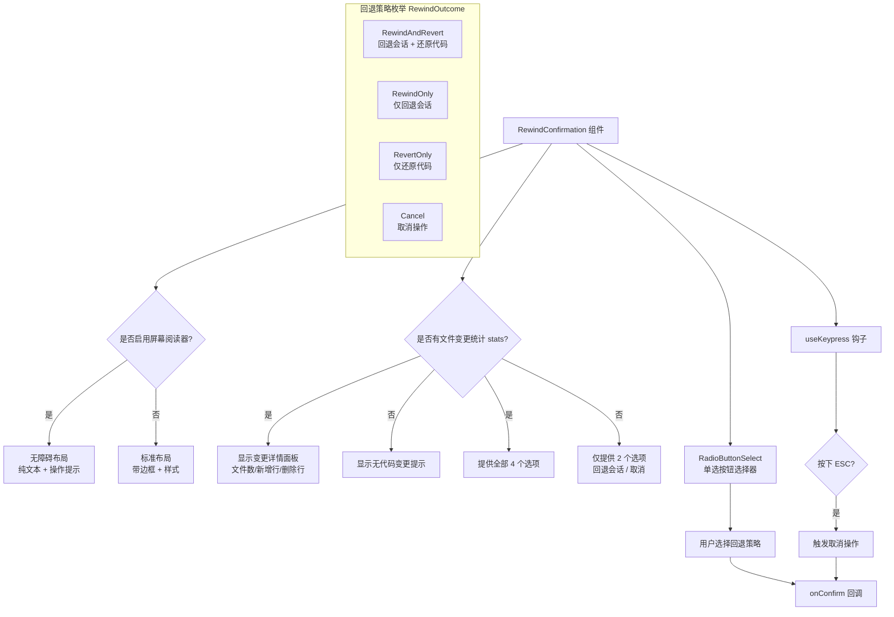

# RewindConfirmation.tsx

## 概述

`RewindConfirmation` 是 Gemini CLI 中用于**会话回退确认**的交互式 UI 组件。当用户触发 "Rewind"（回退）操作时，该组件会弹出一个确认对话框，展示即将被回退的代码变更统计信息（受影响的文件数、新增/删除行数等），并提供多种回退策略供用户选择。组件同时支持屏幕阅读器的无障碍访问模式，针对不同场景渲染不同的 UI 布局。

## 架构图（Mermaid）

## 核心组件

### 1. `RewindOutcome` 枚举

定义了四种回退操作结果：

| 枚举值 | 字符串值 | 说明 |
|---------|----------|------|
| `RewindAndRevert` | `'rewind_and_revert'` | 回退会话历史并还原代码变更 |
| `RewindOnly` | `'rewind_only'` | 仅回退会话历史，保留代码变更 |
| `RevertOnly` | `'revert_only'` | 仅还原代码变更，保留会话历史 |
| `Cancel` | `'cancel'` | 取消操作，不做任何改动 |

### 2. `REWIND_OPTIONS` 常量

类型为 `Array<RadioSelectItem<RewindOutcome>>` 的静态选项数组，包含所有 4 种操作对应的单选按钮配置。每个选项包含 `label`（显示文本）、`value`（枚举值）和 `key`（唯一标识）。

### 3. `RewindConfirmationProps` 接口

| 属性 | 类型 | 必填 | 说明 |
|------|------|------|------|
| `stats` | `FileChangeStats \| null` | 是 | 文件变更统计信息，为 `null` 表示无代码变更 |
| `onConfirm` | `(outcome: RewindOutcome) => void` | 是 | 用户确认操作后的回调函数 |
| `terminalWidth` | `number` | 是 | 终端宽度，用于控制组件渲染宽度 |
| `timestamp` | `string` | 否 | 时间戳字符串，用于显示"多久之前"的提示 |

### 4. `RewindConfirmation` 函数组件

核心渲染逻辑：

- **键盘事件监听**：通过 `useKeypress` 钩子监听 ESC 键，按下后直接触发 `Cancel` 操作。
- **选项动态过滤**：通过 `useMemo` 根据 `stats` 是否为 `null` 决定显示哪些选项。如果没有文件变更统计，则过滤掉 `RewindAndRevert` 和 `RevertOnly` 两个与代码还原相关的选项。
- **双模式渲染**：
  - **屏幕阅读器模式**：使用简化布局，无边框装饰，增加辅助说明文字（"Use arrow keys to navigate, Enter to confirm, Esc to cancel."）。
  - **标准模式**：使用圆角边框（`borderStyle="round"`）、内边距、颜色主题等视觉样式渲染。
- **变更详情展示**：当 `stats` 存在时，显示受影响文件数（单文件显示文件名，多文件显示数量）、新增行数（绿色）、删除行数（红色）；同时显示警告提示"手动编辑或通过 shell 工具编辑的文件不受回退影响"。

## 依赖关系

### 内部依赖

| 模块路径 | 导入内容 | 用途 |
|----------|----------|------|
| `../semantic-colors.js` | `theme` | 语义化颜色主题，用于统一 UI 配色 |
| `./shared/RadioButtonSelect.js` | `RadioButtonSelect`, `RadioSelectItem` | 单选按钮选择器组件及其选项类型 |
| `../utils/rewindFileOps.js` | `FileChangeStats`（类型） | 文件变更统计信息的类型定义 |
| `../hooks/useKeypress.js` | `useKeypress` | 键盘按键监听自定义钩子 |
| `../utils/formatters.js` | `formatTimeAgo` | 将时间戳格式化为相对时间描述（如"3 分钟前"） |
| `../key/keyMatchers.js` | `Command` | 键盘命令枚举，包含 `ESCAPE` 等常量 |
| `../hooks/useKeyMatchers.js` | `useKeyMatchers` | 获取键盘命令匹配器的自定义钩子 |

### 外部依赖

| 包名 | 导入内容 | 用途 |
|------|----------|------|
| `ink` | `Box`, `Text`, `useIsScreenReaderEnabled` | 终端 UI 框架，提供布局组件和无障碍检测 |
| `react` | `React`（类型）, `useMemo` | React 核心库，用于类型标注和性能优化 |

## 关键实现细节

1. **动态选项过滤机制**：组件通过 `useMemo` 钩子根据 `stats` 的有无来动态计算可用选项列表。当 `stats` 为 `null`（无代码变更）时，与代码还原相关的两个选项（`RewindAndRevert` 和 `RevertOnly`）会被过滤掉，仅保留"回退会话"和"取消"两个选项。这保证了用户不会看到无法执行的操作。

2. **ESC 快捷键取消**：通过 `useKeypress` 钩子注册全局键盘监听，当用户按下 ESC 键时直接调用 `onConfirm(RewindOutcome.Cancel)` 取消操作，无需通过选择列表。`useKeyMatchers` 提供了平台无关的按键匹配逻辑。

3. **无障碍访问支持**：使用 `ink` 提供的 `useIsScreenReaderEnabled` 钩子检测屏幕阅读器状态。在屏幕阅读器模式下，组件移除了视觉装饰性的边框和间距，改用纯文本布局，并额外提供了操作说明文本以辅助屏幕阅读器用户理解交互方式。

4. **单文件 vs 多文件展示逻辑**：当 `stats.fileCount === 1` 时，直接显示该文件的文件名（`stats.details?.at(0)?.fileName`）；当影响多个文件时，显示文件数量摘要（如"3 files affected"），避免信息过载。

5. **时间戳格式化**：可选的 `timestamp` 属性通过 `formatTimeAgo` 工具函数转换为人类可读的相对时间（如"5 minutes ago"），用括号包裹显示在变更统计旁边，帮助用户判断操作的时效性。

6. **颜色语义化**：新增行数使用 `theme.status.success`（绿色）显示，删除行数使用 `theme.status.error`（红色）显示，警告信息使用 `theme.status.warning` 显示，遵循了项目统一的语义化颜色规范。
