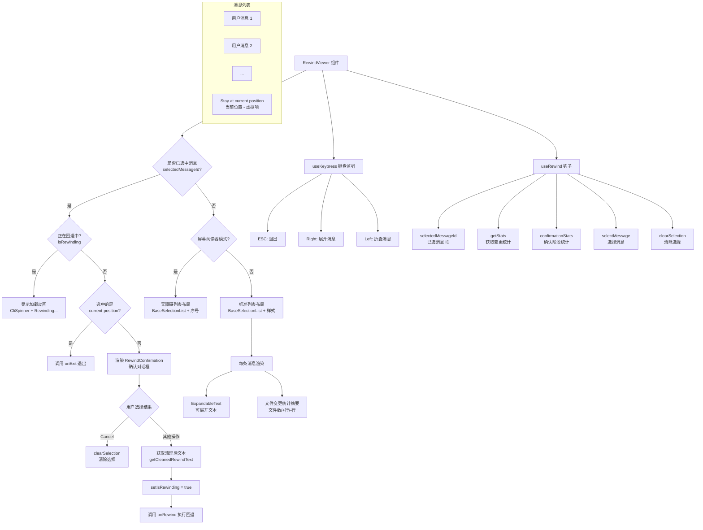

# RewindViewer.tsx

## 概述

`RewindViewer` 是 Gemini CLI 中用于**会话回退浏览与选择**的核心 UI 组件。它展示当前会话中所有用户消息的列表，允许用户通过上下键导航、选择某一个历史消息作为回退目标点。选择后会进入 `RewindConfirmation` 确认阶段，确认后执行实际的回退操作。组件支持消息文本的展开/折叠查看，具备屏幕阅读器无障碍模式，并在回退执行期间展示加载中状态。

## 架构图（Mermaid）



## 核心组件

### 1. `RewindViewerProps` 接口

| 属性 | 类型 | 必填 | 说明 |
|------|------|------|------|
| `conversation` | `ConversationRecord` | 是 | 完整的会话记录对象，包含所有消息 |
| `onExit` | `() => void` | 是 | 退出回退视图的回调函数 |
| `onRewind` | `(messageId: string, newText: string, outcome: RewindOutcome) => Promise<void>` | 是 | 执行回退操作的异步回调，接收目标消息 ID、清理后的文本和回退策略 |

### 2. 常量

| 常量 | 值 | 说明 |
|------|-----|------|
| `MAX_LINES_PER_BOX` | `2` | 每条消息在列表中默认最多显示的行数 |
| `DIALOG_PADDING` | `2` | 对话框上下内边距 |
| `HEADER_HEIGHT` | `2` | 标题区域高度 |
| `CONTROLS_HEIGHT` | `2` | 底部控制提示区域高度 |

### 3. `getCleanedRewindText` 辅助函数

```typescript
const getCleanedRewindText = (userPrompt: MessageRecord): string
```

提取并清理用户消息的显示文本：
- 优先使用 `displayContent`，否则使用 `content`。
- 通过 `partToString` 将消息内容转换为字符串。
- 如果没有 `displayContent`，则额外通过 `stripReferenceContent` 移除引用内容（如文件引用等），获取更干净的纯文本。

### 4. `RewindViewer` 函数组件

组件内部维护以下状态：

| 状态 | 类型 | 说明 |
|------|------|------|
| `isRewinding` | `boolean` | 是否正在执行回退操作 |
| `highlightedMessageId` | `string \| null` | 当前高亮（悬停）的消息 ID |
| `expandedMessageId` | `string \| null` | 当前展开查看完整内容的消息 ID |

核心逻辑流程：

1. **消息过滤**：从 `conversation.messages` 中通过 `useMemo` 过滤出所有 `type === 'user'` 的消息。
2. **列表项构建**：将过滤后的消息映射为列表项数组，末尾追加一个虚拟的 "Stay at current position" 项，用于让用户选择不回退。
3. **高度自适应**：根据 `terminalHeight` 动态计算列表可显示的最大项数 `maxItemsToShow`，确保不超出终端高度限制。
4. **三阶段渲染**：
   - **已选中消息且正在回退**：显示加载动画（`CliSpinner` + "Rewinding..."）。
   - **已选中消息但未开始回退**：渲染 `RewindConfirmation` 确认组件。
   - **未选中消息**：渲染消息列表供用户浏览和选择。

### 5. 列表项渲染逻辑

每条消息在标准模式下渲染为：
- **消息文本**：使用 `ExpandableText` 组件，支持折叠/展开。默认最多显示 `MAX_LINES_PER_BOX`（2 行），可通过左右箭头键展开/折叠。
- **变更统计**：显示该消息关联的文件变更摘要（文件数、新增行数、删除行数）。若无变更则显示"No files have been changed"。
- **"当前位置"虚拟项**：特殊渲染，显示"Stay at current position"及灰色辅助说明文字。

## 依赖关系

### 内部依赖

| 模块路径 | 导入内容 | 用途 |
|----------|----------|------|
| `../contexts/UIStateContext.js` | `useUIState` | 获取终端宽高（`terminalWidth`, `terminalHeight`） |
| `@google/gemini-cli-core` | `ConversationRecord`, `MessageRecord`, `partToString` | 会话记录类型、消息类型、消息内容序列化 |
| `./shared/BaseSelectionList.js` | `BaseSelectionList` | 通用可选择列表基础组件 |
| `../semantic-colors.js` | `theme` | 语义化颜色主题 |
| `../hooks/useKeypress.js` | `useKeypress` | 键盘按键监听钩子 |
| `../hooks/useRewind.js` | `useRewind` | 回退逻辑的核心自定义钩子，管理选中状态和变更统计 |
| `./RewindConfirmation.js` | `RewindConfirmation`, `RewindOutcome` | 回退确认对话框组件和回退结果枚举 |
| `../utils/formatters.js` | `stripReferenceContent` | 移除消息中引用内容的工具函数 |
| `../key/keyMatchers.js` | `Command` | 键盘命令枚举 |
| `./CliSpinner.js` | `CliSpinner` | 加载中旋转动画组件 |
| `./shared/ExpandableText.js` | `ExpandableText` | 可展开/折叠的文本显示组件 |
| `../hooks/useKeyMatchers.js` | `useKeyMatchers` | 键盘命令匹配器钩子 |

### 外部依赖

| 包名 | 导入内容 | 用途 |
|------|----------|------|
| `react` | `React`（类型）, `useMemo`, `useState` | React 核心库 |
| `ink` | `Box`, `Text`, `useIsScreenReaderEnabled` | 终端 UI 框架 |

## 关键实现细节

1. **三阶段状态机**：组件实现了一个隐式的三阶段状态机——浏览列表 -> 确认回退 -> 执行回退。状态由 `selectedMessageId` 和 `isRewinding` 两个变量组合控制。选中消息后进入确认阶段，确认后设置 `isRewinding=true` 进入执行阶段并调用异步 `onRewind`。

2. **虚拟"当前位置"项**：列表末尾始终追加一个 ID 为 `'current-position'` 的虚拟项，且 `initialIndex` 设置为 `items.length - 1`（即默认选中此项）。这样用户打开回退视图后默认停在"当前位置"，向上滚动查看历史消息。选中此项等同于取消回退操作。

3. **动态高度计算**：通过 `terminalHeight` 减去对话框边距、标题高度、控制提示高度后得到列表可用高度，再除以每项预估高度（4 行）算出最大可显示项数。使用 `Math.max` 确保至少显示 1 项，列表至少 5 行高。

4. **消息文本展开/折叠**：通过 `highlightedMessageId` 和 `expandedMessageId` 两个状态配合实现。高亮某条消息时按右箭头（`Command.EXPAND_SUGGESTION`）展开全文，按左箭头折叠。切换高亮项时自动折叠，防止多条消息同时展开导致布局混乱。

5. **异步回退执行**：确认回退后通过 IIFE（`void (async () => { ... })()`）模式调用异步的 `onRewind`。先获取清理后的消息文本，再设置加载状态，最后执行实际回退。这种模式避免了在事件回调中直接使用 `async`。

6. **`useRewind` 钩子集成**：组件核心逻辑委托给 `useRewind` 自定义钩子，该钩子接收 `conversation` 并返回选中状态管理和变更统计计算功能。这实现了 UI 与业务逻辑的解耦。

7. **选中颜色高亮**：被选中的消息文本使用 `theme.status.success`（绿色）显示，未选中的使用 `theme.text.primary`，与 `RewindConfirmation` 保持一致的视觉语言。
