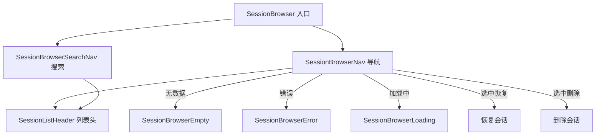

# SessionBrowser

## 概述

`SessionBrowser` 目录实现了会话浏览器功能，允许用户浏览、搜索、恢复和删除历史聊天会话。这是一个完整的子功能模块，包含导航、搜索、状态提示等子组件。

## 目录结构

```
SessionBrowser/
├── SessionBrowserNav.tsx            # 会话浏览器主导航组件
├── SessionBrowserSearchNav.tsx      # 搜索导航（搜索框 + 结果列表）
├── SessionBrowserEmpty.tsx          # 无会话时的空状态提示
├── SessionBrowserError.tsx          # 错误状态提示
├── SessionBrowserLoading.tsx        # 加载状态指示
├── SessionListHeader.tsx            # 会话列表头部（标题 + 操作提示）
├── utils.ts                         # 会话浏览器工具函数
└── __snapshots__/                   # 测试快照
```

## 架构图



## 核心组件

| 组件 | 职责 |
|------|------|
| `SessionBrowserNav` | 主导航组件，展示会话列表，支持上下键选择、Enter 恢复、Delete 删除 |
| `SessionBrowserSearchNav` | 搜索模式导航，支持输入关键字过滤会话 |
| `SessionBrowserEmpty` | 无历史会话时的空状态页面 |
| `SessionBrowserError` | 加载会话出错时的错误页面 |
| `SessionBrowserLoading` | 会话列表加载中的占位动画 |
| `SessionListHeader` | 会话列表头部标题栏 |
| `utils.ts` | 会话格式化、时间戳处理等工具函数 |

## 依赖关系

### 内部依赖
- `../../contexts/`: UIActionsContext（恢复/删除回调）
- `../shared/`: SearchableList、ScrollableList
- `../../hooks/`: useKeypress、useSessionBrowser

### 外部依赖
- `ink`: 终端渲染

## 数据流

1. 用户输入 `/chat` 命令或通过快捷键打开会话浏览器
2. `AppContainer` 设置 `isSessionBrowserOpen = true`
3. `SessionBrowserNav` 加载历史会话列表
4. 用户浏览、搜索或选择会话
5. 选择恢复 -> `UIActions.handleResumeSession` -> 加载会话历史并切换
6. 选择删除 -> `UIActions.handleDeleteSession` -> 从存储中移除
