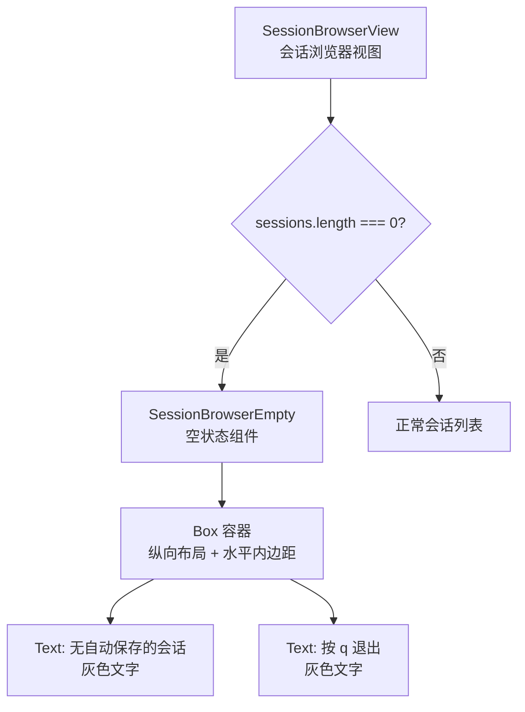

# SessionBrowserEmpty.tsx

## 概述

`SessionBrowserEmpty` 是 Gemini CLI 会话浏览器的**空状态展示组件**。当系统未找到任何自动保存的会话记录时，该组件会被渲染，向用户展示友好的空状态提示信息，并告知用户可以按 `q` 键退出浏览器。这是一个纯展示性的无状态函数组件，没有任何交互逻辑和内部状态。

## 架构图（Mermaid）



## 核心组件

### `SessionBrowserEmpty` 函数组件

这是一个**无 props 的纯展示组件**，直接返回 JSX 元素。

#### 渲染结构

```
Box (flexDirection="column", paddingX={1})
  ├── Text "No auto-saved conversations found." (灰色)
  └── Text "Press q to exit" (灰色)
```

- **外层容器**：使用 `Box` 组件，纵向排列子元素，左右各有 1 个字符的内边距（`paddingX={1}`），与父级 `SessionBrowserView` 的布局保持一致。
- **提示文本**：两行灰色文字，第一行说明当前没有找到自动保存的会话，第二行提示用户按 `q` 键退出。

## 依赖关系

### 内部依赖

| 模块路径 | 导入内容 | 用途 |
|----------|----------|------|
| `../../colors.js` | `Colors` | 基础颜色常量，使用 `Colors.Gray` 设置文字颜色 |

### 外部依赖

| 包名 | 导入内容 | 用途 |
|------|----------|------|
| `react` | `React`（类型） | 仅用于 JSX 元素类型标注 `React.JSX.Element` |
| `ink` | `Box`, `Text` | 终端 UI 框架，提供布局和文本渲染组件 |

## 关键实现细节

1. **无状态纯组件**：该组件不接收任何 props，不维护任何内部状态，不包含任何副作用逻辑。它是一个纯粹的静态 UI 片段，用箭头函数直接返回 JSX，连函数体的花括号和 `return` 语句都省略了。

2. **与父组件的调用关系**：在 `SessionBrowser.tsx` 的 `SessionBrowserView` 组件中，当 `state.sessions.length === 0`（即加载完成但无会话数据）时渲染此组件。注意与 `loading` 状态和 `error` 状态的判断有优先级关系——先判断 `loading`，再判断 `error`，最后判断 `sessions` 是否为空。

3. **退出操作提示**：组件仅提示用户按 `q` 退出，但退出逻辑本身不在此组件中实现。实际的按键监听和退出回调由父级 `SessionBrowser` 组件的 `useSessionBrowserInput` 钩子统一处理（`key.sequence === 'q'` 触发 `onExit()`）。

4. **颜色选择**：使用 `Colors.Gray` 作为文字颜色，与项目中其他辅助/次要信息的颜色保持一致（如 `SessionBrowser` 中的表头、分隔符等也使用 `Colors.Gray`），形成视觉上的统一性。

5. **布局一致性**：`paddingX={1}` 的水平内边距与 `SessionBrowserView` 中正常列表模式下的 `paddingX={1}` 保持一致，确保无论处于何种状态，内容的左右对齐方式是统一的。
