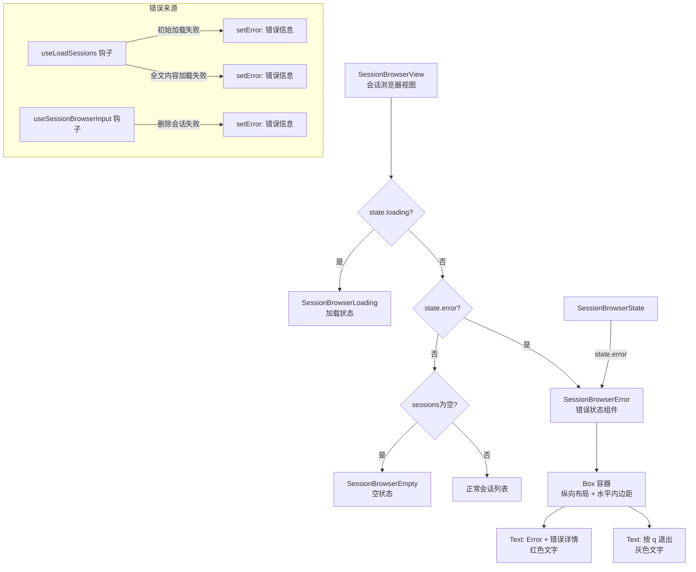

# SessionBrowserError.tsx

## 概述

`SessionBrowserError` 是 Gemini CLI 会话浏览器的**错误状态展示组件**。当会话数据加载失败时（如文件系统读取错误、权限问题等），该组件会被渲染，以红色醒目文字展示错误信息，并提示用户按 `q` 键退出浏览器。它接收 `SessionBrowserState` 作为 props，从中读取 `error` 字段来显示具体的错误内容。

## 架构图（Mermaid）



## 核心组件

### `SessionBrowserError` 函数组件

#### Props

| 属性 | 类型 | 必填 | 说明 |
|------|------|------|------|
| `state` | `SessionBrowserState` | 是 | 会话浏览器的集中状态对象，组件从中读取 `state.error` 字段 |

#### 渲染结构

```
Box (flexDirection="column", paddingX={1})
  ├── Text "Error: {state.error}" (红色 - Colors.AccentRed)
  └── Text "Press q to exit" (灰色 - Colors.Gray)
```

- **外层容器**：使用 `Box` 组件，纵向排列子元素，左右各有 1 个字符的内边距（`paddingX={1}`）。
- **错误信息行**：以红色（`Colors.AccentRed`）显示 "Error: " 前缀加上具体的错误描述文字，颜色醒目易于识别。
- **退出提示行**：以灰色（`Colors.Gray`）提示用户按 `q` 键退出浏览器。

## 依赖关系

### 内部依赖

| 模块路径 | 导入内容 | 用途 |
|----------|----------|------|
| `../../colors.js` | `Colors` | 基础颜色常量，使用 `Colors.AccentRed`（错误红色）和 `Colors.Gray`（辅助灰色） |
| `../SessionBrowser.js` | `SessionBrowserState`（类型） | 会话浏览器集中状态接口的类型定义 |

### 外部依赖

| 包名 | 导入内容 | 用途 |
|------|----------|------|
| `react` | `React`（类型） | 仅用于 JSX 元素类型标注 `React.JSX.Element` |
| `ink` | `Box`, `Text` | 终端 UI 框架，提供布局和文本渲染组件 |

## 关键实现细节

1. **与 `SessionBrowserState` 的耦合**：与 `SessionBrowserEmpty` 组件不同，该组件接收 `SessionBrowserState` 类型的 `state` 作为 props，从中读取 `state.error` 字段。这种设计遵循了 `SessionBrowser` 中集中状态管理的模式——所有子组件通过统一的 `state` 对象获取所需数据，而非单独传递 `error` 字符串，保持了接口的一致性。

2. **错误来源**：`state.error` 可能由以下几种场景设置：
   - **初始会话加载失败**：`useLoadSessions` 钩子中初始 `getSessionFiles` 调用抛出异常时，错误信息为 `err.message` 或默认的 `'Failed to load sessions'`。
   - **全文内容加载失败**：进入搜索模式后加载完整会话内容时失败，错误信息为 `err.message` 或默认的 `'Failed to load full session content'`。
   - **会话删除失败**：`useSessionBrowserInput` 钩子中执行 `onDeleteSession` 回调失败时，错误信息格式为 `'Failed to delete session: {message}'`。

3. **优先级判断**：在 `SessionBrowserView` 的渲染逻辑中，错误状态的判断优先级为第二位（仅次于 `loading`）。即：先检查是否加载中，再检查是否有错误，最后检查会话列表是否为空。这意味着如果同时存在 `loading=true` 和 `error` 不为 `null`，会先显示加载状态而非错误。

4. **退出操作委托**：与 `SessionBrowserEmpty` 相同，该组件仅提示用户按 `q` 退出，但不处理实际的按键监听。退出逻辑由父级 `SessionBrowser` 的 `useSessionBrowserInput` 钩子中 `key.sequence === 'q'` 分支处理。

5. **颜色对比**：错误信息使用 `Colors.AccentRed` 红色高亮显示，与退出提示的 `Colors.Gray` 灰色形成鲜明对比，确保用户第一眼能注意到错误内容。这符合终端 UI 中"红色代表错误"的通用约定。

6. **布局一致性**：`paddingX={1}` 和 `flexDirection="column"` 的布局方式与 `SessionBrowserEmpty` 和 `SessionBrowserView` 中的正常列表视图完全一致，确保在不同状态之间切换时页面布局不会产生跳动感。
