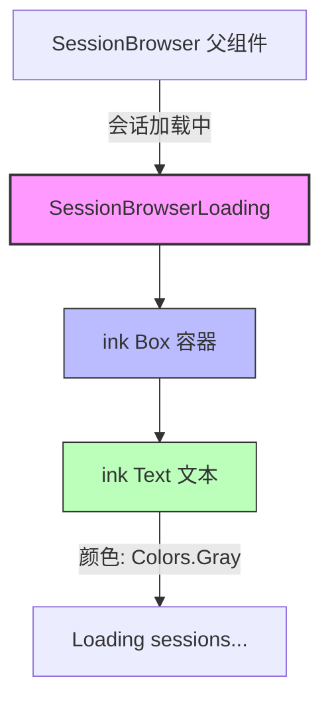

# SessionBrowserLoading.tsx

## 概述

`SessionBrowserLoading` 是一个无状态的 React 函数组件，用于在会话浏览器（SessionBrowser）加载会话列表期间显示加载提示。当应用正在异步获取会话数据时，此组件会向用户展示 "Loading sessions..." 的灰色文本提示，提供视觉反馈，改善用户体验。

该组件非常轻量，没有 props 输入，没有内部状态，仅负责渲染一段静态的加载提示文字。

## 架构图（Mermaid）



## 核心组件

### SessionBrowserLoading

| 属性 | 说明 |
|------|------|
| **类型** | React 无状态函数组件（Functional Component） |
| **Props** | 无（空参数列表） |
| **返回值** | `React.JSX.Element` |
| **导出方式** | 具名导出（`export const`） |

#### 渲染结构

```
Box (flexDirection="column", paddingX={1})
  └── Text (color={Colors.Gray})
        └── "Loading sessions…"
```

- **Box**：作为外层容器，设置了 `flexDirection="column"`（垂直布局）和 `paddingX={1}`（水平方向各 1 个字符的内边距），使加载文字与边界保持一定间距。
- **Text**：使用 `Colors.Gray` 灰色渲染 "Loading sessions..." 文本，灰色表示这是一个临时的、非关键的状态提示。

## 依赖关系

### 内部依赖

| 依赖模块 | 导入内容 | 说明 |
|----------|----------|------|
| `../../colors.js` | `Colors` | 项目统一的颜色常量对象，此处使用 `Colors.Gray` 作为加载提示文本的颜色 |

### 外部依赖

| 依赖包 | 导入内容 | 说明 |
|--------|----------|------|
| `react` | `React`（类型导入） | 用于 JSX 类型声明 `React.JSX.Element` |
| `ink` | `Box`, `Text` | Ink 终端 UI 框架的核心布局和文本组件 |

## 关键实现细节

1. **极简设计**：整个组件仅有 4 行有效代码（不含许可证头部和导入语句），体现了单一职责原则 —— 只负责渲染加载状态的 UI。

2. **箭头函数 + 隐式返回**：组件使用 `const ... = (): React.JSX.Element => (...)` 的箭头函数形式定义，通过圆括号实现隐式 JSX 返回，没有函数体（无花括号），进一步简化代码。

3. **类型安全**：通过 `import type` 语法导入 React 类型，确保仅在类型检查阶段使用，不会在运行时产生额外开销。这是 TypeScript 的最佳实践。

4. **统一颜色体系**：使用项目内部的 `Colors.Gray` 常量而非硬编码颜色值，保证了整个应用 UI 的颜色一致性，方便后续统一调整主题。

5. **省略号细节**：文本使用 Unicode 省略号字符 `…`（U+2026）而非三个英文句点 `...`，这是国际化文本处理的标准做法，显示效果更美观。

6. **Ink 框架适配**：该组件基于 Ink 框架构建，Ink 是一个将 React 组件渲染到终端的框架。`Box` 和 `Text` 是 Ink 的基础组件，分别对应终端中的布局容器和文本元素。
