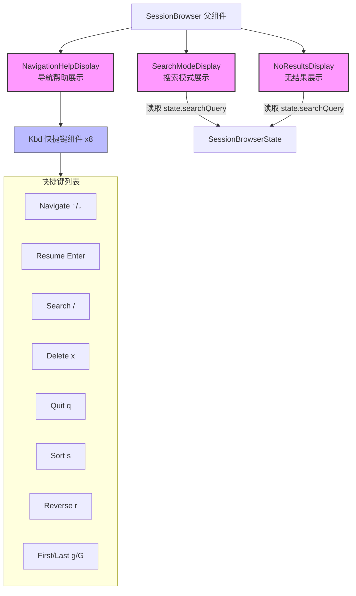

# SessionBrowserNav.tsx

## 概述

`SessionBrowserNav.tsx` 文件包含会话浏览器（SessionBrowser）底部导航区域的三个展示组件，负责向用户显示键盘快捷键帮助、搜索输入状态以及搜索无结果时的提示。这些组件共同构成了会话浏览器的交互引导层，帮助用户了解可用操作并提供搜索反馈。

文件中定义了以下组件：

- **Kbd**（内部辅助组件）：用于格式化显示单个键盘快捷键。
- **NavigationHelpDisplay**（导出）：显示所有可用的键盘快捷键帮助信息。
- **SearchModeDisplay**（导出）：在搜索模式下显示搜索输入框和当前查询内容。
- **NoResultsDisplay**（导出）：当搜索没有匹配结果时显示提示信息。

## 架构图（Mermaid）



## 核心组件

### 1. Kbd（内部辅助组件）

| 属性 | 说明 |
|------|------|
| **类型** | React 无状态函数组件 |
| **导出** | 不导出（文件内部使用） |
| **用途** | 格式化渲染单个键盘快捷键 |

#### Props

| 参数名 | 类型 | 说明 |
|--------|------|------|
| `name` | `string` | 快捷键功能名称（如 "Navigate"、"Search"） |
| `shortcut` | `string` | 快捷键按键（如 "↑/↓"、"/"） |

#### 渲染结果

```
{name}: <粗体>{shortcut}</粗体>
```

功能名称以普通文字渲染，快捷键按键以粗体（`bold`）渲染，使用 React Fragment（`<>...</>`）包裹，不产生额外的 DOM 节点。

---

### 2. NavigationHelpDisplay（导航帮助展示）

| 属性 | 说明 |
|------|------|
| **类型** | React 无状态函数组件 |
| **导出** | 具名导出 |
| **Props** | 无 |
| **返回值** | `React.JSX.Element` |

#### 渲染结构

```
Box (flexDirection="column")
  ├── Text (color=Colors.Gray) —— 第一行快捷键
  │     ├── Kbd("Navigate", "↑/↓")
  │     ├── Kbd("Resume", "Enter")
  │     ├── Kbd("Search", "/")
  │     ├── Kbd("Delete", "x")
  │     └── Kbd("Quit", "q")
  └── Text (color=Colors.Gray) —— 第二行快捷键
        ├── Kbd("Sort", "s")
        ├── Kbd("Reverse", "r")
        └── Kbd("First/Last", "g/G")
```

#### 支持的快捷键

| 快捷键 | 功能 | 说明 |
|--------|------|------|
| `↑/↓` | Navigate（导航） | 在会话列表中上下移动选中项 |
| `Enter` | Resume（恢复） | 恢复/打开选中的会话 |
| `/` | Search（搜索） | 进入搜索模式 |
| `x` | Delete（删除） | 删除选中的会话 |
| `q` | Quit（退出） | 退出会话浏览器 |
| `s` | Sort（排序） | 切换排序方式（日期/消息数/名称） |
| `r` | Reverse（反转） | 反转当前排序顺序 |
| `g/G` | First/Last（首/末） | 跳转到列表首项或末项 |

快捷键分两行显示，通过手动的空格字符串 `{'   '}` 和 `{'         '}` 控制列间距，使第二行的各列大致对齐第一行。

---

### 3. SearchModeDisplay（搜索模式展示）

| 属性 | 说明 |
|------|------|
| **类型** | React 无状态函数组件 |
| **导出** | 具名导出 |
| **返回值** | `React.JSX.Element` |

#### Props

| 参数名 | 类型 | 说明 |
|--------|------|------|
| `state` | `SessionBrowserState` | 会话浏览器的完整状态对象 |

#### 渲染结构

```
Box (marginTop={1})
  └── Text (color=Colors.Gray)    "Search: "
  └── Text (color=Colors.AccentPurple)  {state.searchQuery}
  └── Text (color=Colors.Gray)    " (Esc to cancel)"
```

- **"Search: "** 标签以灰色显示
- **搜索查询内容** `state.searchQuery` 以紫色高亮显示（`Colors.AccentPurple`），突出用户输入
- **"(Esc to cancel)"** 以灰色显示，提示用户如何退出搜索模式
- `marginTop={1}` 在组件上方留出 1 行的间距，与上方内容分隔

---

### 4. NoResultsDisplay（无结果展示）

| 属性 | 说明 |
|------|------|
| **类型** | React 无状态函数组件 |
| **导出** | 具名导出 |
| **返回值** | `React.JSX.Element` |

#### Props

| 参数名 | 类型 | 说明 |
|--------|------|------|
| `state` | `SessionBrowserState` | 会话浏览器的完整状态对象 |

#### 渲染结构

```
Box (marginTop={1})
  └── Text (color=Colors.Gray, dimColor)
        └── "No sessions found matching '{state.searchQuery}'."
```

- 使用 `dimColor` 属性使文本更加暗淡，强调这是一个次要的空状态提示
- 将用户的搜索词嵌入提示信息中，便于用户确认搜索内容
- 同样使用 `marginTop={1}` 保持与上方内容的间距

## 依赖关系

### 内部依赖

| 依赖模块 | 导入内容 | 说明 |
|----------|----------|------|
| `../../colors.js` | `Colors` | 项目统一颜色常量，使用了 `Colors.Gray` 和 `Colors.AccentPurple` |
| `../SessionBrowser.js` | `SessionBrowserState`（类型导入） | 会话浏览器的状态接口类型，包含 `searchQuery` 等字段 |

### 外部依赖

| 依赖包 | 导入内容 | 说明 |
|--------|----------|------|
| `react` | `React`（类型导入） | 用于 JSX 类型声明 |
| `ink` | `Box`, `Text` | Ink 终端 UI 框架的核心组件 |

## 关键实现细节

1. **组件拆分策略**：将导航区域拆分为三个独立组件（导航帮助、搜索模式、无结果），使得父组件可以根据当前状态条件渲染不同的底部区域。例如：非搜索模式显示 `NavigationHelpDisplay`，搜索模式显示 `SearchModeDisplay`，搜索无结果时额外显示 `NoResultsDisplay`。

2. **Kbd 辅助组件的复用**：`Kbd` 组件虽然简单，但被复用了 8 次，封装了"名称: **快捷键**"这一显示模式，避免了重复代码。使用 React Fragment 包裹避免产生额外的布局节点。

3. **手动间距控制**：快捷键之间使用硬编码的空格字符串 `{'   '}` 进行间距控制，而非使用 CSS-like 的 margin/padding。这是因为在终端环境中，字符级别的间距控制更可靠、更直观。第二行使用更多空格来尝试与第一行的列对齐。

4. **颜色语义化使用**：
   - `Colors.Gray`：用于非活跃/辅助文本（快捷键说明、搜索标签、提示文字）
   - `Colors.AccentPurple`：用于高亮用户输入的搜索查询，形成视觉焦点

5. **状态只读消费**：`SearchModeDisplay` 和 `NoResultsDisplay` 接收完整的 `SessionBrowserState` 对象，但仅读取 `searchQuery` 字段。传入完整状态对象而非单独的 `searchQuery` 字符串，可能是为了保持接口一致性，便于未来扩展时读取其他状态字段。

6. **`dimColor` 与 `color` 叠加**：`NoResultsDisplay` 同时使用了 `color={Colors.Gray}` 和 `dimColor` 两个属性，`dimColor` 会在灰色基础上进一步降低亮度，使"无结果"提示显得更加次要和不引人注目。
