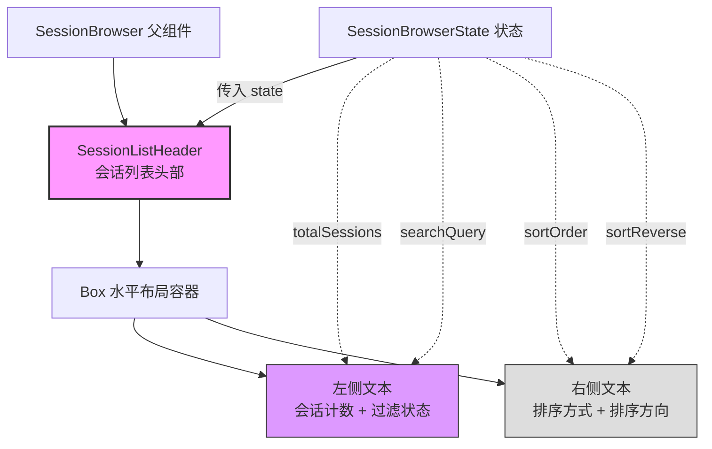

# SessionListHeader.tsx

## 概述

`SessionListHeader` 是会话浏览器（SessionBrowser）的列表头部组件，位于会话列表的顶部，向用户展示两组关键信息：

1. **左侧**：会话总数及是否处于搜索过滤状态
2. **右侧**：当前的排序方式和排序方向

该组件是一个纯展示组件，从 `SessionBrowserState` 中读取状态数据进行渲染，不产生任何副作用或状态变更。它帮助用户在浏览会话列表时始终了解当前视图的上下文信息。

## 架构图（Mermaid）



## 核心组件

### SessionListHeader

| 属性 | 说明 |
|------|------|
| **类型** | React 无状态函数组件 |
| **导出** | 具名导出 |
| **返回值** | `React.JSX.Element` |

#### Props

| 参数名 | 类型 | 说明 |
|--------|------|------|
| `state` | `SessionBrowserState` | 会话浏览器的完整状态对象 |

#### 从 state 中使用的字段

| 字段 | 类型 | 用途 |
|------|------|------|
| `state.totalSessions` | `number` | 显示会话总数 |
| `state.searchQuery` | `string` | 判断是否处于搜索过滤状态（非空时显示 "filtered"） |
| `state.sortOrder` | `'date' \| 'messages' \| 'name'` | 显示当前排序字段 |
| `state.sortReverse` | `boolean` | 判断排序方向（`true` 显示 "asc"，`false` 显示 "desc"） |

#### 渲染结构

```
Box (flexDirection="row", justifyContent="space-between")
  ├── Text (color=Colors.AccentPurple)
  │     └── "Chat Sessions ({totalSessions} total{, filtered})"
  └── Text (color=Colors.Gray)
        └── "sorted by {sortOrder} {asc|desc}"
```

#### 显示示例

**无搜索状态**：
```
Chat Sessions (15 total)                          sorted by date desc
```

**有搜索过滤**：
```
Chat Sessions (15 total, filtered)                sorted by name asc
```

## 依赖关系

### 内部依赖

| 依赖模块 | 导入内容 | 说明 |
|----------|----------|------|
| `../../colors.js` | `Colors` | 项目统一颜色常量，使用了 `Colors.AccentPurple` 和 `Colors.Gray` |
| `../SessionBrowser.js` | `SessionBrowserState`（类型导入） | 会话浏览器的状态接口类型 |

### 外部依赖

| 依赖包 | 导入内容 | 说明 |
|--------|----------|------|
| `react` | `React`（类型导入） | 用于 JSX 类型声明 |
| `ink` | `Box`, `Text` | Ink 终端 UI 框架的核心组件 |

## 关键实现细节

1. **水平两端对齐布局**：使用 `Box` 组件的 `flexDirection="row"` 和 `justifyContent="space-between"` 实现左右两端对齐。这是 Flexbox 布局的经典用法 —— 左侧显示会话计数信息，右侧显示排序信息，中间自动填充空白。这使得头部信息在不同终端宽度下都能保持良好的可读性。

2. **条件文本渲染**：通过三元表达式 `{state.searchQuery ? ', filtered' : ''}` 实现条件文本。当 `searchQuery` 为空字符串（falsy）时不显示额外文本；当有搜索查询时追加 ", filtered" 后缀，让用户知道当前列表经过了过滤。

3. **排序方向的反直觉映射**：排序方向的显示逻辑为 `state.sortReverse ? 'asc' : 'desc'`。这意味着：
   - **默认状态**（`sortReverse = false`）：显示 "desc"（降序），即最新/最大的排在前面
   - **反转状态**（`sortReverse = true`）：显示 "asc"（升序），即最旧/最小的排在前面

   这表明系统的默认排序是降序（最新优先），`sortReverse` 标志反转为升序。

4. **颜色语义**：
   - **`Colors.AccentPurple`**（左侧标题）：紫色高亮用于标题级信息，视觉上醒目，表示这是页面的主要标识
   - **`Colors.Gray`**（右侧排序信息）：灰色用于辅助/次要信息，不抢占视觉焦点

5. **`totalSessions` 与列表长度的区别**：组件显示的是 `state.totalSessions`（所有会话的总数），而非过滤后的会话数。这样即使在搜索过滤状态下，用户也能知道总共有多少会话，配合 "filtered" 标记理解当前视图只是子集。

6. **简洁的组件结构**：整个组件只有一个 `Box` 包含两个 `Text` 节点，没有多余的嵌套层级。这种扁平结构在终端渲染中性能更好，且代码可读性高。
