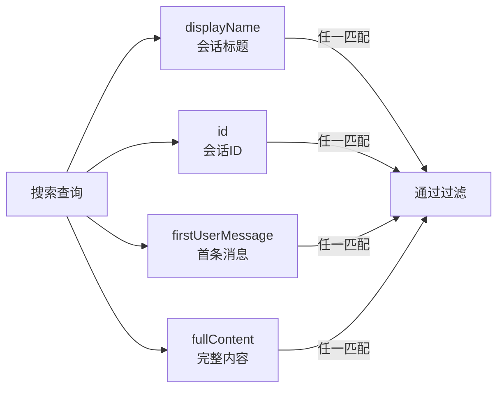

# utils.ts

## 概述

`utils.ts` 是会话浏览器（SessionBrowser）的工具函数模块，提供了会话列表的**排序**、**搜索匹配**和**过滤**三大核心数据处理能力。这些纯函数不依赖 React 或 UI 框架，专注于会话数据的逻辑操作，可以被会话浏览器的各种 Hook 和组件调用。

文件导出了三个函数：

| 函数 | 功能 |
|------|------|
| `sortSessions` | 按指定条件对会话数组排序 |
| `findTextMatches` | 在对话消息中查找搜索关键词并提取上下文片段 |
| `filterSessions` | 根据搜索查询过滤会话，同时填充匹配摘要信息 |

## 架构图（Mermaid）

```mermaid
graph TD
    subgraph 数据流
        SESSIONS[会话数据<br/>SessionInfo 数组] --> FS[filterSessions<br/>过滤会话]
        FS --> SS[sortSessions<br/>排序会话]
        SS --> RESULT[最终结果<br/>过滤且排序的会话列表]
    end

    subgraph filterSessions 内部
        FQ[搜索查询 query] --> TM[标题匹配<br/>displayName / id / firstUserMessage]
        FQ --> CM[内容匹配<br/>fullContent]
        TM -->|匹配成功| FTM[findTextMatches<br/>提取匹配片段]
        CM -->|匹配成功| FTM
        FTM --> SNIPPETS[matchSnippets<br/>匹配上下文数组]
    end

    subgraph findTextMatches 内部
        MSG[消息数组] --> CLEAN[cleanMessage<br/>清理消息文本]
        CLEAN --> SEARCH[大小写不敏感搜索]
        SEARCH --> CTX[提取上下文<br/>前后各10字符]
        CTX --> ELLIPSIS[添加省略号标记]
        ELLIPSIS --> MATCHES[TextMatch 数组]
    end

    style SS fill:#f9f,stroke:#333,stroke-width:2px
    style FS fill:#f9f,stroke:#333,stroke-width:2px
    style FTM fill:#f9f,stroke:#333,stroke-width:2px
```



## 核心组件

### 1. sortSessions — 会话排序函数

```typescript
export const sortSessions = (
  sessions: SessionInfo[],
  sortBy: 'date' | 'messages' | 'name',
  reverse: boolean,
): SessionInfo[] => { ... }
```

#### 参数

| 参数名 | 类型 | 说明 |
|--------|------|------|
| `sessions` | `SessionInfo[]` | 待排序的会话数组 |
| `sortBy` | `'date' \| 'messages' \| 'name'` | 排序依据 |
| `reverse` | `boolean` | 是否反转排序顺序 |

#### 返回值

返回一个**新的**已排序 `SessionInfo[]` 数组（不修改原数组）。

#### 排序规则

| `sortBy` 值 | 排序字段 | 默认排序方向（`reverse=false`） | 比较方式 |
|------------|----------|-------------------------------|----------|
| `'date'` | `lastUpdated` | 降序（最新在前） | `Date.getTime()` 数值比较 |
| `'messages'` | `messageCount` | 降序（最多在前） | 数值比较 |
| `'name'` | `displayName` | 升序（A-Z） | `localeCompare()` 本地化字符串比较 |

> **注意**：`date` 和 `messages` 的默认排序是 `b - a`（降序），而 `name` 的默认排序是 `a.localeCompare(b)`（升序）。当 `reverse=true` 时，会对整个已排序数组调用 `.reverse()` 反转。

---

### 2. findTextMatches — 文本匹配查找函数

```typescript
export const findTextMatches = (
  messages: Array<{ role: 'user' | 'assistant'; content: string }>,
  query: string,
): TextMatch[] => { ... }
```

#### 参数

| 参数名 | 类型 | 说明 |
|--------|------|------|
| `messages` | `Array<{ role: 'user' \| 'assistant'; content: string }>` | 对话消息数组 |
| `query` | `string` | 搜索查询字符串 |

#### 返回值

返回 `TextMatch[]` 数组，每个元素包含一个匹配的上下文片段。

#### TextMatch 接口

```typescript
interface TextMatch {
  before: string;   // 匹配位置之前的文本（可能带省略号前缀）
  match: string;    // 精确匹配的文本
  after: string;    // 匹配位置之后的文本（可能带省略号后缀）
  role: 'user' | 'assistant';  // 匹配所在消息的角色
}
```

#### 处理流程

```
1. 空查询检查 → 空字符串直接返回空数组
2. 遍历每条消息
   2.1 调用 cleanMessage() 清理消息内容（去换行、合并空白、去非打印字符）
   2.2 转小写进行大小写不敏感匹配
   2.3 循环查找所有匹配位置（indexOf 循环）
       2.3.1 计算上下文范围：匹配位置前后各 10 个字符
       2.3.2 切片提取 snippet（before + match + after）
       2.3.3 如果上下文被截断，添加省略号 "..."
       2.3.4 构造 TextMatch 对象并加入结果数组
   2.4 startIndex = matchIndex + 1（避免死循环，允许重叠匹配）
3. 返回所有匹配结果
```

---

### 3. filterSessions — 会话过滤函数

```typescript
export const filterSessions = (
  sessions: SessionInfo[],
  query: string,
): SessionInfo[] => { ... }
```

#### 参数

| 参数名 | 类型 | 说明 |
|--------|------|------|
| `sessions` | `SessionInfo[]` | 待过滤的会话数组 |
| `query` | `string` | 搜索查询字符串 |

#### 返回值

返回过滤后的 `SessionInfo[]` 数组。匹配的会话会被附加 `matchSnippets` 和 `matchCount` 属性。

#### 处理逻辑

```
1. 空查询处理：
   - 返回所有会话的浅拷贝
   - 清除所有会话的 matchSnippets 和 matchCount（设为 undefined）

2. 非空查询过滤：
   - 对每个会话检查三个匹配维度：
     a. displayName（会话显示名称）
     b. id（会话唯一标识）
     c. firstUserMessage（首条用户消息）
   - 以及第四个维度：
     d. fullContent（完整对话内容，可选字段，通过可选链 ?. 访问）

   - 如果任一维度匹配成功：
     - 如果会话有 messages 数组，调用 findTextMatches 提取匹配片段
     - 将匹配片段挂载到 session.matchSnippets
     - 将匹配数量挂载到 session.matchCount
     - 返回 true（保留该会话）

   - 否则返回 false（过滤掉该会话）
```

#### 匹配检查的优先级和范围



## 依赖关系

### 内部依赖

| 依赖模块 | 导入内容 | 说明 |
|----------|----------|------|
| `../../../utils/sessionUtils.js` | `cleanMessage` | 消息文本清理函数，去除换行符、合并连续空白、移除非打印字符 |
| `../../../utils/sessionUtils.js` | `SessionInfo`（类型导入） | 会话信息接口，包含 id、displayName、messageCount、lastUpdated 等字段 |
| `../../../utils/sessionUtils.js` | `TextMatch`（类型导入） | 文本匹配结果接口，包含 before、match、after、role 四个字段 |

### 外部依赖

无外部依赖。本文件是纯 TypeScript 工具模块，不依赖任何第三方包。

## 关键实现细节

1. **不可变数据处理**：`sortSessions` 使用展开运算符 `[...sessions]` 创建数组副本后再排序，避免修改原始数组。这是 React 状态管理中的重要原则 —— 不直接修改 state 中的数组引用。

2. **大小写不敏感搜索**：`findTextMatches` 和 `filterSessions` 都将搜索查询和目标文本统一转为小写后比较（`toLowerCase()`），实现大小写不敏感搜索。但在提取匹配片段时，使用的是原始大小写的文本（变量 `m`），保证显示给用户的内容保持原始格式。

3. **上下文窗口**：匹配片段的上下文窗口为匹配位置前后各 **10 个字符**。通过 `Math.max(0, matchIndex - 10)` 和 `Math.min(m.length, matchIndex + query.length + 10)` 确保不越界。如果上下文被截断（即不是从文本开头或到文本结尾），会添加省略号 `...` 标记。

4. **允许重叠匹配**：在 `findTextMatches` 的循环中，`startIndex = matchIndex + 1`（而非 `matchIndex + query.length`），意味着搜索 "aa" 在文本 "aaa" 中会找到 2 个匹配（位置 0 和位置 1）。这确保了不遗漏任何可能的匹配位置。

5. **消息文本清理**：在搜索前，每条消息通过 `cleanMessage()` 进行预处理：
   - 将所有换行符替换为空格（`\n+` → ` `）
   - 合并连续空白字符（`\s+` → ` `）
   - 移除所有非 ASCII 可打印字符（保留 `\x20-\x7E`）
   - 首尾去空白（`trim()`）

   这确保了搜索在标准化的纯文本上进行，避免格式字符干扰匹配。

6. **副作用：直接修改 session 对象**：`filterSessions` 在过滤过程中通过 `session.matchSnippets = ...` 和 `session.matchCount = ...` **直接修改了传入的 session 对象**的属性。这是一个需要注意的副作用 —— 虽然函数返回的是过滤后的新数组，但数组中的元素仍是原始对象的引用，被直接修改了。在空查询的情况下，函数通过展开运算符 `{ ...session }` 创建浅拷贝来清除这些字段。

7. **`fullContent` 可选字段**：`filterSessions` 中使用可选链 `session.fullContent?.toLowerCase()` 访问 `fullContent` 字段，说明这是一个可选的、延迟加载的字段。只有当完整会话内容被加载后才可用。即使 `fullContent` 未加载，标题、ID 和首条消息的匹配仍然有效。

8. **排序方向的不一致性**：`date` 和 `messages` 使用 `b - a` 排序（降序），而 `name` 使用 `a.localeCompare(b)`（升序）。这意味着 `reverse` 标志对不同排序字段的效果不同：对日期和消息数来说反转意味着从降序变升序，对名称来说则是从升序变降序。这是符合用户直觉的设计 —— 日期默认最新在前，名称默认字母序。
