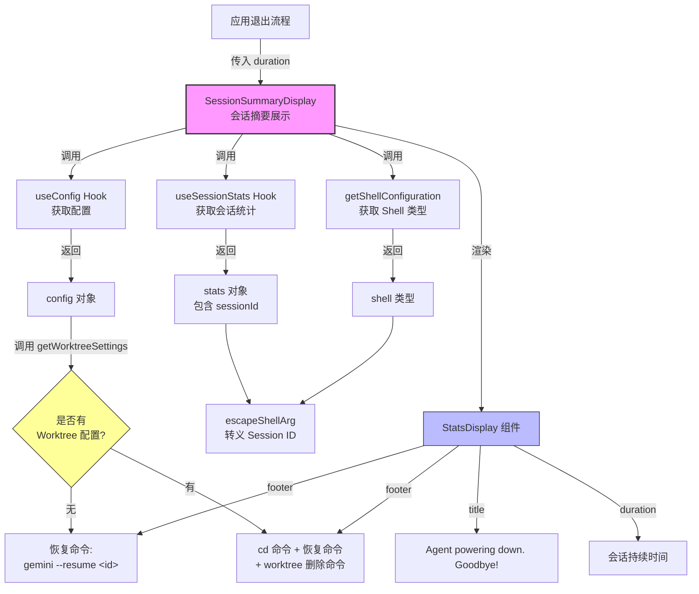

# SessionSummaryDisplay.tsx

## 概述

`SessionSummaryDisplay` 是在 Gemini CLI 会话结束时显示的会话摘要组件。当用户退出 CLI 会话时，该组件会渲染一个告别界面，包含会话的统计信息（通过内部委托给 `StatsDisplay` 组件），以及一条指导用户如何恢复该会话的提示命令。

该组件具备两种场景的处理能力：
1. **普通会话**：提供简单的 `gemini --resume <sessionId>` 恢复命令
2. **Git Worktree 会话**：当会话关联了 Git Worktree 时，提供包含 `cd` 到 worktree 目录和恢复会话的组合命令，以及手动删除 worktree 的命令

## 架构图（Mermaid）



## 核心组件

### SessionSummaryDisplay

| 属性 | 说明 |
|------|------|
| **类型** | React 函数组件（`React.FC`） |
| **导出** | 具名导出 |
| **返回值** | `StatsDisplay` 组件的 JSX |

#### Props 接口

```typescript
interface SessionSummaryDisplayProps {
  duration: string;  // 会话持续时间的格式化字符串
}
```

| 参数名 | 类型 | 说明 |
|--------|------|------|
| `duration` | `string` | 会话的持续时间，已格式化为可读字符串（如 "5m 30s"） |

#### 内部逻辑流程

```
1. 通过 useSessionStats() 获取会话统计数据（stats），其中包含 sessionId
2. 通过 useConfig() 获取应用配置（config）
3. 通过 getShellConfiguration() 获取当前 Shell 类型（shell）
4. 从 config 获取 worktreeSettings（Git Worktree 配置）
5. 使用 escapeShellArg() 对 sessionId 进行 Shell 转义
6. 构建 footer 文本：
   - 无 Worktree：单行恢复命令
   - 有 Worktree：两行文本（cd + resume 命令 和 worktree remove 命令）
7. 渲染 StatsDisplay 组件，传入 title、duration、footer
```

#### Footer 生成逻辑

**场景一：普通会话（无 Worktree）**

```
To resume this session: gemini --resume <escaped-session-id>
```

**场景二：Git Worktree 会话**

```
To resume work in this worktree: cd <escaped-worktree-path> && gemini --resume <escaped-session-id>
To remove manually: git worktree remove <escaped-worktree-path>
```

#### 渲染输出

```
StatsDisplay
  ├── title: "Agent powering down. Goodbye!"
  ├── duration: {props.duration}
  └── footer: {动态生成的恢复命令文本}
```

`StatsDisplay` 是一个功能丰富的统计展示组件，它会自行通过 `useSessionStats()` 获取详细的指标数据（模型使用、工具调用、文件操作等），`SessionSummaryDisplay` 只需传入 title、duration 和 footer 三个定制化参数。

## 依赖关系

### 内部依赖

| 依赖模块 | 导入内容 | 说明 |
|----------|----------|------|
| `./StatsDisplay.js` | `StatsDisplay` | 统计信息展示组件，负责渲染完整的会话统计 UI |
| `../contexts/SessionContext.js` | `useSessionStats` | React Hook，从 SessionStatsContext 获取会话统计数据（包含 sessionId） |
| `../contexts/ConfigContext.js` | `useConfig` | React Hook，从 ConfigContext 获取应用配置对象 |

### 外部依赖

| 依赖包 | 导入内容 | 说明 |
|--------|----------|------|
| `react` | `React`（类型导入） | 用于 `React.FC` 类型声明 |
| `@google/gemini-cli-core` | `escapeShellArg` | Shell 参数转义函数，根据不同 Shell 类型安全地转义字符串 |
| `@google/gemini-cli-core` | `getShellConfiguration` | 获取当前系统的 Shell 配置信息（Shell 类型、路径等） |

## 关键实现细节

1. **Shell 安全转义**：所有嵌入到命令字符串中的动态值（sessionId、worktree path）都通过 `escapeShellArg(arg, shell)` 进行转义。该函数会根据当前 Shell 类型（bash、zsh、PowerShell、cmd 等）应用对应的转义规则，防止特殊字符（空格、引号、通配符等）导致命令注入或执行错误。这是安全编码的重要实践。

2. **Git Worktree 感知**：组件通过 `config.getWorktreeSettings()` 检测当前会话是否运行在 Git Worktree 模式下。`WorktreeSettings` 接口包含：
   - `name: string` — Worktree 名称
   - `path: string` — Worktree 文件系统路径
   - `baseSha: string` — 基础提交的 SHA

   当存在 Worktree 配置时，footer 提供两条命令：一条用于切换到 worktree 目录并恢复会话，另一条用于手动删除 worktree。

3. **组件职责划分**：`SessionSummaryDisplay` 专注于业务逻辑（构建 footer 文本），将 UI 渲染完全委托给 `StatsDisplay`。`StatsDisplay` 组件接收 `title`、`duration`、`footer` 等参数，并自行获取和渲染详细的统计指标。这种分层设计使得：
   - `SessionSummaryDisplay` 可以轻松测试业务逻辑
   - `StatsDisplay` 可以在不同场景复用（如正常退出、错误退出等）

4. **React.FC 类型声明**：使用 `React.FC<SessionSummaryDisplayProps>` 作为组件类型，这是 React 函数组件的标准类型声明方式。与其他文件使用的 `(): React.JSX.Element => (...)` 箭头函数风格不同，这里使用了更正式的 FC（FunctionComponent）泛型。

5. **let 与条件重赋值**：footer 变量使用 `let` 声明，先赋值默认的普通会话恢复命令，然后在 `if (worktreeSettings)` 条件块中覆盖为 Worktree 相关的命令。这种模式简洁明了，避免了三元表达式在多行模板字符串场景下的可读性问题。

6. **Context 依赖**：组件依赖两个 React Context：
   - **SessionStatsContext**（通过 `useSessionStats`）：提供 `stats.sessionId`
   - **ConfigContext**（通过 `useConfig`）：提供 `config.getWorktreeSettings()`

   这意味着该组件必须在对应的 Provider 树内渲染，否则会抛出运行时错误。

7. **告别语设计**："Agent powering down. Goodbye!" 作为标题传递给 `StatsDisplay`，这是一个拟人化的告别语，配合会话统计数据，为用户的 CLI 使用体验画上句号。
