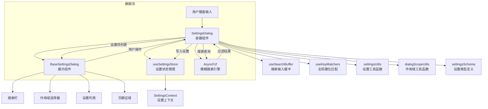

# SettingsDialog.tsx

## 概述

`SettingsDialog` 是 Gemini CLI 的核心设置对话框组件，基于 React (Ink) 构建的终端 UI 组件。它提供了一个完整的设置管理界面，支持多作用域（User / Workspace / System）设置的浏览、搜索、切换、编辑和重置，并能检测需要重启才能生效的设置变更，提示用户重启应用。

该组件本身不直接渲染 UI 元素，而是将数据准备好后委托给 `BaseSettingsDialog` 进行实际渲染，体现了典型的**容器组件 / 展示组件**分离模式。

## 架构图（Mermaid）



## 核心组件

### 1. 接口定义

#### `FzfResult`
模糊搜索结果的类型定义：
```typescript
interface FzfResult {
  item: string;       // 匹配的原始字符串
  start: number;      // 匹配起始位置
  end: number;        // 匹配结束位置
  score: number;      // 匹配分数
  positions?: number[]; // 匹配字符位置数组
}
```

#### `SettingsDialogProps`
组件的 Props 接口：
```typescript
interface SettingsDialogProps {
  onSelect: (settingName: string | undefined, scope: SettingScope) => void;  // 选择/关闭回调
  onRestartRequest?: () => void;           // 重启请求回调
  availableTerminalHeight?: number;        // 可用终端高度
}
```

### 2. 常量

- `MAX_ITEMS_TO_SHOW = 8`：列表中最多显示 8 个设置项
- `KEY_UP / KEY_CTRL_P`：向上导航键绑定
- `KEY_DOWN / KEY_CTRL_N`：向下导航键绑定

### 3. 辅助函数

#### `getActiveRestartRequiredSettings(settings: SettingsState)`
在组件挂载时创建"需要重启的设置"的初始快照。返回一个嵌套 Map：
```
设置键 -> Map { 作用域名 -> JSON序列化的值 }
```
用于后续对比检测设置是否发生变化。

### 4. 核心状态管理

| 状态 | 类型 | 用途 |
|------|------|------|
| `selectedScope` | `LoadableSettingScope` | 当前选中的设置作用域（默认 User） |
| `activeRestartRequiredSettings` | `Map<string, Map<string, string>>` | 挂载时的重启设置快照（不变） |
| `searchQuery` | `string` | 搜索查询字符串 |
| `filteredKeys` | `string[]` | 经搜索过滤后的设置键列表 |

### 5. 核心逻辑

#### 模糊搜索机制
- 使用 `AsyncFzf` 库实现异步模糊搜索
- 搜索基于设置的 `label`（显示名称）而非键名
- 通过 `useMemo` 缓存 Fzf 实例和搜索映射表
- 通过 `useEffect` 在搜索查询变化时异步执行搜索，并用 `active` 标志防止竞态条件

#### 重启检测机制
- `pendingRestartRequiredSettings`（useMemo）：对比当前设置与挂载时快照
- 遍历所有作用域（User / Workspace / System），检查值是否变化
- 只要任一作用域有变化，就标记该设置为"待重启"
- `showRestartPrompt`：当存在待重启设置时为 `true`

#### 设置项数据准备
`items`（useMemo）将 `settingKeys` 映射为 `SettingsDialogItem[]`，每个项包含：
- `key`：设置键名
- `label`：显示标签
- `description`：描述文本
- `type`：设置类型（boolean / enum / string 等）
- `displayValue`：显示值（含 `*` 修改指示器）
- `isGreyedOut`：是否灰显（当前作用域未设置，回退到默认值）
- `scopeMessage`：作用域提示信息
- `rawValue`：原始值
- `editValue`：行内编辑值

#### 回调处理器

| 回调 | 功能 |
|------|------|
| `handleScopeChange` | 切换设置作用域 |
| `handleItemToggle` | 切换布尔/枚举类型设置值（循环切换枚举选项） |
| `handleEditCommit` | 提交行内编辑的新值（解析并保存） |
| `handleItemClear` | 清除当前作用域的设置值（回退到默认） |
| `handleClose` | 关闭对话框（调用 `onSelect(undefined, ...)`) |
| `handleKeyPress` | 自定义按键处理（`r` 键触发重启） |

### 6. 渲染逻辑

组件最终渲染 `<BaseSettingsDialog>`，传入所有准备好的数据和回调：
- 标题为 "Settings"
- 重启提示时边框变为警告色
- 搜索功能在重启提示时禁用
- 仅当工作区存在时显示作用域选择器
- 页脚显示重启提示信息

## 依赖关系

### 内部依赖

| 模块 | 导入内容 | 用途 |
|------|----------|------|
| `../hooks/useKeypress.js` | `Key` 类型 | 键盘事件类型定义 |
| `../semantic-colors.js` | `theme` | 语义化颜色主题 |
| `../../config/settings.js` | `SettingScope`, `LoadableSettingScope`, `Settings` | 设置作用域和类型定义 |
| `../../utils/dialogScopeUtils.js` | `getScopeMessageForSetting` | 获取设置的作用域提示信息 |
| `../../utils/settingsUtils.js` | 多个工具函数 | 设置的读取、显示、解析等核心工具 |
| `../contexts/SettingsContext.js` | `useSettingsStore`, `SettingsState` | 设置状态全局存储 |
| `../utils/textUtils.js` | `getCachedStringWidth` | 计算文本宽度（带缓存） |
| `../../config/settingsSchema.js` | `SettingsType`, `SettingsValue`, `TOGGLE_TYPES` | 设置类型和值的类型定义 |
| `@google/gemini-cli-core` | `debugLogger` | 调试日志 |
| `../hooks/useSearchBuffer.js` | `useSearchBuffer` | 搜索输入缓冲 Hook |
| `./shared/BaseSettingsDialog.js` | `BaseSettingsDialog`, `SettingsDialogItem` | 基础设置对话框展示组件 |
| `../hooks/useKeyMatchers.js` | `useKeyMatchers` | 键位匹配器 Hook |
| `../key/keyBindings.js` | `Command`, `KeyBinding` | 命令枚举和键绑定类 |

### 外部依赖

| 包名 | 导入内容 | 用途 |
|------|----------|------|
| `react` | `useState`, `useMemo`, `useCallback`, `useEffect` | React Hooks |
| `ink` | `Text` | 终端 UI 文本组件 |
| `fzf` | `AsyncFzf` | 异步模糊搜索库 |

## 关键实现细节

1. **容器/展示分离**：`SettingsDialog` 只负责数据逻辑和状态管理，所有 UI 渲染委托给 `BaseSettingsDialog`。这使得设置对话框的逻辑可独立测试，UI 可复用。

2. **重启检测采用快照对比**：在组件挂载时通过 `useState(() => ...)` 惰性初始化捕获设置快照，后续通过 `useMemo` 与当前值对比，精确检测哪些设置在哪个作用域发生了变化。使用 `JSON.stringify` 进行深度比较。

3. **异步模糊搜索的竞态处理**：`useEffect` 中通过闭包变量 `active` 确保搜索结果不会在组件卸载或新搜索发起后被错误应用。

4. **枚举值循环切换**：`handleItemToggle` 对枚举类型实现了环形切换逻辑 -- 到达最后一个选项后回到第一个。

5. **自定义键位映射**：在全局键位匹配器基础上扩展了 `Ctrl+P/N` 作为 `Up/Down` 的替代键，适应不同用户习惯。

6. **标签宽度预计算**：`maxLabelOrDescriptionWidth` 遍历所有设置项预计算最大宽度，确保对齐显示。该值随作用域切换而重新计算。

7. **搜索与重启互斥**：当需要显示重启提示时，搜索功能自动禁用（`showSearch = !showRestartPrompt`），避免用户界面混乱。

8. **设置值的灰显策略**：当某个设置在当前作用域未显式设置（回退到继承值或默认值）时，显示为灰色，帮助用户区分"本作用域设置的值"和"继承的值"。
