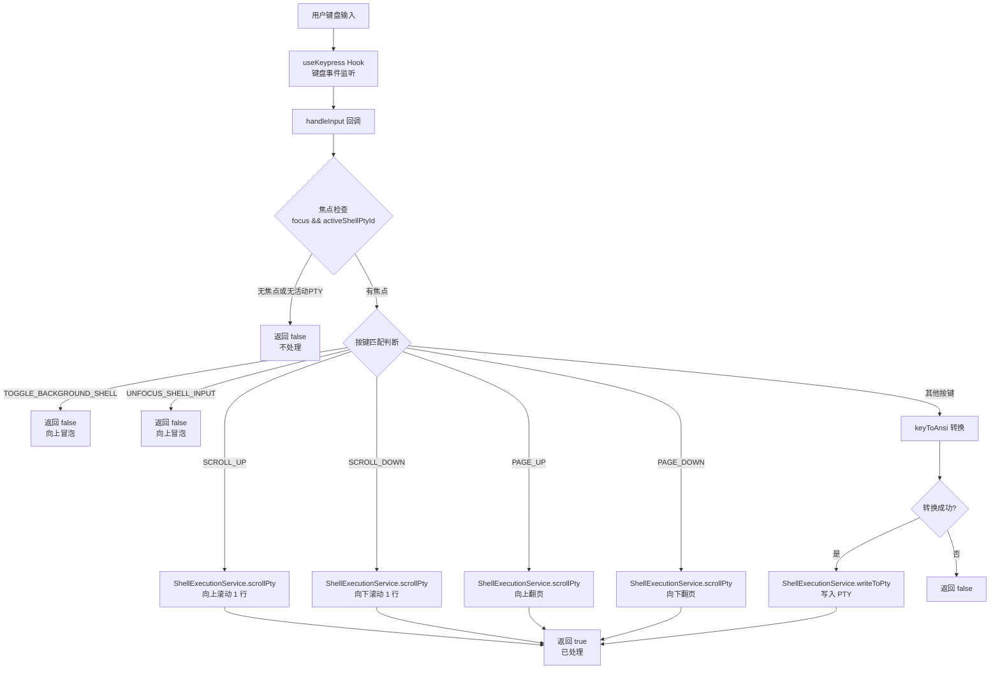
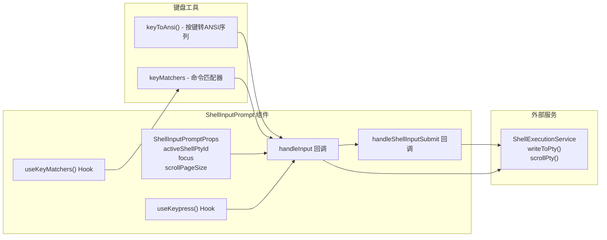

# ShellInputPrompt.tsx

## 概述

`ShellInputPrompt.tsx` 是 Gemini CLI 终端 UI 中的 **Shell 输入提示组件**，负责捕获用户的键盘输入并将其转发到活动的伪终端（PTY）进程。该组件本身不渲染任何可见的 UI 元素（`return null`），它是一个纯粹的 **键盘事件处理器组件**（headless component）。

核心职责：
1. 监听键盘输入事件
2. 将按键转换为 ANSI 转义序列
3. 通过 `ShellExecutionService` 写入活动 PTY
4. 处理滚动命令（上/下滚动、翻页）
5. 允许特定快捷键（如切换背景 Shell、取消焦点）向上冒泡

## 架构图（Mermaid）





## 核心组件

### 1. `ShellInputPromptProps` 接口

| 属性 | 类型 | 默认值 | 说明 |
|------|------|--------|------|
| `activeShellPtyId` | `number \| null` | - | 当前活动的伪终端 ID，`null` 表示无活动 PTY |
| `focus` | `boolean` | `true` | 组件是否获得焦点，未获得焦点时不处理输入 |
| `scrollPageSize` | `number` | `ACTIVE_SHELL_MAX_LINES` | 翻页滚动时每次滚动的行数 |

### 2. `ShellInputPrompt` 函数组件

这是一个 **无渲染组件**（返回 `null`），完全通过 React Hooks 实现其功能。

#### `handleShellInputSubmit` 回调

```typescript
const handleShellInputSubmit = useCallback(
  (input: string) => {
    if (activeShellPtyId) {
      ShellExecutionService.writeToPty(activeShellPtyId, input);
    }
  },
  [activeShellPtyId],
);
```

将字符串写入活动 PTY。仅在 `activeShellPtyId` 存在时执行。

#### `handleInput` 回调 - 核心键盘处理逻辑

这是组件的核心逻辑，处理流程如下：

1. **前置检查**：若 `focus` 为 false 或 `activeShellPtyId` 为 null，直接返回 false（不处理）

2. **冒泡快捷键**：以下两个命令返回 false，让事件向上冒泡到父组件处理：
   - `TOGGLE_BACKGROUND_SHELL`：切换后台 Shell 的快捷键
   - `UNFOCUS_SHELL_INPUT`：取消 Shell 输入焦点的快捷键（Shift+Tab）

3. **滚动命令**：
   - `SCROLL_UP`：向上滚动 1 行（`scrollPty(id, -1)`）
   - `SCROLL_DOWN`：向下滚动 1 行（`scrollPty(id, 1)`）
   - `PAGE_UP`：向上翻页（`scrollPty(id, -scrollPageSize)`）
   - `PAGE_DOWN`：向下翻页（`scrollPty(id, scrollPageSize)`）
   - 所有滚动命令返回 true（已处理，阻止冒泡）

4. **普通按键转发**：
   - 使用 `keyToAnsi(key)` 将按键对象转换为 ANSI 转义序列
   - 转换成功则通过 `handleShellInputSubmit` 写入 PTY，返回 true
   - 转换失败返回 false

5. **useKeypress 注册**：
   ```typescript
   useKeypress(handleInput, { isActive: focus });
   ```
   将 `handleInput` 注册为键盘事件处理器，仅在 `focus` 为 true 时激活。

### 3. 返回值

```typescript
return null;
```

组件不渲染任何 DOM 元素，纯粹作为键盘事件处理的载体。

## 依赖关系

### 内部依赖

| 模块路径 | 导入项 | 用途 |
|---------|-------|------|
| `../hooks/useKeypress.js` | `useKeypress` | 键盘事件监听 Hook |
| `../key/keyToAnsi.js` | `keyToAnsi`, `Key` (type) | 将 Key 对象转换为 ANSI 转义序列 |
| `../constants.js` | `ACTIVE_SHELL_MAX_LINES` | 翻页滚动默认行数常量 |
| `../key/keyMatchers.js` | `Command` | 命令枚举（SCROLL_UP/DOWN、PAGE_UP/DOWN 等） |
| `../hooks/useKeyMatchers.js` | `useKeyMatchers` | 获取命令到按键匹配函数的映射 |

### 外部依赖

| 包名 | 导入项 | 用途 |
|-----|-------|------|
| `react` | `useCallback` | React Hook，用于创建稳定的回调函数引用 |
| `react` | `React` (type) | 类型引用（`React.FC`） |
| `@google/gemini-cli-core` | `ShellExecutionService` | Shell 执行服务，提供 `writeToPty()` 和 `scrollPty()` 静态方法 |

## 关键实现细节

1. **无渲染组件模式（Headless Component）**：组件返回 `null`，不产生任何视觉输出。所有逻辑通过 Hooks 完成。这是 React 中常见的"逻辑组件"模式，将键盘事件处理逻辑封装为可复用的组件。

2. **按键事件的分层处理**：
   - 最高优先级：焦点和 PTY 存在性检查
   - 第二优先级：冒泡快捷键（返回 false 不消费事件）
   - 第三优先级：滚动命令（消费事件）
   - 最低优先级：ANSI 转义序列转发

   这种分层设计确保了快捷键系统与 Shell 输入不冲突。

3. **事件消费机制**：返回 `true` 表示事件已被处理（阻止冒泡），返回 `false` 表示事件未处理（允许冒泡到上层处理器）。`TOGGLE_BACKGROUND_SHELL` 和 `UNFOCUS_SHELL_INPUT` 故意返回 false，使这些全局快捷键在 Shell 输入模式下仍然可用。

4. **ANSI 转义序列转换**：通过 `keyToAnsi()` 将平台无关的 Key 对象转换为标准 ANSI 转义序列，然后写入 PTY。这使得箭头键、功能键、Ctrl 组合键等特殊按键能正确传递到 Shell 进程。

5. **滚动行为**：滚动由 `ShellExecutionService.scrollPty()` 处理，正值向下滚动，负值向上滚动。单行滚动使用 `+/-1`，翻页滚动使用 `+/-scrollPageSize`（默认为 `ACTIVE_SHELL_MAX_LINES`）。

6. **焦点控制**：`focus` prop 既控制 `handleInput` 内部的前置检查，也作为 `useKeypress` 的 `isActive` 参数。双重保障确保无焦点时完全不响应键盘事件。

7. **依赖项优化**：`handleShellInputSubmit` 和 `handleInput` 都使用 `useCallback` 包装，依赖列表精确指定，避免不必要的重新创建。
