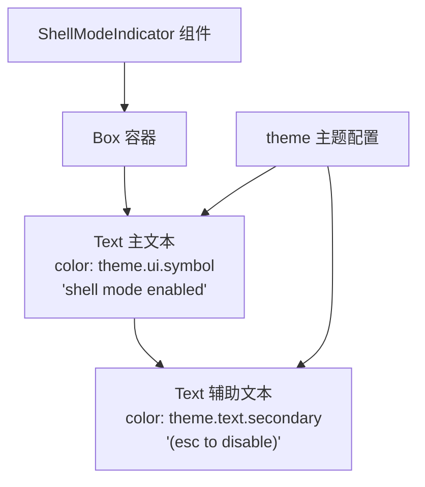
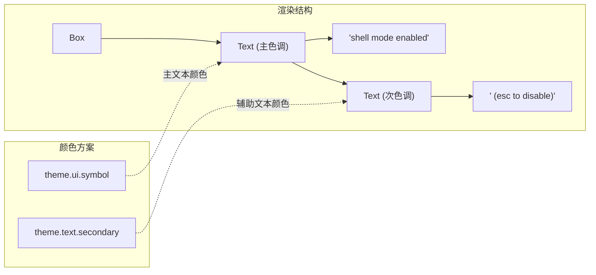

# ShellModeIndicator.tsx

## 概述

`ShellModeIndicator.tsx` 是 Gemini CLI 终端 UI 中的 **Shell 模式指示器组件**，一个极简的纯展示组件。当用户进入 Shell 模式时，该组件在界面上显示 "shell mode enabled (esc to disable)" 提示文本，告知用户当前处于 Shell 模式，并提供退出方式提示。

组件没有任何 props、state 或副作用，是一个完全静态的无状态展示组件。

## 架构图（Mermaid）





## 核心组件

### `ShellModeIndicator` 函数组件

```typescript
export const ShellModeIndicator: React.FC = () => (
  <Box>
    <Text color={theme.ui.symbol}>
      shell mode enabled
      <Text color={theme.text.secondary}> (esc to disable)</Text>
    </Text>
  </Box>
);
```

这是一个无 props 的纯函数组件，使用箭头函数简写形式。

#### 渲染结构

| 层级 | 元素 | 属性 | 内容 |
|------|------|------|------|
| 第 1 层 | `Box` | 默认（无特殊属性） | 容器 |
| 第 2 层 | `Text` | `color={theme.ui.symbol}` | "shell mode enabled" |
| 第 3 层 | `Text`（嵌套） | `color={theme.text.secondary}` | " (esc to disable)" |

#### 视觉效果

- **"shell mode enabled"** 使用 `theme.ui.symbol` 颜色（通常为较醒目的 UI 符号色）
- **" (esc to disable)"** 使用 `theme.text.secondary` 颜色（较淡的次要文本色，与主提示形成视觉层次对比）
- 两部分文本嵌套在同一个 `Text` 元素中，形成单行连续显示

## 依赖关系

### 内部依赖

| 模块路径 | 导入项 | 用途 |
|---------|-------|------|
| `../semantic-colors.js` | `theme` | 语义化颜色主题，提供 `theme.ui.symbol` 和 `theme.text.secondary` |

### 外部依赖

| 包名 | 导入项 | 用途 |
|-----|-------|------|
| `react` | `React` (type) | 类型引用（`React.FC`） |
| `ink` | `Box`, `Text` | Ink 框架布局和文本组件 |

## 关键实现细节

1. **完全无状态**：组件没有任何 props、state、refs 或 Hooks，每次渲染都输出完全相同的内容。这是 React 组件的最简形式。

2. **语义化颜色**：不硬编码颜色值，而是使用 `theme` 对象中的语义化颜色（`ui.symbol` 和 `text.secondary`），确保在不同终端主题下保持一致的视觉层次。

3. **嵌套 Text 实现多色文本**：Ink 框架中，同一行文本要使用不同颜色需要嵌套 `Text` 组件。外层 `Text` 设置主颜色，内层 `Text` 覆盖为次要颜色。

4. **条件渲染由父组件控制**：`ShellModeIndicator` 本身不判断是否处于 Shell 模式，而是由父组件决定何时渲染它。这符合 React 的单一职责原则——指示器只负责"显示"，不负责"判断是否显示"。

5. **用户引导**：文本中包含 "(esc to disable)" 提示，这是 CLI 工具常见的 UX 实践——在模式切换时提供即时的退出方式提示，降低用户因不知如何退出模式而产生的困惑。
