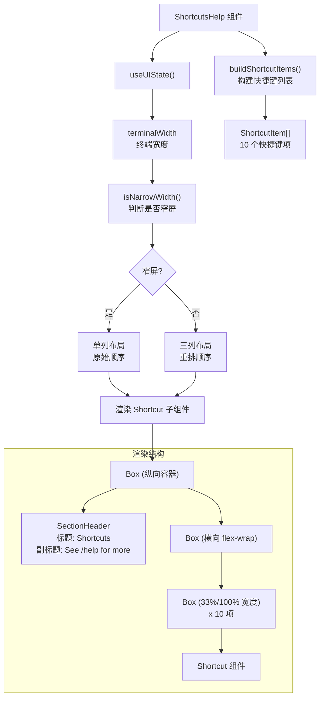
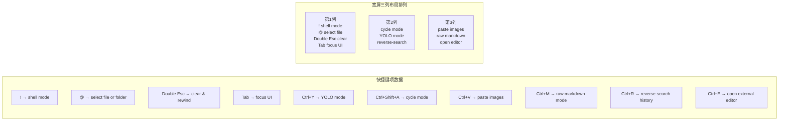

# ShortcutsHelp.tsx

## 概述

`ShortcutsHelp.tsx` 是 Gemini CLI 终端 UI 中的 **快捷键帮助面板组件**，负责向用户展示常用快捷键及其功能描述。该组件通常在应用启动时或用户请求帮助时显示，提供一个结构清晰的快捷键速查表。

组件具有 **响应式布局** 能力：
- **宽屏模式**：以 3 列网格布局展示快捷键，并对顺序进行重新排列以保持第一列的稳定性
- **窄屏模式**：以单列列表形式展示

快捷键的按键描述通过 `formatCommand` 工具函数动态生成，确保与用户实际的按键绑定配置保持一致。

## 架构图（Mermaid）





## 核心组件

### 1. `ShortcutItem` 类型

```typescript
type ShortcutItem = {
  key: string;        // 快捷键显示文本
  description: string; // 功能描述
};
```

表示一个快捷键条目的简单数据结构。

### 2. `buildShortcutItems()` 工厂函数

```typescript
const buildShortcutItems = (): ShortcutItem[] => [...]
```

构建快捷键列表数据。当前定义了 **10 个快捷键项**：

| 索引 | 按键 | 描述 | 来源 |
|------|------|------|------|
| 0 | `!` | shell mode | 硬编码 |
| 1 | `@` | select file or folder | 硬编码 |
| 2 | `Double Esc` | clear & rewind | 硬编码 |
| 3 | `formatCommand(FOCUS_SHELL_INPUT)` | focus UI | 动态生成 |
| 4 | `formatCommand(TOGGLE_YOLO)` | YOLO mode | 动态生成 |
| 5 | `formatCommand(CYCLE_APPROVAL_MODE)` | cycle mode | 动态生成 |
| 6 | `formatCommand(PASTE_CLIPBOARD)` | paste images | 动态生成 |
| 7 | `formatCommand(TOGGLE_MARKDOWN)` | raw markdown mode | 动态生成 |
| 8 | `formatCommand(REVERSE_SEARCH)` | reverse-search history | 动态生成 |
| 9 | `formatCommand(OPEN_EXTERNAL_EDITOR)` | open external editor | 动态生成 |

其中前三项（`!`、`@`、`Double Esc`）的按键文本是硬编码的字面量，后七项通过 `formatCommand()` 从 `Command` 枚举动态生成用户可读的快捷键字符串。

### 3. `Shortcut` 子组件

```typescript
const Shortcut: React.FC<{ item: ShortcutItem }> = ({ item }) => (
  <Box flexDirection="row">
    <Box flexShrink={0} marginRight={1}>
      <Text color={theme.text.accent}>{item.key}</Text>
    </Box>
    <Box flexGrow={1}>
      <Text color={theme.text.primary}>{item.description}</Text>
    </Box>
  </Box>
);
```

单个快捷键条目的展示组件：
- 左侧：**按键文本**，使用 `theme.text.accent`（强调色），`flexShrink={0}` 防止收缩，右侧留 1 字符间距
- 右侧：**描述文本**，使用 `theme.text.primary`（主文本色），`flexGrow={1}` 占据剩余空间

### 4. `ShortcutsHelp` 主组件

```typescript
export const ShortcutsHelp: React.FC = () => { ... }
```

无 props 组件，内部逻辑：

#### 4.1 终端宽度检测

```typescript
const { terminalWidth } = useUIState();
const isNarrow = isNarrowWidth(terminalWidth);
```

从 UI 状态上下文获取终端宽度，通过 `isNarrowWidth()` 判断是否为窄屏。

#### 4.2 响应式布局排列

**窄屏模式**：直接使用原始顺序（索引 0-9）。

**宽屏模式**：重排为 `[0, 5, 6, 1, 4, 7, 2, 8, 9, 3]`。这个顺序在 3 列布局（每行 3 项）下的排列效果为：

| 第 1 列 | 第 2 列 | 第 3 列 |
|---------|---------|---------|
| items[0]: `!` shell mode | items[5]: cycle mode | items[6]: paste images |
| items[1]: `@` select file | items[4]: YOLO mode | items[7]: raw markdown |
| items[2]: `Double Esc` clear & rewind | items[8]: reverse-search | items[9]: open editor |
| items[3]: `Tab` focus UI | | |

注释说明目的是 "Keep first column stable: !, @, Esc Esc, Tab Tab."

#### 4.3 渲染结构

```
Box (flexDirection="column", width="100%")
  SectionHeader (title=" Shortcuts", subtitle=" See /help for more")
  Box (flexDirection="row", flexWrap="wrap", paddingLeft=1, paddingRight=2)
    Box (width="33%"/"100%", paddingRight=2/0) x 10
      Shortcut (item)
```

- 外层 `Box`：纵向排列，全宽
- `SectionHeader`：标题区域，标题为 "Shortcuts"，副标题为 "See /help for more"
- 内层 `Box`：横向排列 + 自动换行（`flexWrap="wrap"`），形成网格效果
- 每项 `Box`：宽屏时占 33%（三列），窄屏时占 100%（单列）

## 依赖关系

### 内部依赖

| 模块路径 | 导入项 | 用途 |
|---------|-------|------|
| `../semantic-colors.js` | `theme` | 语义化颜色主题 |
| `../utils/isNarrowWidth.js` | `isNarrowWidth` | 判断终端宽度是否为窄屏 |
| `./shared/SectionHeader.js` | `SectionHeader` | 分区标题组件 |
| `../contexts/UIStateContext.js` | `useUIState` | 获取终端宽度等 UI 状态 |
| `../key/keyBindings.js` | `Command` | 命令枚举 |
| `../key/keybindingUtils.js` | `formatCommand` | 将 Command 枚举转为用户可读的快捷键字符串 |

### 外部依赖

| 包名 | 导入项 | 用途 |
|-----|-------|------|
| `react` | `React` (type) | 类型引用 |
| `ink` | `Box`, `Text` | Ink 框架布局和文本组件 |

## 关键实现细节

1. **动态快捷键文本**：大部分快捷键的显示文本通过 `formatCommand(Command.XXX)` 动态生成，而非硬编码。这意味着如果用户自定义了按键绑定，帮助面板会自动显示正确的按键。只有 `!`、`@`、`Double Esc` 这三个输入触发式的快捷键是硬编码的，因为它们是文本输入前缀而非键盘绑定。

2. **三列布局的项目重排**：在宽屏模式下，10 个项目被重新排列为 `[0, 5, 6, 1, 4, 7, 2, 8, 9, 3]` 的顺序。由于使用了 `flexWrap="wrap"` + `width="33%"` 形成三列布局，每行按顺序填充 3 项，因此重排后的效果是第一列始终包含 `!`、`@`、`Double Esc`、`Tab` 这四个最基础的快捷键，保持视觉稳定性。

3. **flexWrap 网格布局**：通过 `flexDirection="row"` + `flexWrap="wrap"` + 固定百分比宽度实现 CSS Grid 般的效果。这是 Ink 终端框架中实现多列布局的惯用方法。

4. **语义化颜色分层**：
   - `theme.text.accent`：快捷键文本使用强调色，视觉上优先吸引注意
   - `theme.text.primary`：描述文本使用主文本色，保持可读性
   - 两种颜色的对比帮助用户快速扫描定位目标快捷键

5. **SectionHeader 复用**：标题使用共享的 `SectionHeader` 组件，保持与应用其他区域的视觉一致性。副标题 "See /help for more" 引导用户获取更多帮助。

6. **响应式设计**：组件根据终端宽度自适应布局。窄屏时切换为单列布局，不仅改变宽度百分比（100%），还移除了列间距（`paddingRight=0`），充分利用有限的终端空间。

7. **Key 的唯一性**：`key` 属性使用 `${item.key}-${index}` 组合，虽然理论上 `item.key` 已经唯一（每个快捷键不同），但加上 `index` 确保了极端情况下的安全性。
