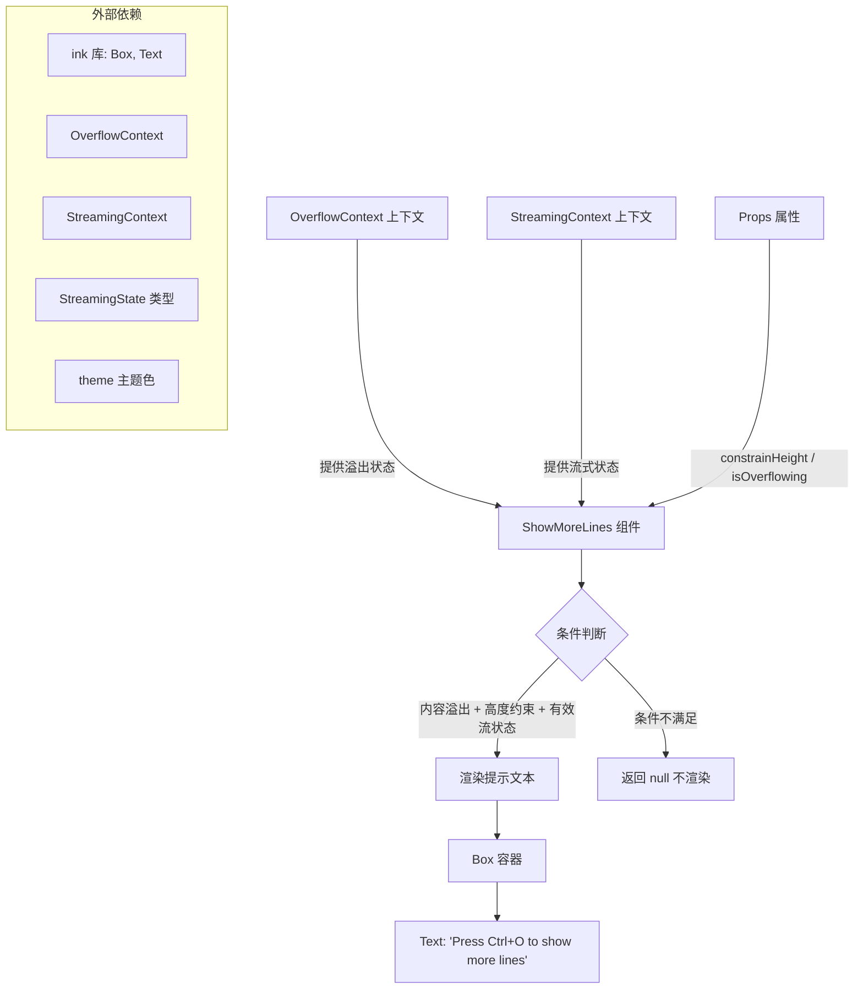

# ShowMoreLines.tsx

## 概述

`ShowMoreLines` 是一个 React (Ink) 功能组件，用于在终端 UI 中当内容溢出可视区域时，向用户显示"按 Ctrl+O 查看更多行"的提示信息。该组件是 Gemini CLI 终端界面的辅助交互提示组件，帮助用户了解当前有被截断的内容可以展开查看。

该组件根据三个条件判断是否渲染提示：
1. 内容是否溢出（`isOverflowing`）
2. 是否启用了高度约束（`constrainHeight`）
3. 当前流式状态是否为空闲、等待确认或正在响应

只有三个条件同时满足时，才会渲染提示文本。

## 架构图（Mermaid）



## 核心组件

### ShowMoreLinesProps 接口

| 属性 | 类型 | 必填 | 说明 |
|------|------|------|------|
| `constrainHeight` | `boolean` | 是 | 是否启用高度约束模式。当为 `true` 时，内容可能被截断 |
| `isOverflowing` | `boolean` | 否 | 可选的外部溢出状态覆盖。如果未提供，则从 `OverflowContext` 中推导 |

### ShowMoreLines 函数组件

主要逻辑流程：

1. **获取上下文状态**：通过 `useOverflowState()` 获取溢出上下文状态，通过 `useStreamingContext()` 获取当前流式传输状态。
2. **计算溢出判定**：优先使用 props 传入的 `isOverflowingProp`；若未提供，则检查 `overflowState.overflowingIds.size > 0` 来判断是否有溢出内容。
3. **渲染条件判断**：只有同时满足以下全部条件时才渲染提示：
   - `isOverflowing` 为 `true`
   - `constrainHeight` 为 `true`
   - `streamingState` 为 `Idle`、`WaitingForConfirmation` 或 `Responding` 之一
4. **渲染输出**：使用 Ink 的 `Box` 和 `Text` 组件渲染带有主题色彩的提示文本。

### 渲染输出结构

```
<Box paddingX={1} marginBottom={1}>
  <Text color={theme.text.accent} wrap="truncate">
    Press Ctrl+O to show more lines
  </Text>
</Box>
```

- `paddingX={1}`：左右各留 1 个字符的内边距
- `marginBottom={1}`：底部留 1 行外边距
- `wrap="truncate"`：文本过长时截断而非换行
- 文本颜色使用 `theme.text.accent` 主题强调色

## 依赖关系

### 内部依赖

| 模块 | 导入项 | 用途 |
|------|--------|------|
| `../contexts/OverflowContext.js` | `useOverflowState` | 获取当前溢出状态上下文，包含溢出元素 ID 集合 |
| `../contexts/StreamingContext.js` | `useStreamingContext` | 获取当前流式传输状态（空闲/等待确认/响应中等） |
| `../types.js` | `StreamingState` | 流式传输状态枚举，用于条件判断 |
| `../semantic-colors.js` | `theme` | 语义化主题色配置，提供 `text.accent` 颜色 |

### 外部依赖

| 包名 | 导入项 | 用途 |
|------|--------|------|
| `ink` | `Box`, `Text` | Ink 框架的布局容器和文本渲染组件，用于终端 UI 渲染 |

## 关键实现细节

1. **双重溢出判断机制**：组件支持两种溢出判断方式——通过 props 直接传入 `isOverflowing`，或者从 `OverflowContext` 上下文中自动推导。使用空值合并运算符 `??` 实现优先级：props 优先，上下文兜底。

2. **流式状态过滤**：提示仅在 `Idle`（空闲）、`WaitingForConfirmation`（等待确认）和 `Responding`（响应中）三种状态下显示。这意味着在其他状态（如正在加载、出错等）下不会显示该提示，避免干扰用户。

3. **条件渲染模式**：组件采用"提前返回 null"的模式，当任一条件不满足时立即返回 `null`，不进行任何渲染。这是 React 组件中常见的条件渲染最佳实践。

4. **快捷键提示**：提示文本固定为 `Press Ctrl+O to show more lines`，对应 Gemini CLI 中展开溢出内容的快捷键 `Ctrl+O`。

5. **主题集成**：使用语义化主题颜色 `theme.text.accent` 来着色提示文本，确保与整体 CLI 主题风格一致，同时以强调色突出显示提示信息的可操作性。
