# StatsDisplay.tsx

## 概述

`StatsDisplay` 是 Gemini CLI 终端界面中用于展示**会话统计信息面板**的核心 React (Ink) 组件。它以带边框的卡片式布局呈现当前 CLI 会话的完整统计数据，包括交互摘要（认证方式、工具调用、成功率、用户一致率、代码变更）、性能指标（墙钟时间、Agent 活跃时间、API 耗时、工具耗时），以及模型使用情况表格（请求数、Token 用量、配额进度条、缓存效率等）。

该文件导出主组件 `StatsDisplay`，同时内部定义了多个辅助子组件：`StatRow`（统计行）、`SubStatRow`（缩进子行）、`Section`（分区标题）、`ModelUsageTable`（模型用量表格），以及辅助函数 `buildModelRows`（构建模型行数据）。

## 架构图（Mermaid）

```mermaid
graph TD
    A[StatsDisplay 主组件] --> B[Section: 交互摘要]
    A --> C[Section: 性能指标]
    A --> D[ModelUsageTable 模型用量表格]
    A --> E[ThemedGradient 标题/页脚]

    B --> F[StatRow: 会话 ID]
    B --> G[StatRow: 认证方式]
    B --> H[StatRow: 层级]
    B --> I[StatRow: Google AI 积分]
    B --> J[StatRow: 工具调用]
    B --> K[StatRow: 成功率]
    B --> L[StatRow: 用户一致率]
    B --> M[StatRow: 代码变更]

    C --> N[StatRow: 墙钟时间]
    C --> O[StatRow: Agent 活跃时间]
    C --> P[SubStatRow: API 耗时]
    C --> Q[SubStatRow: 工具耗时]

    D --> R[buildModelRows 构建行数据]
    R --> S[活跃模型行]
    R --> T[仅配额模型行]
    D --> U[renderProgressBar 进度条渲染]
    D --> V[QuotaStatsInfo 配额统计]

    subgraph 上下文依赖
        W[SessionContext: useSessionStats]
        X[SettingsContext: useSettings]
        Y[ConfigContext: useConfig]
    end

    subgraph 工具函数
        Z[computeSessionStats]
        AA[formatDuration]
        AB[formatResetTime]
        AC[getStatusColor]
        AD[getUsedStatusColor]
    end

    A --> W
    A --> X
    A --> Y
    A --> Z
```



## 核心组件

### 1. StatRow 组件

内部辅助组件，渲染一行统计数据。

| 属性 | 类型 | 说明 |
|------|------|------|
| `title` | `string` | 行标签文本 |
| `children` | `React.ReactNode` | 行值内容（支持复杂嵌套） |

- 标签宽度固定为 28 字符，使用 `theme.text.link` 着色
- 通过固定宽度实现左侧"沟槽"对齐效果

### 2. SubStatRow 组件

缩进的二级统计行，用于展示子项指标。

| 属性 | 类型 | 说明 |
|------|------|------|
| `title` | `string` | 子行标签文本 |
| `children` | `React.ReactNode` | 子行值内容 |

- 左侧缩进 2 字符 (`paddingLeft={2}`)
- 标签前缀为 `» `，使用 `theme.text.secondary` 着色
- 标签宽度为 26 字符（比 StatRow 少 2，补偿缩进）

### 3. Section 组件

分区容器，用于将相关统计行分组并添加粗体标题。

| 属性 | 类型 | 说明 |
|------|------|------|
| `title` | `string` | 分区标题 |
| `children` | `React.ReactNode` | 分区内容 |

- 纵向排列 (`flexDirection="column"`)
- 底部留 1 行间距 (`marginBottom={1}`)
- 标题使用 `bold` + `theme.text.primary`

### 4. buildModelRows 函数

纯逻辑函数，构建模型表格的统一行数据列表。

**参数：**

| 参数 | 类型 | 说明 |
|------|------|------|
| `models` | `Record<string, ModelMetrics>` | 各模型的使用指标数据 |
| `config` | `Config` | 应用配置对象 |
| `quotas` | `RetrieveUserQuotaResponse` | 可选，用户配额信息 |
| `useGemini3_1` | `boolean` | 是否启用 Gemini 3.1 |
| `useGemini3_1FlashLite` | `boolean` | 是否启用 Gemini 3.1 Flash Lite |
| `useCustomToolModel` | `boolean` | 是否使用自定义工具模型 |

**逻辑：**
1. 将模型名中的 `-001` 后缀去除（`getBaseModelName`）
2. 构建"活跃模型行"：从 `models` 中提取有实际使用数据的模型
3. 构建"仅配额模型行"：从 `quotas.buckets` 中找出有配额但未使用的活跃模型
4. 合并两种行并返回

**返回结构：**
```typescript
{
  key: string;
  modelName: string;
  requests: number | string;
  cachedTokens: string;
  inputTokens: string;
  outputTokens: string;
  bucket?: QuotaBucket;
  isActive: boolean;
}
```

### 5. ModelUsageTable 组件

模型用量表格组件，支持两种展示模式：
- **Token 详情模式**（无配额数据时）：显示输入 Token、缓存读取、输出 Token
- **配额模式**（有配额数据时）：显示使用进度条、百分比、重置时间

**核心属性：**

| 属性 | 类型 | 说明 |
|------|------|------|
| `models` | `Record<string, ModelMetrics>` | 模型指标 |
| `config` | `Config` | 配置对象 |
| `quotas` | `RetrieveUserQuotaResponse` | 配额响应 |
| `cacheEfficiency` | `number` | 缓存效率百分比 |
| `totalCachedTokens` | `number` | 总缓存 Token 数 |
| `currentModel` | `string` | 当前使用的模型名 |
| `pooledRemaining` | `number` | 池化剩余配额 |
| `pooledLimit` | `number` | 池化配额上限 |
| `pooledResetTime` | `string` | 池化配额重置时间 |
| `useGemini3_1` | `boolean` | 是否启用 Gemini 3.1 |
| `useGemini3_1FlashLite` | `boolean` | 是否启用 Flash Lite |
| `useCustomToolModel` | `boolean` | 是否使用自定义工具模型 |

**内部函数 `renderProgressBar`：**
- 渲染文本进度条，使用 `▬` 字符
- 已用部分使用状态颜色，空白部分使用 `theme.border.default`
- 对边界值做了特殊处理：用量 > 0 但近似 0 时至少显示 1 格，< 100% 但近似 100% 时最多显示 19 格

**列宽配置：**
- `nameWidth`: 23
- `requestsWidth`: 5
- `uncachedWidth`: 15
- `cachedWidth`: 14
- `outputTokensWidth`: 15
- `percentageWidth`: 6（仅配额模式）
- `resetWidth`: 22（仅配额模式）
- `usageLimitWidth`: 动态计算，自适应终端宽度

### 6. StatsDisplay 主组件（导出）

**Props 接口：**

| 属性 | 类型 | 必填 | 说明 |
|------|------|------|------|
| `duration` | `string` | 是 | 会话持续时间格式化字符串 |
| `title` | `string` | 否 | 自定义标题，默认"Session Stats" |
| `quotas` | `RetrieveUserQuotaResponse` | 否 | 用户配额数据 |
| `footer` | `string` | 否 | 页脚文本 |
| `selectedAuthType` | `string` | 否 | 选定的认证类型 |
| `userEmail` | `string` | 否 | 用户邮箱 |
| `tier` | `string` | 否 | 用户层级 |
| `currentModel` | `string` | 否 | 当前使用模型 |
| `quotaStats` | `QuotaStats` | 否 | 配额统计 |
| `creditBalance` | `number` | 否 | Google AI 积分余额 |

**渲染结构：**
```
┌─────────────────────────── 圆角边框 ──────────────────────────┐
│ [标题: ThemedGradient 或默认 "Session Stats"]                  │
│                                                                │
│ Section: 交互摘要                                              │
│   会话 ID / 认证方式 / 层级 / 积分 / 工具调用 / 成功率 / ...   │
│                                                                │
│ Section: 性能                                                  │
│   墙钟时间 / Agent 活跃时间                                    │
│     » API 耗时                                                 │
│     » 工具耗时                                                 │
│                                                                │
│ ModelUsageTable: 模型用量表格                                  │
│   Model  Reqs  [Input/Cached/Output 或 Usage/Reset]            │
│   ─────────────────────────────────────                        │
│   gemini-2.5-pro   12   ...                                   │
│   ...                                                          │
│                                                                │
│ [页脚: ThemedGradient]                                         │
└────────────────────────────────────────────────────────────────┘
```

## 依赖关系

### 内部依赖

| 模块 | 导入项 | 用途 |
|------|--------|------|
| `./ThemedGradient.js` | `ThemedGradient` | 渲染渐变主题文本（标题/页脚） |
| `../semantic-colors.js` | `theme` | 语义化主题颜色配置 |
| `../utils/formatters.js` | `formatDuration`, `formatResetTime` | 时间格式化工具 |
| `../contexts/SessionContext.js` | `useSessionStats`, `ModelMetrics` | 会话统计上下文与模型指标类型 |
| `../utils/displayUtils.js` | `getStatusColor`, `getUsedStatusColor`, 各阈值常量 | 状态颜色计算与阈值定义 |
| `../utils/computeStats.js` | `computeSessionStats` | 计算派生统计数据 |
| `@google/gemini-cli-core` | `Config`, `RetrieveUserQuotaResponse`, `isActiveModel`, `getDisplayString`, `isAutoModel`, `AuthType` | 核心配置与模型工具函数 |
| `../contexts/SettingsContext.js` | `useSettings` | 用户设置上下文 |
| `../contexts/ConfigContext.js` | `useConfig` | 应用配置上下文 |
| `../types.js` | `QuotaStats` | 配额统计类型 |
| `./QuotaStatsInfo.js` | `QuotaStatsInfo` | 配额统计信息子组件 |

### 外部依赖

| 包名 | 导入项 | 用途 |
|------|--------|------|
| `react` | `React` (类型) | React 类型定义 |
| `ink` | `Box`, `Text`, `useStdout` | Ink 终端 UI 框架组件与 stdout Hook |

## 关键实现细节

1. **双模式表格展示**：`ModelUsageTable` 根据是否有配额数据 (`quotas`) 自动切换展示模式。有配额时显示进度条和重置时间，无配额时显示详细 Token 统计。这种设计使得组件在不同认证/计费场景下都能提供最有价值的信息。

2. **自适应终端宽度**：通过 `useStdout()` 获取终端列数，动态计算 `usageLimitWidth`（配额进度条列宽），在 `[10, 24]` 范围内自适应，确保在不同终端大小下都有合理布局。

3. **进度条边界值处理**：`renderProgressBar` 函数对 0% 和 100% 边界做了精细处理——使用量大于 0 但四舍五入为 0 时至少显示 1 格填充，使用量小于 100% 但四舍五入为 100% 时最多显示 `totalSteps - 1` 格，避免误导用户。

4. **模型行合并策略**：`buildModelRows` 将两类来源的数据合并——实际使用过的模型（有 metrics 数据）和仅有配额的模型（有 bucket 但无使用记录），通过 `isActive` 标记区分，UI 层据此使用不同颜色（主色/次要色）。

5. **颜色阈值系统**：通过 `getStatusColor` 和 `getUsedStatusColor` 函数配合预定义阈值常量（如 `TOOL_SUCCESS_RATE_HIGH`、`QUOTA_USED_WARNING_THRESHOLD` 等），实现成功率、一致率、缓存效率、配额使用率的分级着色（绿/黄/红），提供直观的视觉反馈。

6. **条件渲染的用户身份信息**：认证方式、层级、积分等敏感信息仅在 `settings.merged.ui.showUserIdentity` 为 `true` 时展示，尊重用户隐私设置。

7. **Auto 模型的池化配额提示**：当 `currentModel` 是自动模型 (`isAutoModel`) 且有池化配额数据时，会额外显示 `QuotaStatsInfo` 组件和提示文本 "For a full token breakdown, run `/stats model`."，引导用户获取更详细信息。

8. **模型名标准化**：`getBaseModelName` 去除 `-001` 后缀，再通过 `getDisplayString` 转换为用户友好的显示名称，确保同一模型的不同版本不会重复显示。
