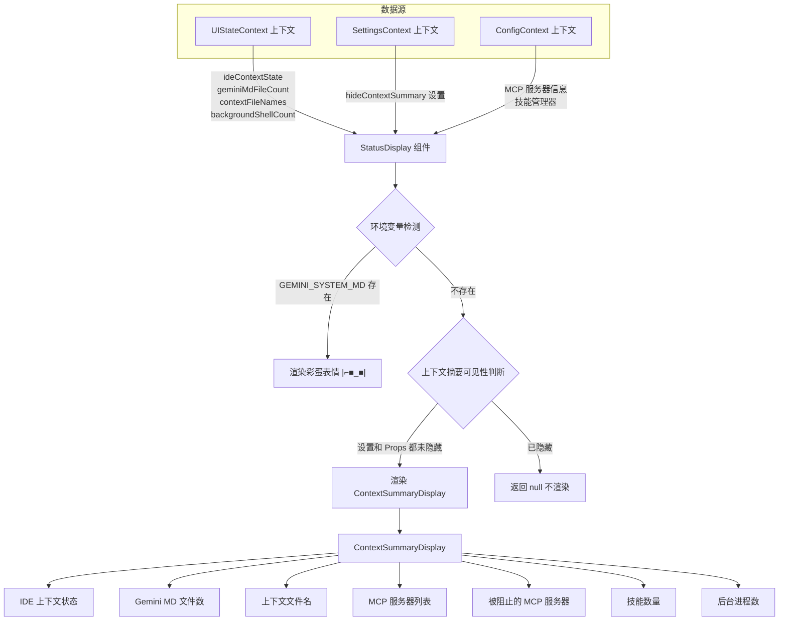

# StatusDisplay.tsx

## 概述

`StatusDisplay` 是 Gemini CLI 终端界面中的**状态展示组件**，负责根据当前配置和 UI 状态决定是否显示上下文摘要信息。该组件作为一个轻量级的路由/决策层，根据不同条件选择性渲染：

1. 当检测到 `GEMINI_SYSTEM_MD` 环境变量时，渲染一个特殊的彩蛋表情 `|⌐■_■|`
2. 当上下文摘要未被隐藏时，渲染 `ContextSummaryDisplay` 组件展示完整的上下文信息
3. 其他情况返回 `null` 不渲染任何内容

该组件整合了 UI 状态上下文、用户设置和应用配置三个数据源，是连接数据层与展示层的关键中间组件。

## 架构图（Mermaid）

## 核心组件

### StatusDisplayProps 接口（已导出）

| 属性 | 类型 | 必填 | 说明 |
|------|------|------|------|
| `hideContextSummary` | `boolean` | 是 | 外部控制是否隐藏上下文摘要的标志 |

### StatusDisplay 函数组件（已导出）

主要逻辑流程：

1. **获取上下文数据**：
   - `useUIState()` —— 获取 UI 状态，包括 IDE 上下文状态、Gemini MD 文件数、上下文文件名列表、后台 Shell 数量
   - `useSettings()` —— 获取用户设置，特别是 `merged.ui.hideContextSummary` 配置项
   - `useConfig()` —— 获取应用配置，用于访问 MCP 客户端管理器和技能管理器

2. **环境变量彩蛋**：检查 `process.env['GEMINI_SYSTEM_MD']` 是否存在。若存在，渲染红色的 ASCII 艺术表情 `|⌐■_■|`（使用 `theme.status.error` 颜色），然后提前返回。

3. **上下文摘要渲染**：当满足以下两个条件时渲染 `ContextSummaryDisplay`：
   - `settings.merged.ui.hideContextSummary` 为 `false`（用户设置未隐藏）
   - `hideContextSummary` 属性为 `false`（父组件未隐藏）

4. **ContextSummaryDisplay 属性传递**：
   - `ideContext`: 来自 `uiState.ideContextState`
   - `geminiMdFileCount`: 来自 `uiState.geminiMdFileCount`
   - `contextFileNames`: 来自 `uiState.contextFileNames`
   - `mcpServers`: 通过 `config.getMcpClientManager()?.getMcpServers()` 获取，默认空对象
   - `blockedMcpServers`: 通过 `config.getMcpClientManager()?.getBlockedMcpServers()` 获取，默认空数组
   - `skillCount`: 通过 `config.getSkillManager().getDisplayableSkills().length` 计算
   - `backgroundProcessCount`: 来自 `uiState.backgroundShellCount`

5. **默认返回**：若上述条件都不满足，返回 `null`。

## 依赖关系

### 内部依赖

| 模块 | 导入项 | 用途 |
|------|--------|------|
| `../semantic-colors.js` | `theme` | 语义化主题颜色配置，用于彩蛋文本着色 |
| `../contexts/UIStateContext.js` | `useUIState` | UI 状态上下文 Hook，提供 IDE 上下文、文件计数等状态 |
| `../contexts/SettingsContext.js` | `useSettings` | 用户设置上下文 Hook，提供 `hideContextSummary` 等配置 |
| `../contexts/ConfigContext.js` | `useConfig` | 应用配置上下文 Hook，提供 MCP 管理器和技能管理器 |
| `./ContextSummaryDisplay.js` | `ContextSummaryDisplay` | 上下文摘要展示子组件，渲染完整的上下文信息面板 |

### 外部依赖

| 包名 | 导入项 | 用途 |
|------|--------|------|
| `react` | `React` (类型) | React 类型定义 |
| `ink` | `Text` | Ink 终端 UI 文本渲染组件 |

## 关键实现细节

1. **双层隐藏控制**：上下文摘要的可见性受两个独立开关控制——用户配置级别的 `settings.merged.ui.hideContextSummary` 和组件属性级别的 `hideContextSummary`。任意一个为 `true` 都会隐藏摘要。这种设计允许用户通过配置持久化隐藏，同时也允许父组件在特定场景下临时隐藏。

2. **环境变量彩蛋**：`GEMINI_SYSTEM_MD` 环境变量触发的 `|⌐■_■|` 表情是一个开发者彩蛋（Nouns DAO 风格的像素墨镜表情）。当该环境变量被设置时，组件不展示任何实际状态信息，而是显示这个特殊标记。这可能用于标识特殊的系统配置模式。

3. **安全的可选链访问**：访问 MCP 服务器信息时使用了可选链 (`?.`) 和空值合并 (`??`)，确保即使 `getMcpClientManager()` 返回 `null` 或 `undefined` 也不会抛出异常，分别回退到空对象 `{}` 和空数组 `[]`。

4. **组件职责单一**：`StatusDisplay` 本身不做任何数据处理或复杂渲染，它的唯一职责是根据条件决定"是否渲染"以及"渲染什么"，将实际的展示工作委托给 `ContextSummaryDisplay`。这符合单一职责原则，使得渲染逻辑和决策逻辑解耦。

5. **接口导出**：`StatusDisplayProps` 接口使用 `export` 导出，便于其他模块在需要时引用该类型，例如父组件传递属性时的类型检查。
