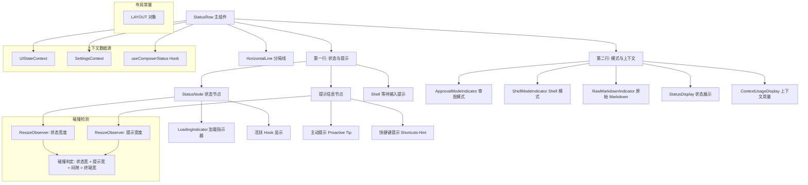

# StatusRow.tsx

## 概述

`StatusRow` 是 Gemini CLI 终端界面中的**状态行组件**，是输入区域上方的核心状态栏。它负责展示一个复合的两行状态区域：

- **第一行 (Row 1)**: 加载/Hook 执行状态 + 提示信息（Tips / 快捷键提示）
- **第二行 (Row 2)**: 模式指示器（审批模式、Shell 模式、原始 Markdown 模式）+ 上下文信息（StatusDisplay、ContextUsageDisplay）

该文件导出两个组件：
1. `StatusNode` —— 渲染加载指示器或 Hook 执行状态的子组件
2. `StatusRow` —— 完整的状态行布局组件

组件具备响应式布局能力，能根据终端宽度（窄屏/宽屏）调整排列方向和间距，并通过 `ResizeObserver` 实现状态区域和提示区域的碰撞检测，避免内容重叠。

## 架构图（Mermaid）



## 核心组件

### LAYOUT 布局常量对象

```typescript
const LAYOUT = {
  STATUS_MIN_HEIGHT: 1,        // 状态区最小高度
  TIP_LEFT_MARGIN: 2,          // 提示左边距
  TIP_RIGHT_MARGIN_NARROW: 0,  // 窄屏提示右边距
  TIP_RIGHT_MARGIN_WIDE: 1,    // 宽屏提示右边距
  INDICATOR_LEFT_MARGIN: 1,    // 指示器左边距
  CONTEXT_DISPLAY_TOP_MARGIN_NARROW: 1,   // 窄屏上下文顶部边距
  CONTEXT_DISPLAY_LEFT_MARGIN_NARROW: 1,  // 窄屏上下文左边距
  CONTEXT_DISPLAY_LEFT_MARGIN_WIDE: 0,    // 宽屏上下文左边距
  COLLISION_GAP: 10,           // 碰撞检测安全间隙
};
```

### StatusNode 组件（已导出）

渲染加载状态或 Hook 执行状态的子组件。

**Props：**

| 属性 | 类型 | 必填 | 说明 |
|------|------|------|------|
| `showTips` | `boolean` | 是 | 是否展示提示 |
| `showWit` | `boolean` | 是 | 是否展示趣味短语 |
| `thought` | `ThoughtSummary \| null` | 是 | 当前思考摘要 |
| `elapsedTime` | `number` | 是 | 已经过时间 |
| `currentWittyPhrase` | `string \| undefined` | 是 | 当前趣味短语 |
| `activeHooks` | `ActiveHook[]` | 是 | 活跃的 Hook 列表 |
| `showLoadingIndicator` | `boolean` | 是 | 是否显示加载指示器 |
| `errorVerbosity` | `'low' \| 'full' \| undefined` | 是 | 错误详细程度 |
| `onResize` | `(width: number) => void` | 否 | 元素宽度变化回调 |

**核心逻辑：**

1. **提前返回**：若无活跃 Hook 且不需要加载指示器，返回 `null`
2. **Hook 处理**：
   - 过滤出用户可见的 Hook（`isUserVisibleHook`）
   - 单个 Hook 显示 "Executing Hook"，多个显示 "Executing Hooks"
   - 每个 Hook 显示名称，如有进度则附加 `(index/total)`
   - 对 Hook 名称用 `stripAnsi` 净化，防止 ANSI 转义序列注入
   - 若无用户可见 Hook，使用通用工作标签 `GENERIC_WORKING_LABEL`
3. **非 Hook 模式**：显示思考摘要 (`thought`)，同样对 `subject` 进行 `stripAnsi` 净化
4. **ResizeObserver 集成**：通过 `ref` 回调挂载 `ResizeObserver`，实时报告元素宽度变化

### StatusRow 组件（已导出）

完整的两行状态栏布局组件。

**Props：**

| 属性 | 类型 | 必填 | 说明 |
|------|------|------|------|
| `showUiDetails` | `boolean` | 是 | 是否展示完整 UI 详情 |
| `isNarrow` | `boolean` | 是 | 是否为窄屏模式 |
| `terminalWidth` | `number` | 是 | 终端宽度（字符数） |
| `hideContextSummary` | `boolean` | 是 | 是否隐藏上下文摘要 |
| `hideUiDetailsForSuggestions` | `boolean` | 是 | 是否因建议模式隐藏 UI 详情 |
| `hasPendingActionRequired` | `boolean` | 是 | 是否有待处理的用户操作 |

**核心逻辑流程：**

1. **状态获取**：通过 `useUIState`、`useSettings`、`useComposerStatus` 获取所有必要状态
2. **提示内容计算** (`tipContentStr`)：
   - 优先级 1：主动提示（`uiState.currentTip`），但排除交互式 Shell 等待时的特定短语
   - 优先级 2：快捷键提示（"? for shortcuts" 或 "press tab twice for more"）
   - 需同时满足：`showShortcutsHint` 设置开启、未隐藏 UI 详情、无待处理操作、输入缓冲区为空
3. **碰撞检测**：`statusWidth + tipWidth + COLLISION_GAP > terminalWidth` 则隐藏提示
4. **行可见性判断**：
   - `showRow1`: 需要加载指示器、有活跃 Hook 或有提示时显示
   - `showRow2`: 有模式内容或需要最小化上下文时显示
5. **布局渲染**：
   - Row 1 三种模式：最小化模式（状态 + 模式指示点）、交互式 Shell 等待模式、完整模式
   - Row 1 与 Row 2 之间有条件渲染 `HorizontalLine` 分隔线
   - Row 2 左侧为模式指示器（审批/Shell/原始 Markdown），右侧为上下文信息

### 提示节点渲染函数 (renderTipNode)

- 判断是否为快捷键提示（`"? for shortcuts"` 或 `"press tab twice for more"`）
- 快捷键提示在帮助面板可见时使用 `accent` 色，否则使用 `secondary` 色
- 趣味短语使用斜体
- 主动提示前缀 `"Tip: "`

## 依赖关系

### 内部依赖

| 模块 | 导入项 | 用途 |
|------|--------|------|
| `@google/gemini-cli-core` | `isUserVisibleHook`, `ThoughtSummary` | Hook 可见性判断与思考摘要类型 |
| `../types.js` | `ActiveHook` | 活跃 Hook 类型定义 |
| `../contexts/UIStateContext.js` | `useUIState` | UI 状态上下文（提示、Hook、思考等） |
| `../contexts/SettingsContext.js` | `useSettings` | 用户设置上下文 |
| `../semantic-colors.js` | `theme` | 语义化主题颜色 |
| `../textConstants.js` | `GENERIC_WORKING_LABEL` | 通用"工作中"标签文本 |
| `../hooks/usePhraseCycler.js` | `INTERACTIVE_SHELL_WAITING_PHRASE` | 交互式 Shell 等待短语常量 |
| `./LoadingIndicator.js` | `LoadingIndicator` | 加载指示器组件 |
| `./StatusDisplay.js` | `StatusDisplay` | 状态展示组件 |
| `./ContextUsageDisplay.js` | `ContextUsageDisplay` | 上下文用量展示组件 |
| `./shared/HorizontalLine.js` | `HorizontalLine` | 水平分隔线组件 |
| `./ApprovalModeIndicator.js` | `ApprovalModeIndicator` | 审批模式指示器 |
| `./ShellModeIndicator.js` | `ShellModeIndicator` | Shell 模式指示器 |
| `./RawMarkdownIndicator.js` | `RawMarkdownIndicator` | 原始 Markdown 指示器 |
| `../hooks/useComposerStatus.js` | `useComposerStatus` | 组合状态 Hook |

### 外部依赖

| 包名 | 导入项 | 用途 |
|------|--------|------|
| `react` | `React`, `useCallback`, `useRef`, `useState` | React 核心 Hooks |
| `ink` | `Box`, `Text`, `ResizeObserver`, `DOMElement` | Ink 终端 UI 组件与 DOM 观察器 |
| `strip-ansi` | `stripAnsi` | 清除字符串中的 ANSI 转义序列 |

## 关键实现细节

1. **ResizeObserver 碰撞检测系统**：该组件使用了两个独立的 `ResizeObserver` 实例分别监测状态区域和提示区域的实际渲染宽度。当两者宽度之和加上安全间隙（10 字符）超过终端宽度时，自动隐藏提示信息，防止内容重叠。这是一种基于实际测量而非估算的精确布局方案。

2. **ResizeObserver 生命周期管理**：通过 `useRef` + `useCallback` 的 ref 回调模式管理 `ResizeObserver` 的创建和销毁。当 DOM 节点变化时先断开旧的 observer，再创建新的。这避免了内存泄漏和重复监听。

3. **ANSI 注入防护**：对 Hook 名称和思考主题都使用 `stripAnsi()` 进行净化处理，防止恶意的 ANSI 转义序列通过这些用户可见的文本注入终端，造成终端显示异常或安全问题。

4. **三级提示优先级**：提示信息按严格优先级选择——主动提示 > 快捷键提示 > 无提示。同时对交互式 Shell 等待场景做了特殊处理：当正在等待 Shell 输入时，不显示与 Shell 等待相关的特定短语作为提示，避免信息重复。

5. **响应式双行布局**：在窄屏模式下，Row 2 从水平排列切换为垂直排列（`flexDirection` 从 `row` 变为 `column`），指示器和上下文信息上下堆叠；同时调整对齐方式和边距。

6. **最小化与完整模式**：通过 `showUiDetails` 控制完整/最小化模式。最小化模式下，Row 1 将状态节点和模式指示点（彩色圆点 `●`）并排显示在同一行，而非分两行。Row 2 的最小化模式仅显示模式内容对象和上下文用量。

7. **隐藏但可测量的提示节点**：提示节点始终渲染但通过 `display="none"` 隐藏，这样 `ResizeObserver` 仍能测量其宽度用于碰撞检测。只有当碰撞检测通过时才设置 `display="flex"` 使其可见。这是一种优雅的"先测量再决定是否显示"的技术方案。

8. **布局常量集中管理**：所有布局相关的魔法数字被提取到 `LAYOUT` 对象中统一管理，提高代码可读性和可维护性。
