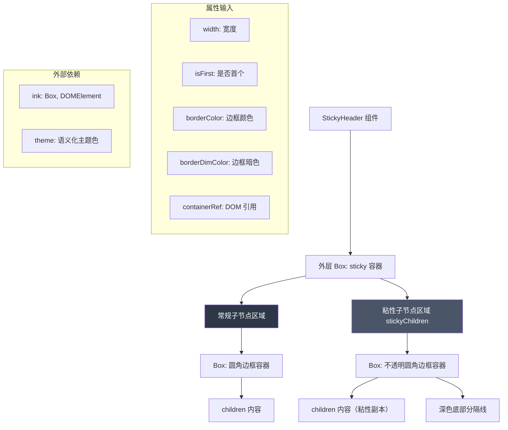

# StickyHeader.tsx

## 概述

`StickyHeader` 是 Gemini CLI 终端界面中实现**粘性头部（Sticky Header）**效果的 React (Ink) 组件。它利用 Ink 框架的 `sticky` 和 `stickyChildren` 特性，在终端滚动内容时将头部区域固定在可视区域顶部，类似于 Web 中的 `position: sticky` 效果。

该组件采用双层渲染结构：
- **常规子节点 (children)**：在正常文档流中渲染的头部内容，带有圆角边框
- **粘性子节点 (stickyChildren)**：当常规内容滚出可视区域时，替代显示的固定头部，带有底部深色分隔线

这种设计确保用户在滚动长内容时始终能看到当前区块的头部标识信息。

## 架构图（Mermaid）



## 核心组件

### StickyHeaderProps 接口（已导出）

| 属性 | 类型 | 必填 | 说明 |
|------|------|------|------|
| `children` | `React.ReactNode` | 是 | 头部内容节点 |
| `width` | `number` | 是 | 组件总宽度（字符数） |
| `isFirst` | `boolean` | 是 | 是否为第一个粘性头部（影响顶部边框和内边距） |
| `borderColor` | `string` | 是 | 边框颜色 |
| `borderDimColor` | `boolean` | 是 | 边框是否使用暗淡颜色 |
| `containerRef` | `React.RefObject<DOMElement \| null>` | 否 | 外层容器的 DOM 引用，供父组件操作 |

### StickyHeader 函数组件（已导出）

该组件为纯展示组件，无内部状态和副作用，直接返回 JSX 结构。

#### 外层容器（根 Box）

```tsx
<Box
  ref={containerRef}
  sticky              // 启用粘性定位
  minHeight={1}       // 最小高度 1 行
  flexShrink={0}      // 不允许收缩
  width={width}       // 使用传入宽度
  stickyChildren={...} // 粘性替代内容
>
```

- `sticky` 属性启用 Ink 的粘性滚动特性
- `flexShrink={0}` 确保头部不会被 flex 布局压缩
- `stickyChildren` 定义了滚动时固定显示的替代内容

#### 粘性子节点 (stickyChildren)

当常规内容滚出视口时显示的替代头部：

```
┌──────────────────────────────────── (isFirst 时有顶部圆角边框)
│  [children 内容]                     paddingX=1
├──────────────────────────────────── 深色分隔线 (theme.ui.dark)
```

特点：
- `opaque` 属性使背景不透明，遮挡下方滚动内容
- `borderBottom={false}` 隐藏底部圆角边框
- `borderTop={isFirst}` 仅第一个头部显示顶部边框
- `paddingTop={isFirst ? 0 : 1}` 非首个头部有额外顶部内边距
- 内部有深色底部分隔线（宽度为 `width - 2`，减去左右边框各 1 字符）
- 分隔线使用 `single` 边框样式，仅显示底部边框

#### 常规子节点区域

在正常文档流中渲染的头部：

```
┌──────────────────────────────────── (isFirst 时有顶部圆角边框)
│  [children 内容]                     paddingX=1, paddingBottom=1
```

特点：
- 完整的圆角边框样式（左右均显示）
- `borderBottom={false}` 隐藏底部边框（因为下方紧跟内容区域）
- `paddingBottom={1}` 底部留 1 行间距
- `paddingTop={isFirst ? 0 : 1}` 与粘性版本保持一致

## 依赖关系

### 内部依赖

| 模块 | 导入项 | 用途 |
|------|--------|------|
| `../semantic-colors.js` | `theme` | 语义化主题颜色，提供 `ui.dark` 用于深色分隔线 |

### 外部依赖

| 包名 | 导入项 | 用途 |
|------|--------|------|
| `react` | `React` (类型) | React 类型定义 |
| `ink` | `Box`, `DOMElement` | Ink 终端 UI 布局容器与 DOM 元素类型 |

## 关键实现细节

1. **双层渲染架构**：组件同时定义了常规渲染内容和粘性替代内容。常规内容参与正常文档流布局，当它滚出可视区域时，Ink 的 `sticky` 机制自动切换到 `stickyChildren` 中定义的内容。两者都渲染相同的 `children`，但布局和样式略有差异。

2. **opaque 不透明背景**：粘性子节点设置了 `opaque` 属性，使其具有不透明背景。这确保当粘性头部固定在顶部时，不会透出下方滚动的内容，提供清晰的视觉层次。

3. **isFirst 首项特殊处理**：第一个 `StickyHeader` 与后续的在视觉上有所区别：
   - 首项显示顶部圆角边框 (`borderTop={isFirst}`)
   - 首项无额外顶部内边距 (`paddingTop=0`)
   - 非首项顶部内边距为 1 (`paddingTop=1`)

   这使得多个粘性头部在视觉上能优雅地连接，第一个有完整的顶部边框，后续的则有间距分隔。

4. **深色分隔线**：粘性版本的头部底部有一条深色 (`theme.ui.dark`) 分隔线，使用 `single` 边框样式仅显示底部边框。宽度为 `width - 2`，扣除了左右圆角边框各 1 字符的占位。这条分隔线在视觉上区分了固定的头部和下方的滚动内容。

5. **常规版本底部无边框**：常规渲染的头部故意隐藏底部边框 (`borderBottom={false}`)，因为它的下方紧接着内容区域，底部边框会与内容区域的边框产生视觉冲突。取而代之的是通过 `paddingBottom={1}` 留出间距。

6. **containerRef 透传**：外层 Box 接受 `containerRef` 属性，允许父组件通过 ref 直接访问 DOM 元素，用于尺寸测量、滚动控制或其他 DOM 操作。

7. **纯展示组件**：整个组件没有使用任何 Hook（`useState`、`useEffect` 等），没有内部状态和副作用，是一个纯粹的展示组件。所有逻辑（如宽度计算、是否为首项等）都由父组件通过 props 传入，保持了组件的简单性和可预测性。
