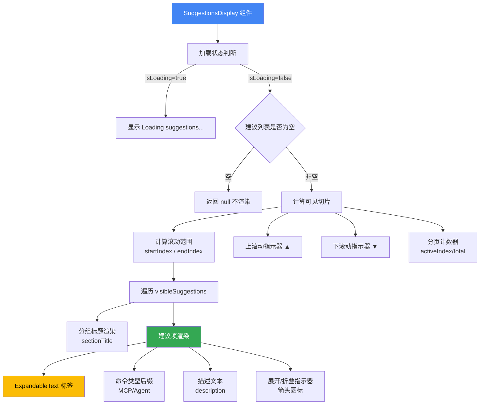

# SuggestionsDisplay.tsx

## 概述

`SuggestionsDisplay` 是一个基于 Ink 框架的 React 终端 UI 组件，用于在 CLI 界面中渲染建议列表（自动补全/命令建议）。它支持两种模式：`reverse`（反向搜索）和 `slash`（斜杠命令），具备滚动分页、高亮选中项、分组标题、长文本展开/折叠等功能。

**文件路径**: `packages/cli/src/ui/components/SuggestionsDisplay.tsx`

## 架构图（Mermaid）

## 核心组件

### 1. `Suggestion` 接口（导出）

定义单条建议的数据结构：

| 字段 | 类型 | 必填 | 说明 |
|------|------|------|------|
| `label` | `string` | 是 | 建议的显示标签 |
| `value` | `string` | 是 | 建议的实际值 |
| `insertValue` | `string` | 否 | 插入到输入框的值（可能与 value 不同） |
| `description` | `string` | 否 | 建议的描述文本 |
| `matchedIndex` | `number` | 否 | 匹配字符的起始索引，用于高亮 |
| `commandKind` | `CommandKind` | 否 | 命令类型（如 MCP_PROMPT、AGENT） |
| `sectionTitle` | `string` | 否 | 所属分组的标题 |
| `submitValue` | `string` | 否 | 提交时使用的值 |

### 2. `SuggestionsDisplayProps` 接口（内部）

组件的属性定义：

| 属性 | 类型 | 说明 |
|------|------|------|
| `suggestions` | `Suggestion[]` | 全部建议列表 |
| `activeIndex` | `number` | 当前激活（选中）的建议索引 |
| `isLoading` | `boolean` | 是否正在加载建议 |
| `width` | `number` | 组件宽度（字符列数） |
| `scrollOffset` | `number` | 滚动偏移量，决定可见窗口起始位置 |
| `userInput` | `string` | 用户当前输入内容，用于匹配高亮 |
| `mode` | `'reverse' \| 'slash'` | 模式：反向搜索 或 斜杠命令 |
| `expandedIndex` | `number` | 当前展开的建议索引（可选） |

### 3. `SuggestionsDisplay` 函数组件（导出）

主组件函数，包含以下核心逻辑：

#### 3.1 加载状态处理
当 `isLoading` 为 `true` 时，显示灰色 "Loading suggestions..." 提示文本。

#### 3.2 空列表处理
当 `suggestions` 为空数组时，返回 `null` 不渲染任何内容。

#### 3.3 滚动分页逻辑
- **最大可见建议数**: `MAX_SUGGESTIONS_TO_SHOW = 8`（导出常量）
- 通过 `scrollOffset` 计算 `startIndex` 和 `endIndex`，从完整列表中切出可见切片 `visibleSuggestions`
- 当 `scrollOffset > 0` 时在顶部显示 `▲` 上箭头
- 当 `endIndex < suggestions.length` 时在底部显示 `▼` 下箭头
- 当总建议数超过 `MAX_SUGGESTIONS_TO_SHOW` 时，显示分页计数 `(activeIndex+1/total)`

#### 3.4 命令类型后缀映射
通过 `COMMAND_KIND_SUFFIX` 映射表为特定命令类型添加后缀标记：
- `CommandKind.MCP_PROMPT` -> ` [MCP]`
- `CommandKind.AGENT` -> ` [Agent]`

#### 3.5 列宽计算
- 在 `slash` 模式下，命令列宽度取 `maxLabelLength` 与 `width * 0.5` 的较小值
- 在 `reverse` 模式下，命令列宽度为 0（不使用固定列宽）

#### 3.6 单条建议渲染
每条建议包含：
- **分组标题**: 当 `mode === 'slash'` 且当前建议的 `sectionTitle` 与前一条不同时，渲染 `-- sectionTitle --` 分割线
- **标签**: 通过 `ExpandableText` 组件渲染，支持匹配高亮和展开/折叠
- **命令类型后缀**: MCP / Agent 标记
- **描述**: 右侧显示，使用 `sanitizeForDisplay` 清洗，最大100字符，超出截断
- **展开指示器**: 当建议值超过 `MAX_WIDTH` 且为激活项时，显示 `→`（折叠态）或 `←`（展开态）

#### 3.7 样式处理
- 激活项背景色: `theme.background.focus`
- 激活项文字色: `theme.ui.focus`
- 非激活项文字色: `theme.text.secondary`

### 4. 导出常量

| 常量 | 值 | 说明 |
|------|------|------|
| `MAX_SUGGESTIONS_TO_SHOW` | `8` | 最多同时显示的建议数 |
| `MAX_WIDTH` | 从 `ExpandableText` 转导出 | 文本最大宽度阈值 |

## 依赖关系

### 内部依赖

| 模块 | 导入内容 | 说明 |
|------|----------|------|
| `../semantic-colors.js` | `theme` | 语义化主题颜色配置 |
| `./shared/ExpandableText.js` | `ExpandableText`, `MAX_WIDTH` | 可展开文本组件及宽度常量 |
| `../commands/types.js` | `CommandKind` | 命令类型枚举 |
| `../colors.js` | `Colors` | 颜色常量集合（如 `Colors.Gray`） |
| `../utils/textUtils.js` | `sanitizeForDisplay` | 文本清洗工具函数 |

### 外部依赖

| 包名 | 导入内容 | 说明 |
|------|----------|------|
| `ink` | `Box`, `Text` | Ink 终端 UI 框架的布局和文本组件 |

## 关键实现细节

1. **虚拟滚动窗口**: 组件并不渲染所有建议，而是通过 `scrollOffset` + `MAX_SUGGESTIONS_TO_SHOW` 实现类似虚拟滚动的效果。外部组件需要负责管理 `scrollOffset` 的值，确保 `activeIndex` 始终在可见窗口内。

2. **双模式布局**: `slash` 模式下采用固定列宽布局（命令名 + 描述两栏），`reverse` 模式下采用弹性布局（`flexShrink: 1`），两种模式通过条件展开 props 实现。

3. **分组标题去重**: 通过比较当前建议与前一条建议的 `sectionTitle` 来决定是否渲染分组标题，确保每个分组只渲染一次标题头。

4. **匹配高亮委托**: 匹配高亮逻辑不在本组件实现，而是委托给 `ExpandableText` 组件，通过传递 `matchedIndex` 和 `userInput` 实现。

5. **文本安全处理**: 描述文本通过 `sanitizeForDisplay` 清洗后再渲染，限制最大100个字符，防止终端渲染异常。

6. **`flexShrink` 类型断言**: 代码中使用 `0 as const` 和 `1 as const` 进行类型断言，这是为了满足 Ink 框架对 `flexShrink` 属性的严格类型要求。

7. **Key 策略**: 使用 `${suggestion.value}-${originalIndex}` 作为 React key，结合值和原始索引确保唯一性。
