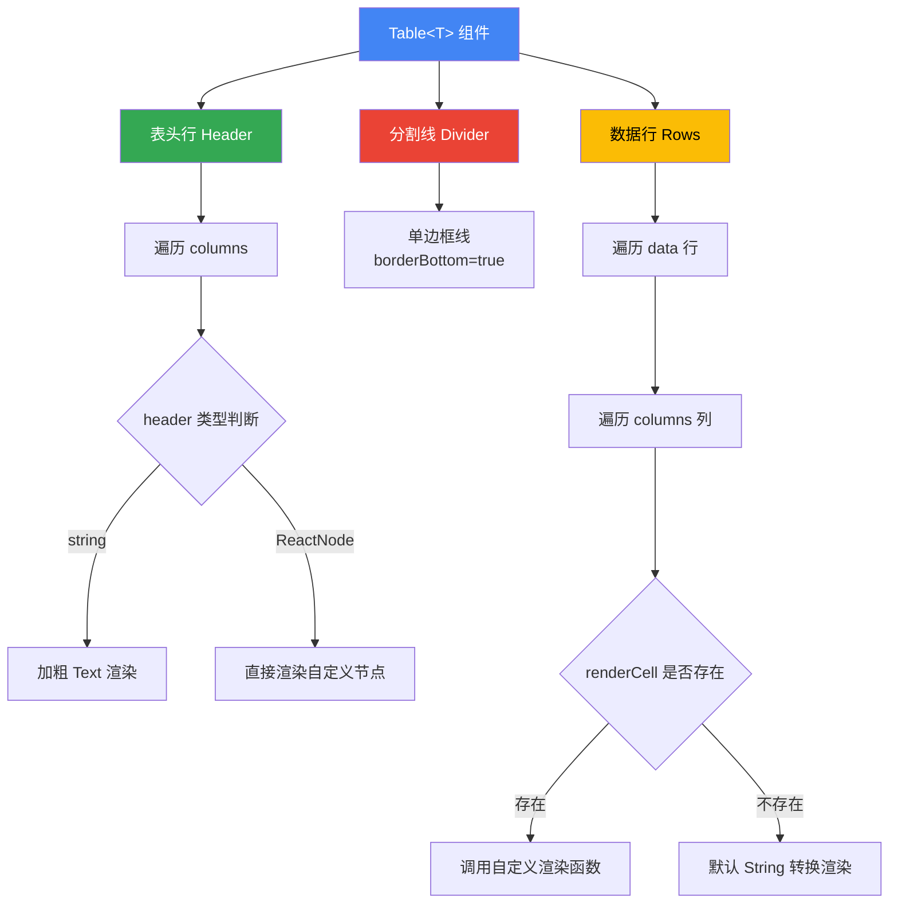

# Table.tsx

## 概述

`Table` 是一个基于 Ink 框架的泛型 React 终端 UI 表格组件，用于在 CLI 界面中以表格形式展示结构化数据。它支持自定义列宽、弹性布局、自定义单元格渲染函数，以及表头加粗和分割线等样式特性。组件设计简洁，采用 TypeScript 泛型确保数据类型安全。

**文件路径**: `packages/cli/src/ui/components/Table.tsx`

## 架构图（Mermaid）

## 核心组件

### 1. `Column<T>` 接口（导出）

定义表格列的配置结构，泛型参数 `T` 表示数据行的类型：

| 字段 | 类型 | 必填 | 说明 |
|------|------|------|------|
| `key` | `string` | 是 | 数据字段名，用于默认渲染时从数据对象中取值 |
| `header` | `React.ReactNode` | 是 | 表头内容，可以是字符串或自定义 React 节点 |
| `width` | `number` | 否 | 固定列宽（字符数） |
| `flexGrow` | `number` | 否 | Flexbox 弹性增长比例 |
| `flexShrink` | `number` | 否 | Flexbox 弹性收缩比例 |
| `flexBasis` | `number \| string` | 否 | Flexbox 基础尺寸 |
| `renderCell` | `(item: T) => React.ReactNode` | 否 | 自定义单元格渲染函数，接收整行数据 |

### 2. `TableProps<T>` 接口（内部）

组件的属性定义：

| 属性 | 类型 | 说明 |
|------|------|------|
| `data` | `T[]` | 表格数据数组，每个元素代表一行 |
| `columns` | `Array<Column<T>>` | 列定义数组，决定表格结构和渲染方式 |

### 3. `Table<T>` 函数组件（导出）

泛型表格组件，结构由三个主要部分组成：

#### 3.1 表头行 (Header)
- 遍历 `columns` 数组，为每列渲染一个表头单元格
- 如果 `header` 是字符串，使用 `<Text bold>` 加粗渲染，颜色为 `theme.text.primary`
- 如果 `header` 是自定义 ReactNode，直接渲染
- 每列通过 `col.width`、`flexGrow`、`flexShrink`、`flexBasis` 控制布局
- `flexBasis` 的默认逻辑：如果指定了 `col.width` 则为 `undefined`，否则为 `0`

#### 3.2 分割线 (Divider)
- 使用 Ink 的 `Box` 组件 + `borderStyle="single"` 实现
- 仅显示底边框（`borderBottom=true`，其他三边为 `false`）
- 边框颜色为 `theme.border.default`

#### 3.3 数据行 (Rows)
- 外层遍历 `data` 数组（行），内层遍历 `columns` 数组（列）
- 如果列定义了 `renderCell` 函数，调用该函数并传入整行数据 `item`
- 如果未定义 `renderCell`，使用默认渲染：通过 `col.key` 从数据对象中取值并 `String()` 转换
- 默认渲染时使用类型断言 `item as Record<string, unknown>` 以兼容泛型类型

## 依赖关系

### 内部依赖

| 模块 | 导入内容 | 说明 |
|------|----------|------|
| `../semantic-colors.js` | `theme` | 语义化主题颜色配置 |

### 外部依赖

| 包名 | 导入内容 | 说明 |
|------|----------|------|
| `react` | `React`（type only） | React 类型定义，用于 `React.ReactNode` |
| `ink` | `Box`, `Text` | Ink 终端 UI 框架的布局和文本组件 |

## 关键实现细节

1. **TypeScript 泛型设计**: 组件使用泛型 `<T>` 参数化，使得 `data`、`columns` 和 `renderCell` 之间保持类型一致性。调用者传入具体类型后，`renderCell` 的 `item` 参数会被自动推断为正确类型。

2. **Flexbox 布局模型**: 表格布局完全基于 Ink 的 Flexbox 模型。每列单元格支持 `width`（固定宽度）和 `flexGrow/flexShrink/flexBasis`（弹性宽度）两种布局方式，可灵活组合使用。

3. **`flexBasis` 默认值策略**: 当列未指定 `flexBasis` 时，组件会根据是否有 `width` 来决定默认值：
   - 有 `width` 时 `flexBasis` 为 `undefined`（使用固定宽度）
   - 无 `width` 时 `flexBasis` 为 `0`（从零开始按 `flexGrow` 分配空间）
   这个逻辑在表头和数据行中保持一致。

4. **表头双模式渲染**: `header` 字段接受 `React.ReactNode` 类型，当传入字符串时自动添加加粗和主题色样式，当传入自定义 ReactNode 时直接渲染，提供了灵活的表头定制能力。

5. **默认单元格渲染的类型安全**: 默认渲染路径中使用 `item as Record<string, unknown>` 类型断言，并通过 `String()` 转换确保任何类型的值都能安全渲染。代码中使用 ESLint 注释 `@typescript-eslint/no-unsafe-type-assertion` 明确标注了该断言。

6. **单元格间距**: 每个单元格设置 `paddingRight={1}` 确保列之间有一个字符的间距，提升可读性。

7. **Key 策略**: 表头使用 `header-${index}`，数据行使用 `row-${rowIndex}`，单元格使用 `cell-${rowIndex}-${colIndex}`，保证 React 渲染时的唯一性。
