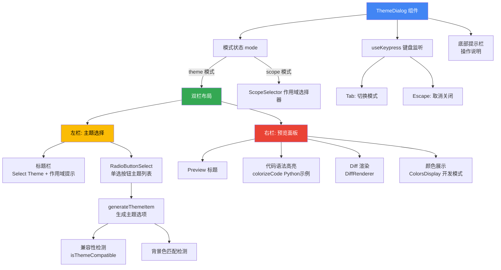

# ThemeDialog.tsx

## 概述

`ThemeDialog` 是一个功能丰富的主题选择对话框组件，基于 Ink 终端 UI 框架构建。它提供了一个双栏布局的交互式界面：左侧是主题列表选择器（带单选按钮），右侧是实时代码预览面板（包含语法高亮代码块和 diff 渲染）。用户可以通过键盘在"主题选择"和"作用域选择"两种模式间切换，支持主题兼容性检测、终端背景色匹配提示，以及将主题设置保存到不同的配置作用域（用户级/项目级）。

**文件路径**: `packages/cli/src/ui/components/ThemeDialog.tsx`

## 架构图（Mermaid）

## 核心组件

### 1. `ThemeDialogProps` 接口（内部）

对话框组件的属性定义：

| 属性 | 类型 | 必填 | 说明 |
|------|------|------|------|
| `onSelect` | `(themeName: string, scope: LoadableSettingScope) => void \| Promise<void>` | 是 | 主题选定后的回调，接收主题名和作用域 |
| `onCancel` | `() => void` | 是 | 对话框取消/关闭时的回调 |
| `onHighlight` | `(themeName: string \| undefined) => void` | 是 | 主题高亮（悬停/预览）时的回调 |
| `settings` | `LoadedSettings` | 是 | 已加载的设置对象 |
| `availableTerminalHeight` | `number` | 否 | 可用的终端高度（行数） |
| `terminalWidth` | `number` | 是 | 终端宽度（字符列数） |

### 2. `generateThemeItem` 辅助函数（内部）

为主题列表生成选项数据项。

**参数**:
| 参数 | 类型 | 说明 |
|------|------|------|
| `name` | `string` | 主题名称 |
| `typeDisplay` | `string` | 主题类型显示文本（如 "Dark", "Light"） |
| `fullTheme` | `Theme \| undefined` | 完整主题对象 |
| `terminalBackgroundColor` | `string \| undefined` | 当前终端背景色 |

**返回值结构**:
| 字段 | 类型 | 说明 |
|------|------|------|
| `label` | `string` | 显示标签 |
| `value` | `string` | 值（主题名） |
| `themeNameDisplay` | `string` | 主题名显示 |
| `themeTypeDisplay` | `string` | 主题类型显示 |
| `themeWarning` | `string` | 不兼容警告（如 " (Incompatible)"） |
| `themeMatch` | `string` | 匹配提示（如 " (Matches terminal)"） |
| `key` | `string` | React key |
| `isCompatible` | `boolean` | 是否与当前终端兼容 |

**核心逻辑**:
- 通过 `themeManager.isThemeCompatible()` 检测主题是否与终端背景色兼容
- 通过 `resolveColor()` 解析主题背景色，并与终端背景色进行不区分大小写的比较
- 兼容主题标记为空字符串，不兼容主题标记为 `" (Incompatible)"`
- 背景色匹配的主题标记为 `" (Matches terminal)"`

### 3. `ThemeDialog` 函数组件（导出）

主组件函数，包含复杂的状态管理和交互逻辑。

#### 3.1 状态管理

| 状态 | 类型 | 初始值 | 说明 |
|------|------|--------|------|
| `selectedScope` | `LoadableSettingScope` | `SettingScope.User` | 选中的设置作用域 |
| `highlightedThemeName` | `string` | 当前设置的主题名或自动推断 | 当前高亮的主题名 |
| `mode` | `'theme' \| 'scope'` | `'theme'` | 当前交互模式 |

`highlightedThemeName` 的初始值逻辑：
1. 如果 `settings.merged.ui.theme` 已设置，使用该值
2. 否则调用 `pickDefaultThemeName()` 根据终端背景色自动推断最匹配的主题

#### 3.2 主题列表生成与排序

1. 从 `themeManager.getAvailableThemes()` 获取所有可用主题
2. 使用 `capitalize()` 生成类型显示文本（如果主题名已包含类型则为空）
3. 通过 `generateThemeItem()` 生成选项数据
4. **排序规则**: 兼容主题排在前面，同兼容性内按名称字母序排列

#### 3.3 键盘交互

通过 `useKeypress` Hook 实现：
- **Tab 键**: 在 `theme` 和 `scope` 模式间切换
- **Escape 键**: 调用 `onCancel` 关闭对话框
- 其他按键事件由子组件（`RadioButtonSelect`、`ScopeSelector`）处理

#### 3.4 预览面板布局计算

组件包含精细的预览面板尺寸计算：

| 常量 | 值 | 说明 |
|------|------|------|
| `PREVIEW_PANE_WIDTH_PERCENTAGE` | `0.55` | 预览面板宽度占比 |
| `PREVIEW_PANE_WIDTH_SAFETY_MARGIN` | `0.9` | 安全边距系数 |
| `TOTAL_HORIZONTAL_PADDING` | `4` | 总水平内边距 |
| `PREVIEW_PANE_FIXED_VERTICAL_SPACE` | `8` | 预览面板固定垂直空间 |

计算过程：
1. `colorizeCodeWidth` = `(terminalWidth - 4) * 0.55 * 0.9`（至少为1）
2. 从可用高度中扣除边框、Tab选择器、内边距等固定空间
3. 剩余高度按 60%:40% 分配给代码块和 diff 块
4. 如果空间不足，自动移除 padding 以节省空间

#### 3.5 双模式 UI

**theme 模式（主题选择）**:
- 左栏（45%宽）: `RadioButtonSelect` 主题选择器，带自定义 `renderItem` 实现主题名、类型、兼容性警告、匹配提示的彩色渲染
- 右栏（55%宽）: 预览面板，包含 Python 斐波那契函数的语法高亮代码块和一段 Python diff 示例
- 开发模式下额外显示 `ColorsDisplay` 颜色展示组件

**scope 模式（作用域选择）**:
- 显示 `ScopeSelector` 组件，用于选择设置保存的作用域

#### 3.6 底部操作提示

根据当前模式动态显示操作说明：
- theme 模式: `(Use Enter to select, Tab to configure scope, Esc to close)`
- scope 模式: `(Use Enter to apply scope, Tab to select theme, Esc to close)`

### 4. 自定义渲染项（renderItem）

`RadioButtonSelect` 的 `renderItem` 实现了复杂的主题名渲染逻辑：
- 解析主题名中的括号部分（如 "Theme Name (Variant)"），括号内容用次要颜色显示
- 类型显示（"Dark"/"Light"）用次要颜色显示
- 匹配提示用成功色（绿色）显示
- 不兼容警告用警告色（黄色）显示

## 依赖关系

### 内部依赖

| 模块 | 导入内容 | 说明 |
|------|----------|------|
| `../semantic-colors.js` | `theme` | 语义化主题颜色配置 |
| `../themes/theme-manager.js` | `themeManager`, `DEFAULT_THEME` | 主题管理器实例和默认主题 |
| `../themes/theme.js` | `pickDefaultThemeName`, `Theme`(type) | 默认主题推断函数和主题类型定义 |
| `../themes/color-utils.js` | `resolveColor` | 颜色解析工具函数 |
| `./shared/RadioButtonSelect.js` | `RadioButtonSelect` | 单选按钮选择器组件 |
| `./messages/DiffRenderer.js` | `DiffRenderer` | Diff 渲染组件 |
| `../utils/CodeColorizer.js` | `colorizeCode` | 代码语法高亮工具函数 |
| `../../config/settings.js` | `LoadableSettingScope`(type), `LoadedSettings`(type), `SettingScope` | 设置相关类型和枚举 |
| `../../utils/dialogScopeUtils.js` | `getScopeMessageForSetting` | 设置作用域提示信息生成 |
| `../hooks/useKeypress.js` | `useKeypress` | 键盘事件监听 Hook |
| `../hooks/useAlternateBuffer.js` | `useAlternateBuffer` | 备用屏幕缓冲区检测 Hook |
| `./shared/ScopeSelector.js` | `ScopeSelector` | 设置作用域选择器组件 |
| `../contexts/UIStateContext.js` | `useUIState` | UI 状态上下文 Hook |
| `./ColorsDisplay.js` | `ColorsDisplay` | 颜色展示组件（开发模式） |
| `../../utils/installationInfo.js` | `isDevelopment` | 开发环境检测标志 |

### 外部依赖

| 包名 | 导入内容 | 说明 |
|------|----------|------|
| `react` | `React`(type), `useCallback`, `useState` | React 核心库 |
| `ink` | `Box`, `Text` | Ink 终端 UI 框架的布局和文本组件 |

## 关键实现细节

1. **主题兼容性检测**: 通过 `themeManager.isThemeCompatible()` 检测主题是否适合当前终端背景色。不兼容的主题不会被隐藏，而是排到列表末尾并标记 "(Incompatible)" 警告，保留用户的选择自由。

2. **终端背景色匹配**: 通过 `resolveColor()` 解析主题背景色，与终端实际背景色进行不区分大小写的比较。匹配的主题显示 "(Matches terminal)" 绿色提示，帮助用户快速找到最适合的主题。

3. **智能初始主题选择**: 组件初始化时，如果用户未配置主题，会通过 `pickDefaultThemeName()` 根据终端背景色自动推断最匹配的主题，提供开箱即用的体验。

4. **自适应高度布局**: 预览面板的代码块和 diff 块高度根据可用终端高度动态计算。当空间不足时，自动移除内边距以容纳更多内容。代码块和 diff 块按 60%:40% 分配可用高度。

5. **备用屏幕缓冲区适配**: 通过 `useAlternateBuffer()` 检测是否在备用屏幕缓冲区中运行。仅在非备用缓冲区模式下才限制代码块和 diff 块的高度，在备用缓冲区中则不设限。

6. **双模式 Tab 切换**: 使用 `mode` 状态在"主题选择"和"作用域选择"两种模式间切换，共享同一个对话框容器。两种模式的选择结果通过 `highlightedThemeName` 和 `selectedScope` 组合后传递给 `onSelect` 回调。

7. **作用域感知提示**: 通过 `getScopeMessageForSetting()` 生成作用域相关的提示信息，告知用户当前主题设置在其他作用域是否有覆盖或冲突。

8. **开发模式专属功能**: 通过 `isDevelopment` 标志，在开发环境下额外渲染 `ColorsDisplay` 组件，方便开发者查看和调试主题颜色配置。

9. **预览面板实时更新**: 当用户在主题列表中移动高亮时，`handleThemeHighlight` 同时更新本地状态和调用 `onHighlight` 回调，使预览面板能实时显示高亮主题的效果（通过 `previewTheme` 传递给 `DiffRenderer`）。

10. **类型安全的自定义渲染**: `renderItem` 中使用类型断言 `item as typeof item & { themeWarning?: string; themeMatch?: string }` 来安全访问 `generateThemeItem` 添加的额外字段，这是因为 `RadioButtonSelect` 的泛型约束可能不包含这些扩展字段。
