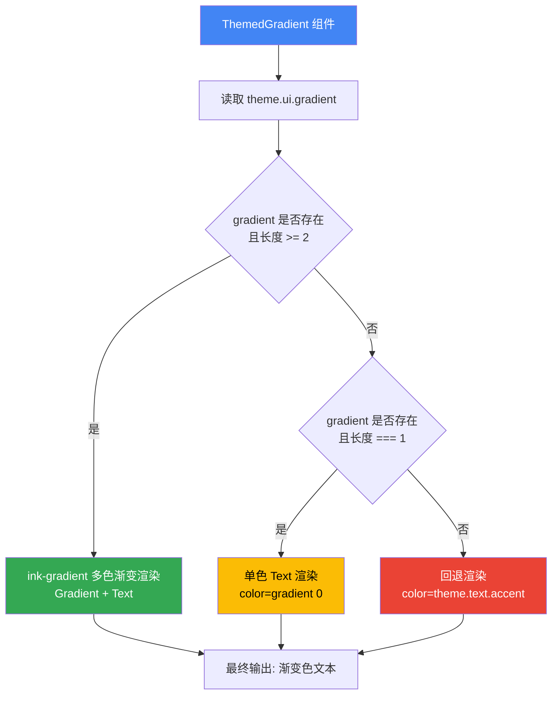

# ThemedGradient.tsx

## 概述

`ThemedGradient` 是一个基于 Ink 框架的 React 终端 UI 组件，用于在 CLI 界面中渲染带有主题渐变色效果的文本。它根据当前主题配置中的渐变色数组长度，智能选择三种渲染策略：多色渐变、单色渲染、或回退到主题强调色。组件接口与 Ink 的 `Text` 组件完全兼容，可作为 `Text` 的直接替代。

**文件路径**: `packages/cli/src/ui/components/ThemedGradient.tsx`

## 架构图（Mermaid）

## 核心组件

### 1. `ThemedGradient` 函数组件（导出）

类型：`React.FC<TextProps>`

一个函数式组件，接收与 Ink `Text` 组件完全相同的 props（`TextProps`），额外利用 `children` 渲染文本内容。

#### Props 说明

| 属性 | 类型 | 说明 |
|------|------|------|
| `children` | `React.ReactNode` | 要渲染的文本内容 |
| `...props` | `TextProps`（除 children 外） | 所有 Ink Text 组件支持的属性（如 `bold`、`italic`、`underline` 等） |

#### 渲染逻辑（三层分支）

| 条件 | 渲染方式 | 说明 |
|------|----------|------|
| `gradient` 存在且 `length >= 2` | `<Gradient colors={gradient}><Text {...props}>{children}</Text></Gradient>` | 使用 `ink-gradient` 库实现多色渐变效果 |
| `gradient` 存在且 `length === 1` | `<Text color={gradient[0]} {...props}>{children}</Text>` | 仅单色，直接设为 `Text` 的 `color` |
| `gradient` 不存在或为空 | `<Text color={theme.text.accent} {...props}>{children}</Text>` | 回退到主题强调色 |

## 依赖关系

### 内部依赖

| 模块 | 导入内容 | 说明 |
|------|----------|------|
| `../semantic-colors.js` | `theme` | 语义化主题颜色配置，提供 `theme.ui.gradient` 和 `theme.text.accent` |

### 外部依赖

| 包名 | 导入内容 | 说明 |
|------|----------|------|
| `react` | `React`（type only） | React 类型定义，用于 `React.FC` |
| `ink` | `Text`, `TextProps`（type） | Ink 终端 UI 框架的文本组件及其类型定义 |
| `ink-gradient` | `Gradient`（默认导出） | Ink 生态的渐变文本渲染库 |

## 关键实现细节

1. **三层渐变降级策略**: 组件实现了优雅的降级机制：
   - **优先**: 多色渐变（2+ 颜色），使用 `ink-gradient` 库创建终端渐变效果
   - **其次**: 单色应用（1 颜色），直接作为 `Text` 的 `color` 属性
   - **回退**: 使用主题强调色 `theme.text.accent`

   这确保了在任何主题配置下都能正常渲染。

2. **`TextProps` 透传**: 组件类型为 `React.FC<TextProps>`，通过 `{...props}` 将所有 Text 属性透传给内部 `Text` 组件。这意味着调用者可以使用 `bold`、`italic`、`underline`、`strikethrough`、`dimColor` 等所有 Ink Text 支持的属性。

3. **`ink-gradient` 包装关系**: 在多色渐变模式下，`Gradient` 组件包裹 `Text` 组件。`Gradient` 接收 `colors` 数组，对其 children（`Text` 渲染的文本字符）逐字符应用渐变色彩。

4. **主题驱动**: 渐变色配置完全来源于 `theme.ui.gradient`，这是一个可选的字符串数组。不同主题可以定义不同的渐变色方案，组件自动适配。

5. **组件签名设计**: 使用 `React.FC<TextProps>` 类型而非自定义 props 接口，使其成为 `Text` 的完全兼容替代品（drop-in replacement），调用者无需了解额外的 API。

6. **props 展开顺序**: 在单色和回退模式中，`color` 属性在 `{...props}` 之前设置（`<Text color={...} {...props}>`），这意味着如果调用者显式传入 `color` 属性，会覆盖组件内部的颜色设置。不过在多色渐变模式中，颜色由 `Gradient` 组件控制，调用者的 `color` prop 不会生效。
