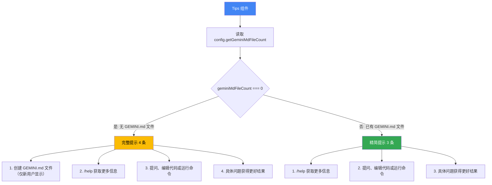

# Tips.tsx

## 概述

`Tips` 是一个基于 Ink 框架的 React 终端 UI 组件，用于在 CLI 启动时向用户显示入门提示信息。它根据用户是否已创建 `GEMINI.md` 配置文件来动态调整提示内容和编号，为新用户和已配置用户分别提供差异化的引导体验。

**文件路径**: `packages/cli/src/ui/components/Tips.tsx`

## 架构图（Mermaid）

## 核心组件

### 1. `TipsProps` 接口（内部）

组件的属性定义：

| 属性 | 类型 | 必填 | 说明 |
|------|------|------|------|
| `config` | `Config` | 是 | 应用配置对象，来自 `@google/gemini-cli-core` 包 |

### 2. `Tips` 函数组件（导出）

类型：`React.FC<TipsProps>`

一个函数式组件，根据配置状态渲染入门提示列表。

#### 2.1 核心逻辑

1. 通过 `config.getGeminiMdFileCount()` 获取用户已创建的 `GEMINI.md` 文件数量
2. 根据文件数量决定渲染内容：

**当 `geminiMdFileCount === 0`（新用户，无 GEMINI.md 文件）**:
| 编号 | 提示内容 |
|------|----------|
| 1 | 创建 **GEMINI.md** 文件来定制你的交互体验 |
| 2 | `/help` 获取更多信息 |
| 3 | 提问编码问题、编辑代码或运行命令 |
| 4 | 提问越具体，结果越好 |

**当 `geminiMdFileCount > 0`（老用户，已有 GEMINI.md 文件）**:
| 编号 | 提示内容 |
|------|----------|
| 1 | `/help` 获取更多信息 |
| 2 | 提问编码问题、编辑代码或运行命令 |
| 3 | 提问越具体，结果越好 |

#### 2.2 样式细节

- 整体容器：纵向排列（`flexDirection="column"`），顶部外边距1行（`marginTop={1}`）
- 标题文本："Tips for getting started:" 使用 `theme.text.primary` 颜色
- 提示序号和普通文本：使用 `theme.text.primary` 颜色
- `GEMINI.md` 文字：加粗显示（`<Text bold>`）
- `/help` 命令：使用 `theme.text.secondary` 次要颜色，与普通文本形成视觉区分

## 依赖关系

### 内部依赖

| 模块 | 导入内容 | 说明 |
|------|----------|------|
| `../semantic-colors.js` | `theme` | 语义化主题颜色配置 |

### 外部依赖

| 包名 | 导入内容 | 说明 |
|------|----------|------|
| `react` | `React`（type only） | React 类型定义，用于 `React.FC` |
| `ink` | `Box`, `Text` | Ink 终端 UI 框架的布局和文本组件 |
| `@google/gemini-cli-core` | `Config`（type） | 核心配置类型定义 |

## 关键实现细节

1. **条件化提示项**: 第一条提示（创建 `GEMINI.md` 文件）通过条件渲染 `{geminiMdFileCount === 0 && (...)}` 仅在用户未创建任何 `GEMINI.md` 文件时显示。这避免了对已经完成初始配置的用户显示多余的引导。

2. **动态编号调整**: 后续三条提示的序号通过三元表达式动态调整：
   - 无 GEMINI.md 时编号为 2、3、4（因为第1条被占用）
   - 有 GEMINI.md 时编号为 1、2、3

   这确保了编号始终连续，不会出现跳号。

3. **Config 依赖注入**: 组件不直接检测文件系统，而是通过 `Config` 对象的 `getGeminiMdFileCount()` 方法获取信息。这种依赖注入模式使组件更易于测试和解耦。

4. **语义化颜色使用**: 组件统一使用 `theme.text.primary` 和 `theme.text.secondary` 语义化颜色，确保在不同主题下都能保持良好的可读性和视觉层次。

5. **文本强调策略**: 采用两种强调方式来突出关键信息：
   - `<Text bold>GEMINI.md</Text>` 使用加粗突出文件名
   - `<Text color={theme.text.secondary}>/help</Text>` 使用次要颜色区分命令文本

   这帮助用户快速定位可操作的元素。

6. **组件类型声明**: 使用 `React.FC<TipsProps>` 箭头函数声明而非 `function` 声明，与项目中其他简单展示组件保持一致的代码风格（对比 `ThemeDialog` 等复杂组件使用 `function` 声明）。
