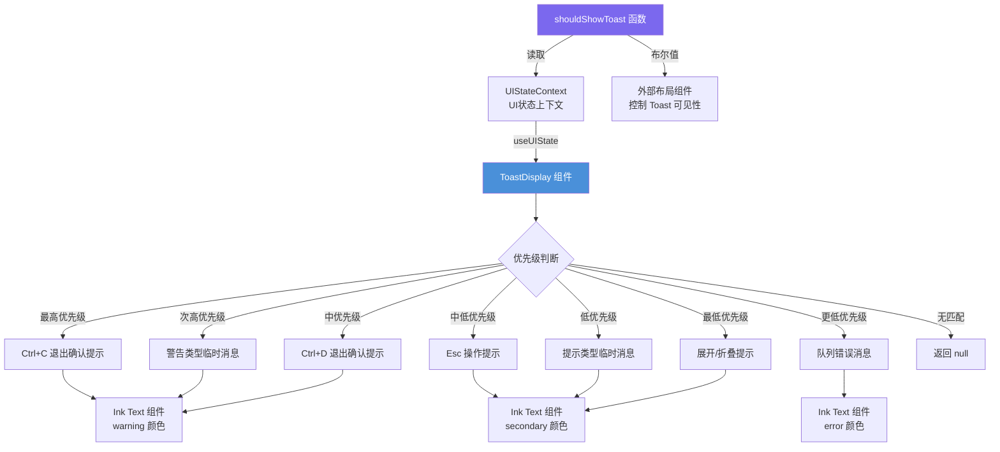

# ToastDisplay.tsx

## 概述

`ToastDisplay` 是一个 React 函数组件，用于在 CLI 界面底部显示临时的 Toast 通知消息。它根据当前 UI 状态（`UIState`）的不同条件，按优先级顺序渲染不同类型的提示信息，包括退出确认提示、警告消息、Esc 操作提示、队列错误消息以及展开/折叠提示。该组件是用户交互反馈系统的核心组成部分，确保用户在执行关键操作时能够获得即时的视觉反馈。

此外，该文件还导出了一个辅助函数 `shouldShowToast`，用于判断当前是否需要显示 Toast 通知，常被外部布局组件用来控制 Toast 区域的可见性。

## 架构图（Mermaid）

## 核心组件

### `shouldShowToast(uiState: UIState): boolean`

一个纯函数，接收 `UIState` 对象并返回布尔值，判断当前是否有需要展示的 Toast 消息。判断依据包括以下任一条件为真：

| 条件 | 说明 |
|------|------|
| `uiState.ctrlCPressedOnce` | 用户按下了一次 Ctrl+C |
| `Boolean(uiState.transientMessage)` | 存在临时消息（警告或提示） |
| `uiState.ctrlDPressedOnce` | 用户按下了一次 Ctrl+D |
| `uiState.showEscapePrompt && (buffer或history非空)` | Esc 提示可见且输入缓冲区或历史记录不为空 |
| `Boolean(uiState.queueErrorMessage)` | 存在队列错误消息 |
| `uiState.showIsExpandableHint` | 需要显示展开/折叠提示 |

### `ToastDisplay` 组件

React 函数组件，按以下优先级顺序渲染 Toast 消息：

1. **Ctrl+C 退出确认**（`warning` 颜色）：显示 "Press Ctrl+C again to exit."
2. **警告类型临时消息**（`warning` 颜色）：当 `transientMessage.type === TransientMessageType.Warning` 时，显示消息文本。
3. **Ctrl+D 退出确认**（`warning` 颜色）：显示 "Press Ctrl+D again to exit."
4. **Esc 操作提示**（`secondary` 颜色）：
   - 如果输入缓冲区为空且无历史记录，返回 `null`（不显示）。
   - 如果输入缓冲区为空，显示 "Press Esc again to rewind."
   - 如果输入缓冲区非空，显示 "Press Esc again to clear prompt."
5. **提示类型临时消息**（`secondary` 颜色）：当 `transientMessage.type === TransientMessageType.Hint` 时，显示消息文本。
6. **队列错误消息**（`error` 颜色）：直接显示 `queueErrorMessage` 文本。
7. **展开/折叠提示**（`secondary` 颜色）：根据 `constrainHeight` 状态显示 "Press Ctrl+O to show more/collapse lines of the last response"。

如果没有任何条件匹配，则返回 `null`。

## 依赖关系

### 内部依赖

| 模块 | 导入内容 | 用途 |
|------|----------|------|
| `../semantic-colors.js` | `theme` | 语义化颜色主题对象，用于为不同类型的 Toast 消息设置颜色（warning、secondary、error） |
| `../contexts/UIStateContext.js` | `useUIState`, `UIState`（类型） | UI 状态上下文 Hook 和类型定义，获取当前 UI 状态以决定显示哪种 Toast |
| `../../utils/events.js` | `TransientMessageType` | 临时消息类型枚举，用于区分 Warning 和 Hint 两种临时消息 |

### 外部依赖

| 包名 | 导入内容 | 用途 |
|------|----------|------|
| `react` | `React`（类型导入） | React 类型系统支持，用于 `React.FC` 类型注解 |
| `ink` | `Text` | Ink 终端 UI 框架的文本组件，用于渲染带颜色的文本输出 |

## 关键实现细节

1. **优先级机制**：Toast 消息通过 `if-else` 链实现优先级排序，确保同一时间只显示最重要的一条消息。Ctrl+C 退出确认具有最高优先级，这是出于安全考虑——用户尝试退出时必须最先看到退出确认提示。

2. **`shouldShowToast` 与组件的对称性**：`shouldShowToast` 函数的判断条件与 `ToastDisplay` 组件的渲染条件保持一致（但并非完全相同，例如 `showEscapePrompt` 在 `shouldShowToast` 中有额外的 buffer/history 检查）。外部组件可以使用 `shouldShowToast` 来决定是否为 Toast 预留显示空间，避免布局闪烁。

3. **颜色语义化**：使用 `theme` 对象进行颜色映射：
   - `theme.status.warning`：用于退出确认和警告消息（醒目提示）
   - `theme.text.secondary`：用于普通操作提示（柔和提示）
   - `theme.status.error`：用于错误消息（强调异常）

4. **Esc 提示的条件渲染**：Esc 提示在输入缓冲区为空且无历史记录时不会显示（返回 `null`），因为此时没有可清除或回退的内容。根据缓冲区是否有文本，动态切换提示文案（"rewind" vs "clear prompt"）。

5. **展开/折叠提示**：通过 `constrainHeight` 状态动态切换提示文案（"show more" vs "collapse"），提示用户可以使用 Ctrl+O 快捷键来展开或折叠最近的响应内容。

6. **纯函数设计**：`shouldShowToast` 是一个纯函数，不依赖任何 Hook，可以在组件外部或非 React 上下文中安全调用。
