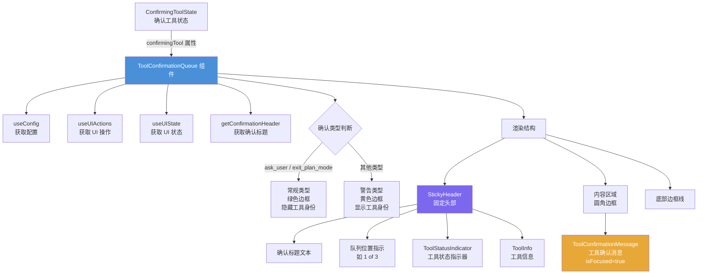

# ToolConfirmationQueue.tsx

## 概述

`ToolConfirmationQueue` 是一个 React 函数组件，负责渲染工具执行确认队列的 UI。当 AI 模型需要执行某些需要用户确认的工具操作时（如文件修改、执行命令等），该组件会以模态对话框的形式展示确认界面，显示工具的详细信息和操作内容，并等待用户进行确认或拒绝。

该组件支持队列机制——当多个工具需要确认时，会显示当前确认项在队列中的位置（如 "1 of 3"）。组件还根据确认类型（常规操作 vs 需要关注的操作）使用不同的视觉样式（绿色 vs 黄色边框），并智能计算可用内容高度以最大化 diff 和其他内容的显示空间。

此外，该文件还导出了一个辅助函数 `getConfirmationHeader`，用于根据确认详情类型生成对应的标题文本。

## 架构图（Mermaid）

## 核心组件

### `getConfirmationHeader(details: SerializableConfirmationDetails | undefined): string`

一个私有辅助函数，根据确认详情的类型返回对应的标题字符串：

| `details.type` | 返回标题 |
|-----------------|----------|
| `ask_user` | "Answer Questions" |
| `exit_plan_mode` | "Ready to start implementation?" |
| `undefined` / 其他 | "Action Required" |

### `ToolConfirmationQueueProps` 接口

| 属性 | 类型 | 说明 |
|------|------|------|
| `confirmingTool` | `ConfirmingToolState` | 当前需要确认的工具状态，包含 `tool`（工具详情）、`index`（当前索引）、`total`（队列总数） |

### `ToolConfirmationQueue` 组件

主组件，负责渲染完整的工具确认模态界面。其渲染结构分为三个部分：

1. **StickyHeader（固定头部）**：
   - 显示确认标题（通过 `getConfirmationHeader` 获取）
   - 当队列中有多个工具时，显示位置指示器（如 "1 of 3"）
   - 对非常规类型的确认，显示 `ToolStatusIndicator` 和 `ToolInfo`

2. **内容区域**：
   - 使用圆角边框包裹
   - 渲染 `ToolConfirmationMessage` 组件，始终设置 `isFocused={true}`（因为该组件作为模态覆盖层使用）
   - 宽度为 `mainAreaWidth - 4`，减去父级边框和内边距

3. **底部边框**：
   - 一个高度为 1 的圆角底部边框，完成视觉包围

## 依赖关系

### 内部依赖

| 模块 | 导入内容 | 用途 |
|------|----------|------|
| `../semantic-colors.js` | `theme` | 语义化颜色主题，用于设置边框颜色和文本颜色 |
| `../contexts/ConfigContext.js` | `useConfig` | 获取应用配置，传递给 `ToolConfirmationMessage` |
| `./messages/ToolConfirmationMessage.js` | `ToolConfirmationMessage` | 工具确认消息组件，渲染具体的确认内容和交互区域 |
| `./messages/ToolShared.js` | `ToolStatusIndicator`, `ToolInfo` | 工具状态指示器和工具信息组件，用于展示工具标识 |
| `../contexts/UIStateContext.js` | `useUIState` | 获取 UI 状态，包括终端宽高、内容高度约束等 |
| `../hooks/useConfirmingTool.js` | `ConfirmingToolState`（类型） | 确认工具状态的类型定义 |
| `./StickyHeader.js` | `StickyHeader` | 固定头部组件，提供圆角边框顶部样式 |
| `../contexts/UIActionsContext.js` | `useUIActions` | 获取 UI 操作方法，提供 `getPreferredEditor` |
| `@google/gemini-cli-core` | `SerializableConfirmationDetails`（类型） | 可序列化的确认详情类型定义 |

### 外部依赖

| 包名 | 导入内容 | 用途 |
|------|----------|------|
| `react` | `React`（类型导入） | React 类型系统支持 |
| `ink` | `Box`, `Text` | Ink 终端 UI 框架的布局和文本组件 |

## 关键实现细节

1. **安全检查**：组件在渲染前首先检查 `tool.confirmationDetails` 是否存在，如果不存在则返回 `null`，避免 `ToolConfirmationMessage` 因缺少必要数据而崩溃。

2. **高度计算策略**：
   - 最大高度（`maxHeight`）优先使用 `uiAvailableHeight`，最小值为 4 行；如果不可用则取终端高度的 50%。
   - 可用内容高度（`availableContentHeight`）在 `constrainHeight` 为 `true` 时，从 `maxHeight` 中减去外壳占用的行数（边框 2 行 + 头部 2 行 + 工具身份 2 行），最小保持 4 行。
   - 当 `constrainHeight` 为 `false` 时，`availableContentHeight` 为 `undefined`，表示不限制内容高度。
   - 如果隐藏工具身份（`hideToolIdentity`），则减去的行数从 6 降为 4。

3. **常规类型 vs 警告类型**：
   - `ask_user` 和 `exit_plan_mode` 被视为"常规"（`isRoutine`）操作，使用绿色（`theme.status.success`）边框，并隐藏工具标识区域以简化界面。
   - 其他类型使用黄色（`theme.status.warning`）边框，并完整显示工具名称、状态和描述，提醒用户关注。

4. **模态行为**：通过始终设置 `isFocused={true}`，`ToolConfirmationMessage` 组件表现为模态覆盖层，确保用户焦点集中在确认操作上，不会与底层的 Shell/Composer 交互产生冲突。

5. **队列指示器**：仅在 `total > 1` 时显示 "index of total" 文本，为用户提供队列进度的视觉反馈，帮助用户了解还有多少工具等待确认。

6. **三段式边框结构**：使用 `StickyHeader`（顶部圆角边框）+ 中间内容区域（左右边框）+ 底部边框（底部圆角）组合形成完整的视觉包围盒，创建类似模态对话框的外观。
