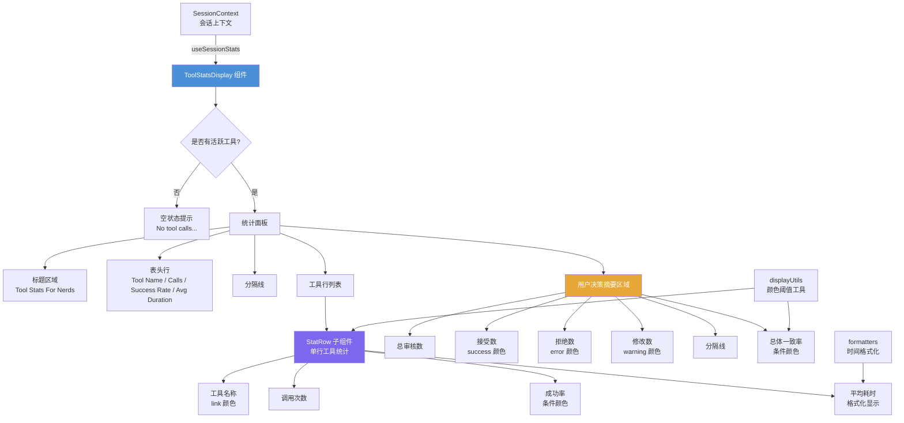

# ToolStatsDisplay.tsx

## 概述

`ToolStatsDisplay` 是一个 React 函数组件，用于以表格形式展示当前会话中所有工具调用的统计信息。该组件是一个面向开发者的诊断面板（标题为 "Tool Stats For Nerds"），展示每个工具的调用次数、成功率、平均耗时，以及用户对工具建议的决策摘要（接受/拒绝/修改），最终汇总为一个总体一致率。

该文件还包含一个内部子组件 `StatRow`，用于渲染每个工具的单行统计数据，以及一组列宽常量用于对齐表格布局。

## 架构图（Mermaid）

## 核心组件

### 列宽常量

| 常量 | 值 | 说明 |
|------|-----|------|
| `TOOL_NAME_COL_WIDTH` | 25 | 工具名称列宽度 |
| `CALLS_COL_WIDTH` | 8 | 调用次数列宽度 |
| `SUCCESS_RATE_COL_WIDTH` | 15 | 成功率列宽度 |
| `AVG_DURATION_COL_WIDTH` | 15 | 平均耗时列宽度 |

### `StatRow` 子组件

内部函数组件，负责渲染单个工具的统计行。

**Props**：

| 属性 | 类型 | 说明 |
|------|------|------|
| `name` | `string` | 工具名称 |
| `stats` | `ToolCallStats` | 工具调用统计数据（来自 `@google/gemini-cli-core`） |

**计算逻辑**：
- **成功率**：`(stats.success / stats.count) * 100`，当 `count` 为 0 时为 0。
- **平均耗时**：`stats.durationMs / stats.count`，当 `count` 为 0 时为 0。
- **成功率颜色**：使用 `getStatusColor` 函数，根据 `TOOL_SUCCESS_RATE_HIGH` 和 `TOOL_SUCCESS_RATE_MEDIUM` 阈值进行着色（绿色/黄色/红色）。

**渲染列**：
1. 工具名称（`theme.text.link` 颜色，左对齐）
2. 调用次数（`theme.text.primary` 颜色，右对齐）
3. 成功率百分比（条件颜色，右对齐，保留 1 位小数）
4. 平均耗时（`theme.text.primary` 颜色，右对齐，使用 `formatDuration` 格式化）

### `ToolStatsDisplay` 主组件

**空状态**：当没有任何工具被调用时（`activeTools.length === 0`），在圆角边框内显示 "No tool calls have been made in this session."

**有数据时的渲染结构**：

1. **标题**："Tool Stats For Nerds"（`theme.text.accent` 颜色，粗体）
2. **表头行**：Tool Name / Calls / Success Rate / Avg Duration（均粗体）
3. **分隔线**：单线底部边框
4. **工具行列表**：遍历 `activeTools` 使用 `StatRow` 渲染
5. **用户决策摘要**：
   - 标题 "User Decision Summary"（粗体）
   - Total Reviewed Suggestions（总审核数）
   - Accepted（接受数，绿色）
   - Rejected（拒绝数，红色）
   - Modified（修改数，黄色）
6. **底部分隔线**
7. **总体一致率**：`(accept / totalReviewed) * 100`，使用 `USER_AGREEMENT_RATE_HIGH` 和 `USER_AGREEMENT_RATE_MEDIUM` 阈值着色。无审核数据时显示 "--"。

## 依赖关系

### 内部依赖

| 模块 | 导入内容 | 用途 |
|------|----------|------|
| `../semantic-colors.js` | `theme` | 语义化颜色主题，提供文本、边框、状态等颜色 |
| `../utils/formatters.js` | `formatDuration` | 时间格式化工具函数，将毫秒数转换为人类可读的持续时间字符串 |
| `../utils/displayUtils.js` | `getStatusColor`, `TOOL_SUCCESS_RATE_HIGH`, `TOOL_SUCCESS_RATE_MEDIUM`, `USER_AGREEMENT_RATE_HIGH`, `USER_AGREEMENT_RATE_MEDIUM` | 状态颜色计算函数和阈值常量 |
| `../contexts/SessionContext.js` | `useSessionStats` | 会话统计上下文 Hook，获取当前会话的工具调用统计数据 |
| `@google/gemini-cli-core` | `ToolCallStats`（类型） | 工具调用统计数据的类型定义 |

### 外部依赖

| 包名 | 导入内容 | 用途 |
|------|----------|------|
| `react` | `React`（类型导入） | React 类型系统支持 |
| `ink` | `Box`, `Text` | Ink 终端 UI 框架的布局和文本组件 |

## 关键实现细节

1. **活跃工具过滤**：通过 `Object.entries(tools.byName).filter(([, metrics]) => metrics.count > 0)` 过滤掉从未被调用的工具，只展示有实际调用记录的工具。

2. **决策汇总计算**：使用 `reduce` 对所有工具的 `decisions` 进行累加，得到全局的 accept/reject/modify 总数。总审核数 `totalReviewed` 为三者之和。

3. **一致率（Agreement Rate）**：定义为 `accept / totalReviewed * 100`，即用户接受工具建议的比例。该指标反映了 AI 工具建议的质量——高一致率表明 AI 的工具选择和参数通常符合用户预期。

4. **颜色阈值系统**：使用 `getStatusColor` 函数根据不同的百分比阈值返回对应颜色：
   - 工具成功率使用 `TOOL_SUCCESS_RATE_HIGH` / `TOOL_SUCCESS_RATE_MEDIUM` 阈值
   - 用户一致率使用 `USER_AGREEMENT_RATE_HIGH` / `USER_AGREEMENT_RATE_MEDIUM` 阈值
   - 高于绿色阈值显示绿色，介于绿色和黄色之间显示黄色，低于黄色阈值显示红色

5. **固定列宽布局**：使用常量定义列宽，总宽度为 `25 + 8 + 15 + 15 = 63`，加上边框和内边距约为 70 字符。用户决策摘要区域的标签列使用 `TOOL_NAME_COL_WIDTH + CALLS_COL_WIDTH + SUCCESS_RATE_COL_WIDTH`（共 48）的组合宽度。

6. **边框设计**：整个面板使用 `round` 边框样式和 `theme.border.default` 颜色。内部分隔线使用 `single` 边框样式，仅显示底部边框线。

7. **空数据保护**：在计算成功率和平均耗时时，统一检查 `count > 0` 避免除零错误；一致率在 `totalReviewed > 0` 时才显示百分比，否则显示 "--"。
