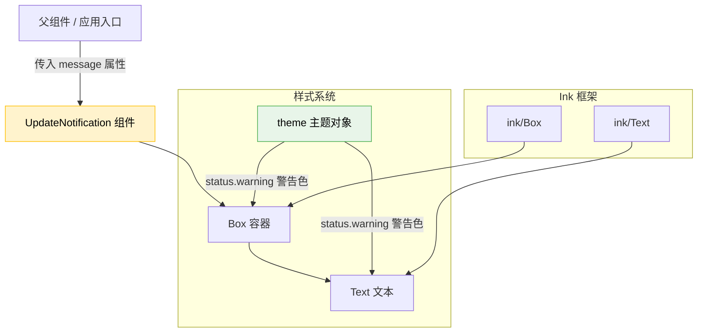

# UpdateNotification.tsx

## 概述

`UpdateNotification` 是一个轻量级的 React (Ink) 函数组件，用于在 CLI 终端界面中向用户展示**版本更新通知**。当检测到有新版本可用时，该组件以一个带有圆角边框、警告色高亮的文本框形式呈现更新提示消息。

该组件属于 Gemini CLI 的终端 UI 层，基于 [Ink](https://github.com/vadimdemedes/ink) 框架构建，利用 Ink 提供的 `Box` 和 `Text` 原语来实现终端中的布局与样式渲染。

**文件路径**: `packages/cli/src/ui/components/UpdateNotification.tsx`
**许可证**: Apache-2.0 (Copyright 2025 Google LLC)

## 架构图（Mermaid）



## 核心组件

### UpdateNotificationProps 接口

| 属性 | 类型 | 必填 | 说明 |
|------|------|------|------|
| `message` | `string` | 是 | 要展示的更新通知文本内容，例如 "A new version x.x.x is available" |

### UpdateNotification 函数组件

这是一个**无状态函数组件**（Stateless Functional Component），采用箭头函数 + 隐式返回的简洁写法。

**渲染结构**:

```
Box (圆角边框容器)
  └── Text (更新提示文字)
```

**样式配置**:

| 属性 | 值 | 说明 |
|------|-----|------|
| `borderStyle` | `"round"` | 使用圆角字符绘制边框（`╭╮╰╯`） |
| `borderColor` | `theme.status.warning` | 边框颜色使用主题中的警告色 |
| `paddingX` | `1` | 水平内边距为1个字符宽度 |
| `marginY` | `1` | 垂直外边距为1行高度（上下各留一行空白） |
| `Text color` | `theme.status.warning` | 文本颜色同样使用警告色 |

**终端渲染效果示意**:

```
╭──────────────────────────────────────╮
│ A new version 1.2.3 is available!    │
╰──────────────────────────────────────╯
```

## 依赖关系

### 内部依赖

| 模块 | 导入内容 | 说明 |
|------|---------|------|
| `../semantic-colors.js` | `theme` | 语义化颜色主题对象，提供统一的 UI 配色方案。此处使用 `theme.status.warning` 获取警告状态对应的终端颜色值 |

### 外部依赖

| 包名 | 导入内容 | 说明 |
|------|---------|------|
| `ink` | `Box`, `Text` | Ink 框架的核心布局与文本渲染组件。`Box` 提供类似 CSS Flexbox 的终端布局能力；`Text` 用于渲染带样式的文本 |

## 关键实现细节

1. **极简设计**: 整个组件仅 23 行代码，是一个纯展示型组件，不包含任何状态管理、副作用或业务逻辑。它只负责将传入的 `message` 字符串以特定样式渲染到终端中。

2. **主题一致性**: 边框颜色和文本颜色均使用 `theme.status.warning`，保证了视觉上的一致性，同时通过语义化颜色系统（`semantic-colors.js`）实现了与其他组件的风格统一。如果全局主题发生变化，该组件会自动适配。

3. **圆角边框**: 使用 `borderStyle="round"` 实现圆角边框效果，这在终端 UI 中提供了比默认直角边框更柔和的视觉体验，适合用于非侵入式的通知提示场景。

4. **间距处理**: `paddingX={1}` 确保文本与边框之间有适当留白；`marginY={1}` 确保通知框与上下方的其他内容之间有适当间隔，避免视觉拥挤。

5. **导出方式**: 使用**命名导出**（`export const`），而非默认导出，这符合项目中的模块导出规范，便于在其他文件中按名称精确导入。

6. **组件职责单一**: 该组件不负责判断"是否需要显示更新通知"或"获取最新版本号"等逻辑，这些职责由上层父组件承担。`UpdateNotification` 只负责"渲染"这一单一职责。
