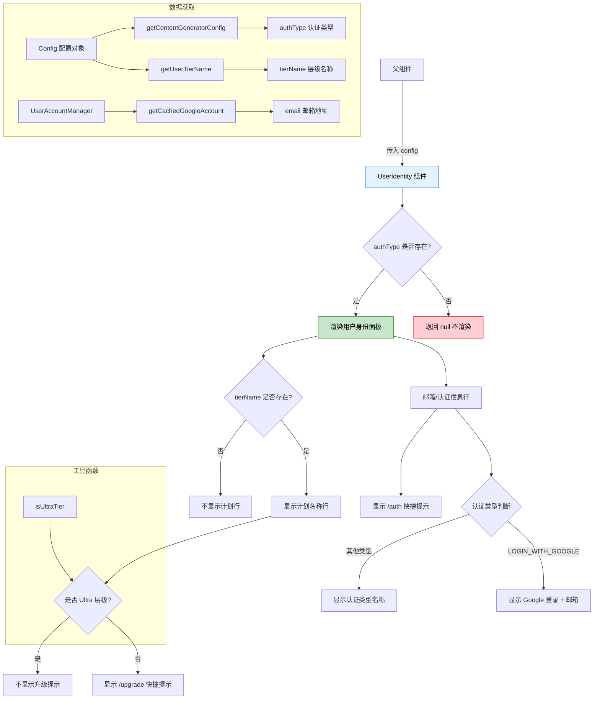

# UserIdentity.tsx

## 概述

`UserIdentity` 是一个 React (Ink) 函数组件，用于在 CLI 终端界面中展示**当前用户的身份信息和订阅计划**。它会根据用户的认证类型显示登录邮箱，并展示当前的订阅层级（Tier）名称。组件还附带了快捷命令提示（如 `/auth`、`/upgrade`），方便用户快速执行认证管理或升级操作。

**文件路径**: `packages/cli/src/ui/components/UserIdentity.tsx`
**许可证**: Apache-2.0 (Copyright 2026 Google LLC)

## 架构图（Mermaid）



## 核心组件

### UserIdentityProps 接口

| 属性 | 类型 | 必填 | 说明 |
|------|------|------|------|
| `config` | `Config` | 是 | 来自 `@google/gemini-cli-core` 的配置对象，包含认证类型、用户层级等信息 |

### UserIdentity 函数组件

使用 `React.FC<UserIdentityProps>` 类型注解的函数组件，包含三个 `useMemo` 计算值和条件渲染逻辑。

#### 状态与计算值

| 计算值 | 类型 | 依赖项 | 说明 |
|--------|------|--------|------|
| `authType` | `AuthType \| undefined` | 直接从 config 读取 | 通过 `config.getContentGeneratorConfig()?.authType` 获取当前认证类型 |
| `email` | `string \| undefined` | `[authType]` | 当存在 authType 时，通过 `UserAccountManager` 获取缓存的 Google 账户邮箱 |
| `tierName` | `string \| undefined` | `[config, authType]` | 当存在 authType 时，通过 `config.getUserTierName()` 获取用户订阅层级名称 |
| `isUltra` | `boolean` | `[tierName]` | 通过 `isUltraTier(tierName)` 判断用户是否为 Ultra 层级 |

#### 渲染结构

```
Box (垂直布局容器, flexDirection="column")
├── Box (第一行：邮箱/认证信息)
│   ├── Text (认证信息内容)
│   │   ├── [Google 登录] "Signed in with Google: user@example.com"
│   │   └── [其他认证] "Authenticated with {authType}"
│   └── Text (" /auth" 快捷命令提示, 次要文字色)
│
└── [条件渲染: tierName 存在时]
    Box (第二行：订阅计划信息)
    ├── Text ("Plan: {tierName}")
    └── [条件渲染: 非 Ultra 时]
        Text (" /upgrade" 快捷命令提示, 次要文字色)
```

#### 条件渲染逻辑

1. **无认证时**: 如果 `authType` 不存在，组件返回 `null`，完全不渲染。
2. **Google 登录**: 当 `authType === AuthType.LOGIN_WITH_GOOGLE` 时，显示 "Signed in with Google" 以及可选的邮箱地址。
3. **其他认证方式**: 显示 "Authenticated with {authType}" 的通用格式。
4. **层级信息**: 仅当 `tierName` 存在时才渲染计划行。
5. **升级提示**: 仅当用户不是 Ultra 层级时才显示 `/upgrade` 快捷命令。

## 依赖关系

### 内部依赖

| 模块 | 导入内容 | 说明 |
|------|---------|------|
| `../semantic-colors.js` | `theme` | 语义化颜色主题对象，使用 `theme.text.primary` 和 `theme.text.secondary` 控制文字颜色 |
| `../../utils/tierUtils.js` | `isUltraTier` | 工具函数，判断给定的层级名称是否为 Ultra 层级 |

### 外部依赖

| 包名 | 导入内容 | 说明 |
|------|---------|------|
| `react` | `React` (类型), `useMemo` | React 类型定义和记忆化 Hook |
| `ink` | `Box`, `Text` | Ink 框架的终端 UI 布局与文本渲染组件 |
| `@google/gemini-cli-core` | `Config` (类型), `UserAccountManager`, `AuthType` | 核心库：配置管理、用户账户管理、认证类型枚举 |

## 关键实现细节

1. **useMemo 性能优化**: 组件使用了三个 `useMemo` 钩子来缓存计算结果：
   - `email` 的计算涉及实例化 `UserAccountManager` 并读取缓存，通过 `useMemo` 避免每次渲染都重复执行。
   - `tierName` 和 `isUltra` 同样被缓存，依赖于各自的输入值。

2. **UserAccountManager 实例化**: `email` 的获取方式是在 `useMemo` 回调内**每次需要时创建新的 `UserAccountManager` 实例**，调用 `getCachedGoogleAccount()` 获取本地缓存的 Google 账户信息。使用 `?? undefined` 将 `null` 统一转换为 `undefined`。

3. **可选链安全访问**: `config.getContentGeneratorConfig()?.authType` 使用可选链操作符，确保当 `getContentGeneratorConfig()` 返回 `undefined` 或 `null` 时不会抛出异常。

4. **文本截断处理**: 认证信息和层级信息的 `Text` 组件均设置了 `wrap="truncate-end"`，当终端宽度不足以显示完整文本时，会在末尾截断并可能添加省略号，防止 UI 布局错乱。

5. **快捷命令提示**: 组件在认证信息后显示 `/auth`，在计划信息后显示 `/upgrade`（非 Ultra 用户），这些是 CLI 的交互命令提示，使用 `theme.text.secondary`（次要文字色）渲染，视觉上与主要信息形成层次区分。

6. **Ultra 层级特殊处理**: Ultra 是最高层级，因此当用户已经是 Ultra 时，不显示 `/upgrade` 提示，避免向已达最高级别的用户推荐升级。

7. **认证类型分支**: 组件区分了 `LOGIN_WITH_GOOGLE`（Google OAuth 登录）和其他认证类型（如 API Key 等），对 Google 登录会额外展示邮箱信息，提供更丰富的身份标识。
