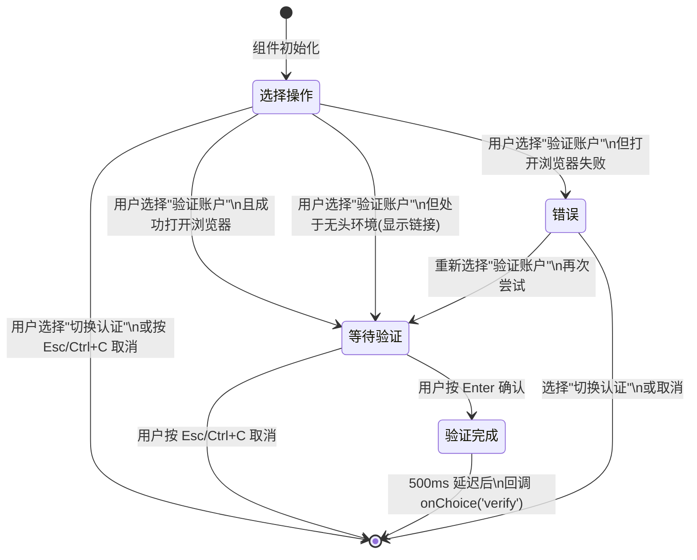
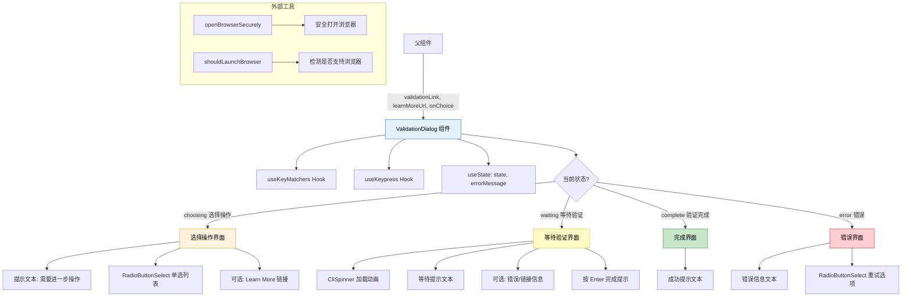

# ValidationDialog.tsx

## 概述

`ValidationDialog` 是一个有状态的 React (Ink) 函数组件，用于在 CLI 终端界面中处理**用户账户验证流程**。当服务需要额外的用户验证操作时（例如账户验证、CAPTCHA 等），该组件会展示一个交互式对话框，引导用户完成验证或切换认证方式。

该组件实现了一个完整的状态机，包含"选择操作"、"等待验证"、"验证完成"和"错误"四种状态，并能自动打开浏览器进行验证、处理无头（headless）环境的降级方案，以及支持键盘快捷键操控。

**文件路径**: `packages/cli/src/ui/components/ValidationDialog.tsx`
**许可证**: Apache-2.0 (Copyright 2025 Google LLC)

## 架构图（Mermaid）





## 核心组件

### ValidationDialogProps 接口

| 属性 | 类型 | 必填 | 说明 |
|------|------|------|------|
| `validationLink` | `string \| undefined` | 否 | 验证链接 URL，用于在浏览器中打开验证页面 |
| `validationDescription` | `string \| undefined` | 否 | 验证描述文本（在 Props 中定义但当前未在组件中使用） |
| `learnMoreUrl` | `string \| undefined` | 否 | "了解更多"链接，在选择界面底部展示 |
| `onChoice` | `(choice: ValidationIntent) => void` | 是 | 用户做出选择后的回调函数，接收 `ValidationIntent` 类型参数 |

### DialogState 类型

```typescript
type DialogState = 'choosing' | 'waiting' | 'complete' | 'error';
```

| 状态 | 说明 |
|------|------|
| `choosing` | 初始状态，用户正在选择操作（验证 / 切换认证） |
| `waiting` | 已打开浏览器验证页面，等待用户完成验证 |
| `complete` | 用户确认验证完成，短暂展示成功消息 |
| `error` | 打开浏览器失败，显示错误信息和重试选项 |

### 选项列表 (items)

| 标签 | 值 | 说明 |
|------|-----|------|
| `Verify your account` | `'verify'` | 触发账户验证流程 |
| `Change authentication` | `'change_auth'` | 切换认证方式 |

### 关键方法

#### handleSelect (useCallback)

核心的选项处理函数，依赖 `[validationLink, onChoice]`：

- **选择 `verify`（验证账户）**:
  1. 如果提供了 `validationLink`:
     - 先调用 `shouldLaunchBrowser()` 检测当前环境是否支持打开浏览器。
     - **支持浏览器**: 调用 `openBrowserSecurely(validationLink)` 打开验证页面，成功后进入 `waiting` 状态。
     - **不支持浏览器（无头环境）**: 将验证链接作为错误消息显示，提示用户手动在浏览器中打开，然后进入 `waiting` 状态。
     - **打开失败**: 捕获异常，设置错误消息，进入 `error` 状态。
  2. 如果未提供 `validationLink`: 直接调用 `onChoice('verify')` 进行重试。

- **选择 `change_auth` 或其他**: 直接调用 `onChoice(choice)` 传递给父组件处理。

#### 键盘事件处理 (useKeypress)

- **Esc 或 Ctrl+C**: 在任何非 `complete` 状态下，触发 `onChoice('cancel')` 取消操作。
- **Enter**: 仅在 `waiting` 状态下有效，将状态转换为 `complete`。
- `isActive` 配置: 当状态为 `complete` 时停用键盘监听。

#### 完成延迟效果 (useEffect)

当状态变为 `complete` 时：
1. 设置一个 500ms 的定时器。
2. 定时器到期后调用 `onChoice('verify')`。
3. 清理函数会在组件卸载或依赖变化时清除定时器。

### 渲染结构（按状态）

#### choosing（选择操作）状态

```
Box (圆角边框, 垂直布局, padding=1)
├── Box (marginBottom=1)
│   └── Text "Further action is required to use this service."
├── Box (marginTop=1, marginBottom=1)
│   └── RadioButtonSelect [验证账户, 切换认证]
└── [条件: learnMoreUrl 存在]
    Box (marginTop=1)
    └── Text (dimColor) "Learn more: {learnMoreUrl}"
```

#### waiting（等待验证）状态

```
Box (圆角边框, 垂直布局, padding=1)
├── Box
│   ├── CliSpinner (加载动画)
│   └── Text " Waiting for verification... (Press Esc or Ctrl+C to cancel)"
├── [条件: errorMessage 存在]
│   Box (marginTop=1)
│   └── Text "{errorMessage}"  ← 无头环境下显示验证链接
└── Box (marginTop=1)
    └── Text (dimColor) "Press Enter when verification is complete."
```

#### complete（验证完成）状态

```
Box (圆角边框, 垂直布局, padding=1)
└── Text (成功色) "Verification complete"
```

#### error（错误）状态

```
Box (圆角边框, 垂直布局, padding=1)
├── Text (错误色) "{errorMessage}" 或默认错误提示
└── Box (marginTop=1)
    └── RadioButtonSelect [验证账户, 切换认证]
```

## 依赖关系

### 内部依赖

| 模块 | 导入内容 | 说明 |
|------|---------|------|
| `./shared/RadioButtonSelect.js` | `RadioButtonSelect` | 单选按钮选择组件，提供上下键导航、Enter 确认的交互式选项列表 |
| `../semantic-colors.js` | `theme` | 语义化颜色主题对象，使用 `status.error`、`status.success`、`text.accent` |
| `./CliSpinner.js` | `CliSpinner` | CLI 加载动画组件，在等待验证时显示旋转指示器 |
| `../hooks/useKeypress.js` | `useKeypress` | 自定义键盘监听 Hook，支持全局键盘事件处理和激活/停用控制 |
| `../key/keyMatchers.js` | `Command` | 命令枚举，定义了 `ESCAPE`、`QUIT`、`RETURN` 等键盘命令 |
| `../hooks/useKeyMatchers.js` | `useKeyMatchers` | 自定义 Hook，返回键盘命令匹配函数映射 |

### 外部依赖

| 包名 | 导入内容 | 说明 |
|------|---------|------|
| `react` | `React` (类型), `useState`, `useEffect`, `useCallback` | React 核心 Hooks |
| `ink` | `Box`, `Text` | Ink 框架的终端 UI 布局与文本渲染组件 |
| `@google/gemini-cli-core` | `openBrowserSecurely`, `shouldLaunchBrowser`, `ValidationIntent` (类型) | 核心库：安全打开浏览器、环境检测、验证意图类型 |

## 关键实现细节

1. **状态机模式**: 组件使用 `DialogState` 联合类型实现了一个清晰的四状态状态机。每种状态对应独立的渲染分支，代码结构清晰，易于维护和扩展。渲染函数通过多个 `if` 提前返回来实现状态分支，最后的 `return` 是默认的 `choosing` 状态。

2. **无头环境降级**: 通过 `shouldLaunchBrowser()` 检测当前是否为无头（headless）环境（如 SSH 远程终端、Docker 容器等）。在无头环境下，不尝试打开浏览器，而是将验证链接直接显示在终端中，让用户手动复制到浏览器打开。这种降级策略确保了组件在各种环境下都能正常工作。

3. **异步错误处理**: `handleSelect` 是一个 `async` 函数，使用 `try-catch` 包裹 `openBrowserSecurely` 调用。捕获到的错误会被转换为用户友好的错误消息，并通过状态机转入 `error` 状态，允许用户重试或更换认证方式。

4. **延迟反馈**: 验证完成后不是立即回调父组件，而是先展示 "Verification complete" 成功消息 500ms，然后再调用 `onChoice('verify')`。这个短暂的延迟给用户一个视觉确认，提升了交互体验。

5. **键盘交互层次**: 键盘事件处理分两层：
   - **全局层**: `useKeypress` Hook 处理 Esc/Ctrl+C 取消操作，在所有非 complete 状态下生效。
   - **组件层**: `RadioButtonSelect` 组件内部处理上下键导航和 Enter 选择。
   - **状态特定**: `waiting` 状态下 Enter 键被全局层拦截，用于确认验证完成。

6. **`validationDescription` 未使用**: Props 接口定义了 `validationDescription` 属性，但在组件的解构赋值和渲染逻辑中均未使用。这可能是为未来扩展预留的接口，或是重构过程中的遗留。

7. **void 操作符**: `onSelect` 回调中使用 `void handleSelect(...)` 语法，这是因为 `handleSelect` 返回 `Promise<void>`，而 `onSelect` 期望同步回调。`void` 操作符明确表示忽略 Promise 返回值，避免 TypeScript/ESLint 的 floating promise 警告。

8. **清理函数模式**: `useEffect` 中的定时器使用了标准的清理函数模式（`return () => clearTimeout(timer)`），确保组件在卸载或状态快速变化时不会产生内存泄漏或意外的回调调用。
