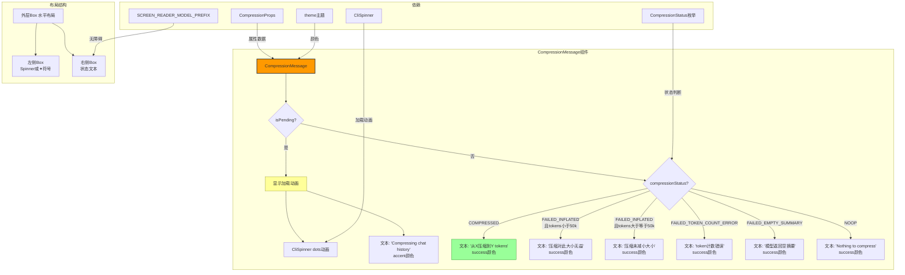

# CompressionMessage.tsx

## 概述

`CompressionMessage` 是一个 React（Ink）函数式组件，用于在 CLI 终端中展示**聊天历史压缩**操作的状态和结果。当用户执行 `/compress` 命令时，该组件会被渲染出来。

组件具有两种视觉状态：
1. **进行中状态**: 显示一个旋转的加载动画（dots spinner）+ "Compressing chat history" 文本，使用 accent 颜色
2. **完成状态**: 显示 `✦` 前缀符号 + 压缩结果文本，使用 success 颜色

根据压缩操作的不同结果（成功、失败、无操作等），组件会显示不同的提示信息。

**文件路径**: `packages/cli/src/ui/components/messages/CompressionMessage.tsx`

## 架构图（Mermaid）



## 核心组件

### 1. CompressionDisplayProps 接口

```typescript
export interface CompressionDisplayProps {
  compression: CompressionProps;
}
```

其中 `CompressionProps`（定义于 `../../types.js`）的结构为：

```typescript
interface CompressionProps {
  isPending: boolean;
  originalTokenCount: number | null;
  newTokenCount: number | null;
  compressionStatus: CompressionStatus | null;
}
```

| 属性 | 类型 | 说明 |
|------|------|------|
| `isPending` | `boolean` | 压缩操作是否仍在进行中 |
| `originalTokenCount` | `number \| null` | 压缩前的 token 数量 |
| `newTokenCount` | `number \| null` | 压缩后的 token 数量 |
| `compressionStatus` | `CompressionStatus \| null` | 压缩操作的最终状态枚举 |

### 2. CompressionStatus 枚举

定义于 `@google/gemini-cli-core`（`packages/core/src/core/turn.ts`）：

```typescript
enum CompressionStatus {
  COMPRESSED = 1,
  COMPRESSION_FAILED_INFLATED_TOKEN_COUNT,   // 值 = 2
  COMPRESSION_FAILED_TOKEN_COUNT_ERROR,      // 值 = 3
  COMPRESSION_FAILED_EMPTY_SUMMARY,          // 值 = 4
  NOOP,                                      // 值 = 5
}
```

| 枚举值 | 数值 | 说明 |
|--------|------|------|
| `COMPRESSED` | 1 | 压缩成功 |
| `COMPRESSION_FAILED_INFLATED_TOKEN_COUNT` | 2 | 压缩后 token 数反而增加 |
| `COMPRESSION_FAILED_TOKEN_COUNT_ERROR` | 3 | token 计数过程出错 |
| `COMPRESSION_FAILED_EMPTY_SUMMARY` | 4 | 模型返回了空的摘要 |
| `NOOP` | 5 | 无需压缩（历史过短或无内容） |

### 3. CompressionMessage 函数式组件

```typescript
export function CompressionMessage({
  compression,
}: CompressionDisplayProps): React.JSX.Element { ... }
```

#### getCompressionText() 内部函数

该函数根据 `isPending` 和 `compressionStatus` 返回对应的提示文本：

| 条件 | 返回文本 |
|------|----------|
| `isPending === true` | `'Compressing chat history'` |
| `COMPRESSED` | `'Chat history compressed from {originalTokens} to {newTokens} tokens.'` |
| `FAILED_INFLATED` 且原始 token < 50k | `'Compression was not beneficial for this history size.'` |
| `FAILED_INFLATED` 且原始 token >= 50k | `'Chat history compression did not reduce size. This may indicate issues with the compression prompt.'` |
| `FAILED_TOKEN_COUNT_ERROR` | `'Could not compress chat history due to a token counting error.'` |
| `FAILED_EMPTY_SUMMARY` | `'Chat history compression failed: the model returned an empty summary.'` |
| `NOOP` | `'Nothing to compress.'` |
| 默认 | `''`（空字符串） |

#### 布局结构

```
┌─────────────────────────────────────────────────┐
│ Box (flexDirection="row")                       │
│ ┌────────────┐ ┌─────────────────────────────┐  │
│ │ marginR=1  │ │ Text                        │  │
│ │ CliSpinner │ │ 压缩状态文本                 │  │
│ │ 或 ✦ 符号  │ │ aria-label="Model: "        │  │
│ └────────────┘ └─────────────────────────────┘  │
└─────────────────────────────────────────────────┘
```

- **左侧**: 进行中时显示 `CliSpinner`（dots 类型动画），完成后显示 `✦` 符号（accent 颜色）
- **右侧**: 状态文本，进行中使用 `accent` 颜色，完成后使用 `success` 颜色

### 4. 完整源码（带注释）

```tsx
/*
 * 压缩消息在执行 /compress 命令时出现，
 * 在压缩进行中显示加载动画，完成后显示压缩统计数据。
 */
export function CompressionMessage({
  compression,
}: CompressionDisplayProps): React.JSX.Element {
  // 解构压缩状态数据
  const { isPending, originalTokenCount, newTokenCount, compressionStatus } =
    compression;

  // 空值安全处理，null 转为 0
  const originalTokens = originalTokenCount ?? 0;
  const newTokens = newTokenCount ?? 0;

  // 根据状态生成对应提示文本
  const getCompressionText = () => {
    if (isPending) {
      return 'Compressing chat history';
    }
    switch (compressionStatus) {
      case CompressionStatus.COMPRESSED:
        return `Chat history compressed from ${originalTokens} to ${newTokens} tokens.`;
      case CompressionStatus.COMPRESSION_FAILED_INFLATED_TOKEN_COUNT:
        // 小于 50k 时，压缩开销可能超过收益
        if (originalTokens < 50000) {
          return 'Compression was not beneficial for this history size.';
        }
        // 大于 50k 时，压缩应该有效但未生效，可能是压缩提示词有问题
        return 'Chat history compression did not reduce size. This may indicate issues with the compression prompt.';
      case CompressionStatus.COMPRESSION_FAILED_TOKEN_COUNT_ERROR:
        return 'Could not compress chat history due to a token counting error.';
      case CompressionStatus.COMPRESSION_FAILED_EMPTY_SUMMARY:
        return 'Chat history compression failed: the model returned an empty summary.';
      case CompressionStatus.NOOP:
        return 'Nothing to compress.';
      default:
        return '';
    }
  };

  const text = getCompressionText();

  return (
    <Box flexDirection="row">
      {/* 左侧：加载动画或完成图标 */}
      <Box marginRight={1}>
        {isPending ? (
          <CliSpinner type="dots" />
        ) : (
          <Text color={theme.text.accent}>✦</Text>
        )}
      </Box>
      {/* 右侧：状态文本 */}
      <Box>
        <Text
          color={
            compression.isPending ? theme.text.accent : theme.status.success
          }
          aria-label={SCREEN_READER_MODEL_PREFIX}
        >
          {text}
        </Text>
      </Box>
    </Box>
  );
}
```

## 依赖关系

### 内部依赖

| 模块 | 导入内容 | 用途 |
|------|----------|------|
| `../../types.js` | `CompressionProps`（类型） | 压缩状态数据的类型定义，包含 `isPending`、`originalTokenCount`、`newTokenCount`、`compressionStatus` 四个字段 |
| `../CliSpinner.js` | `CliSpinner` | 终端加载动画组件，包裹 `ink-spinner`，支持用户设置开关（`ui.showSpinner`）和调试计数器（`debugState.debugNumAnimatedComponents`） |
| `../../semantic-colors.js` | `theme` | 语义化主题颜色对象，使用 `text.accent`（前缀/进行中颜色）和 `status.success`（完成颜色） |
| `../../textConstants.js` | `SCREEN_READER_MODEL_PREFIX` | 屏幕阅读器前缀常量，值为 `'Model: '` |

### 外部依赖

| 包名 | 导入内容 | 用途 |
|------|----------|------|
| `ink` | `Box`, `Text` | Ink 终端 UI 基础布局和文本组件 |
| `@google/gemini-cli-core` | `CompressionStatus` | 压缩状态枚举类型，定义了 5 种压缩结果状态 |

## 关键实现细节

1. **双状态视觉反馈**: 组件在进行中（`isPending=true`）和完成（`isPending=false`）时有完全不同的视觉表现：
   - 进行中：旋转动画 + accent 颜色文本 -- 表示操作正在执行
   - 完成后：静态 `✦` 图标 + success 颜色文本 -- 表示操作已结束
   这种双状态设计为用户提供了清晰的操作进度感知。

2. **50k token 阈值的智能提示**: 当压缩失败（`COMPRESSION_FAILED_INFLATED_TOKEN_COUNT`）时，组件根据原始 token 数量进行了细分处理：
   - **小于 50,000 tokens**: 友好提示"压缩对此大小无益"——因为较小上下文的压缩开销可能超过收益，这是预期行为
   - **大于等于 50,000 tokens**: 警告提示"压缩未减小大小，可能是压缩提示词有问题"——大上下文理应能被有效压缩，失败说明可能存在系统性问题

3. **空值安全处理**: `originalTokenCount` 和 `newTokenCount` 可能为 `null`（在压缩尚未完成或失败时），通过 `?? 0` 提供默认值，避免在字符串模板插值中出现 `null`。

4. **导出方式差异**: 与同目录下其他组件（如 `ErrorMessage`、`GeminiMessage`）使用 `const + 箭头函数 + React.FC` 导出不同，此组件使用 `export function` 声明式导出，返回类型标注为 `React.JSX.Element`。这可能是不同贡献者的代码风格差异。

5. **CliSpinner 的配置感知**: `CliSpinner` 内部会读取用户设置 `ui.showSpinner`，如果用户关闭了动画显示，spinner 将返回 `null`（不渲染任何内容）。同时它会维护 `debugState.debugNumAnimatedComponents` 计数器，方便调试时追踪活跃的动画组件数量。

6. **无障碍支持**: 文本 `Text` 组件设置了 `aria-label={SCREEN_READER_MODEL_PREFIX}`（值为 `'Model: '`），与 `GeminiMessage` 保持一致的无障碍体验，确保屏幕阅读器用户能识别这是来自模型的输出消息。

7. **完成后颜色统一为 success**: 无论压缩结果是成功、失败还是无操作，完成后的文本颜色均为 `theme.status.success`（绿色）。这意味着组件不通过颜色区分成功和失败——区分是通过文本内容实现的。这种设计可能是为了视觉简洁，避免在终端中出现过多颜色变化。
