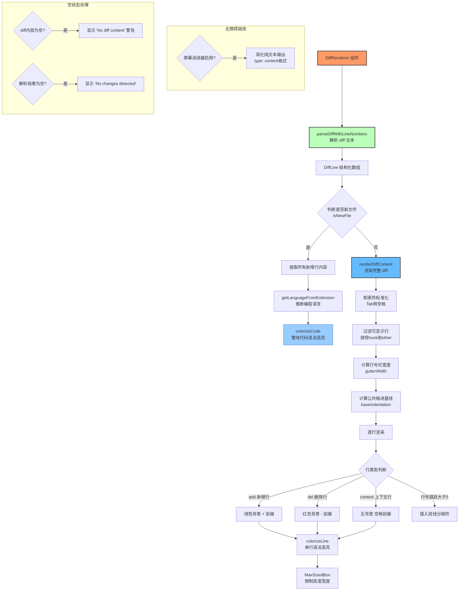

# DiffRenderer.tsx

## 概述

`DiffRenderer` 是一个功能丰富的 diff（差异对比）渲染组件，用于在 Gemini CLI 的终端界面中以语法高亮和色彩编码的方式展示文件差异。组件能够解析标准的 Git unified diff 格式，并支持以下高级特性：

- **行号标注**: 每行显示对应的原始/新文件行号
- **语法高亮**: 根据文件扩展名推断语言类型，对代码内容进行语法着色
- **新文件优化**: 对于全新文件的 diff，直接以完整代码块形式渲染（而非 diff 格式），提升可读性
- **间隔标记**: 当上下文行之间存在较大行号跳跃时，插入可视分隔线
- **无障碍支持**: 在屏幕阅读器模式下提供简化的纯文本输出
- **缩进标准化**: 自动去除公共缩进前缀，优化显示效果
- **制表符标准化**: 将 Tab 字符替换为空格，确保一致的显示宽度

**文件路径**: `packages/cli/src/ui/components/messages/DiffRenderer.tsx`

## 架构图（Mermaid）



## 核心组件

### 1. 类型定义

#### DiffLine 接口

```typescript
interface DiffLine {
  type: 'add' | 'del' | 'context' | 'hunk' | 'other';
  oldLine?: number;
  newLine?: number;
  content: string;
}
```

解析后的 diff 行数据结构：

| 字段 | 类型 | 说明 |
|------|------|------|
| `type` | `'add' \| 'del' \| 'context' \| 'hunk' \| 'other'` | 行类型：`add`（新增）、`del`（删除）、`context`（上下文）、`hunk`（区块头 @@）、`other`（如 "\ No newline at end of file"） |
| `oldLine` | `number \| undefined` | 原文件中的行号（`del` 和 `context` 类型有此值） |
| `newLine` | `number \| undefined` | 新文件中的行号（`add` 和 `context` 类型有此值） |
| `content` | `string` | 行内容（已去除 `+`、`-`、空格等 diff 前缀符号） |

#### DiffRendererProps 接口

```typescript
interface DiffRendererProps {
  diffContent: string;
  filename?: string;
  tabWidth?: number;
  availableTerminalHeight?: number;
  terminalWidth: number;
  theme?: Theme;
}
```

| 属性 | 类型 | 必填 | 默认值 | 说明 |
|------|------|------|--------|------|
| `diffContent` | `string` | 是 | - | 原始 Git unified diff 文本内容 |
| `filename` | `string` | 否 | `undefined` | 文件名（用于推断语言和生成唯一 key） |
| `tabWidth` | `number` | 否 | `4` | 制表符转换为空格的数量 |
| `availableTerminalHeight` | `number` | 否 | `undefined` | 可用的终端高度（行数），传递给 MaxSizedBox |
| `terminalWidth` | `number` | 是 | - | 终端宽度（字符数） |
| `theme` | `Theme` | 否 | `undefined` | 可选的自定义主题对象，传递给 colorizeCode |

### 2. parseDiffWithLineNumbers 函数（diff 解析器）

```typescript
function parseDiffWithLineNumbers(diffContent: string): DiffLine[]
```

这是 diff 解析的核心函数，将原始 unified diff 文本转换为结构化的 `DiffLine` 数组。

**解析逻辑流程**:

```
对于输入文本的每一行：
1. 匹配 hunk 头 (@@ -oldStart,count +newStart,count @@)
   -> 提取起始行号，设置当前行号计数器
   -> 标记进入 hunk 状态
   -> 行号计数器各减 1（因为后续逻辑是"先递增后使用"）

2. 不在 hunk 内
   -> 跳过 Git 头部行（'--- a/file' 等）
   -> 跳过其他非 hunk 内容

3. 在 hunk 内：
   - '+' 开头 -> type='add'，递增 newLine，去除前缀
   - '-' 开头 -> type='del'，递增 oldLine，去除前缀
   - ' ' 开头 -> type='context'，同时递增 oldLine 和 newLine，去除前缀
   - '\' 开头 -> type='other'（保留原始内容）
```

**Hunk 头正则表达式**:
```typescript
const hunkHeaderRegex = /^@@ -(\d+),?\d* \+(\d+),?\d* @@/;
```
支持带/不带行数的 hunk 格式（如 `@@ -1,5 +1,7 @@` 或 `@@ -1 +1 @@`）。

### 3. DiffRenderer 主组件

```typescript
export const DiffRenderer: React.FC<DiffRendererProps> = ({
  diffContent, filename, tabWidth = DEFAULT_TAB_WIDTH,
  availableTerminalHeight, terminalWidth, theme,
}) => { ... }
```

#### Hooks 使用

```typescript
const settings = useSettings();                           // 用户设置
const screenReaderEnabled = useIsScreenReaderEnabled();   // 屏幕阅读器检测
```

#### 三个核心 useMemo 计算

**parsedLines** -- 解析 diff 内容:
```typescript
const parsedLines = useMemo(() => {
  if (!diffContent || typeof diffContent !== 'string') return [];
  return parseDiffWithLineNumbers(diffContent);
}, [diffContent]);
```

**isNewFile** -- 判断是否为新文件:
```typescript
const isNewFile = useMemo(() => {
  if (parsedLines.length === 0) return false;
  return parsedLines.every(
    (line) =>
      line.type === 'add' || line.type === 'hunk' ||
      line.type === 'other' || line.content.startsWith('diff --git') ||
      line.content.startsWith('new file mode'),
  );
}, [parsedLines]);
```
逻辑：如果所有行都是 `add`、`hunk`、`other` 类型或 Git 头部元信息，则判定为新文件。

**renderedOutput** -- 主渲染逻辑（按优先级处理）:

| 优先级 | 条件 | 渲染结果 |
|--------|------|----------|
| 1 | `diffContent` 为空或非字符串 | `"No diff content."` 警告文本（warning 颜色） |
| 2 | `parsedLines` 为空 | `"No changes detected."` 圆角边框提示 |
| 3 | 屏幕阅读器启用 | 简化输出，每行 `{type}: {content}` 格式 |
| 4 | 是新文件 | 提取 add 行内容，`colorizeCode` 整块语法高亮 |
| 5 | 普通 diff | 调用 `renderDiffContent` 完整 diff 渲染 |

### 4. renderDiffContent 函数（核心 diff 渲染器）

```typescript
const renderDiffContent = (
  parsedLines: DiffLine[],
  filename: string | undefined,
  tabWidth: number,
  availableTerminalHeight: number | undefined,
  terminalWidth: number,
) => { ... }
```

这是最复杂的渲染函数，完整处理流程如下：

#### Step 1: 制表符标准化

```typescript
const normalizedLines = parsedLines.map((line) => ({
  ...line,
  content: line.content.replace(/\t/g, ' '.repeat(tabWidth)),
}));
```
将所有 Tab 字符替换为指定数量的空格（默认 4 个）。

#### Step 2: 过滤可显示行

```typescript
const displayableLines = normalizedLines.filter(
  (l) => l.type !== 'hunk' && l.type !== 'other',
);
```
只保留 `add`、`del`、`context` 三种类型。

#### Step 3: 计算行号栏宽度

```typescript
const maxLineNumber = Math.max(0, ...所有oldLine, ...所有newLine);
const gutterWidth = Math.max(1, maxLineNumber.toString().length);
```
根据最大行号的数字位数确定左侧行号栏的字符宽度。

#### Step 4: 推断编程语言

```typescript
const fileExtension = filename?.split('.').pop() || null;
const language = fileExtension ? getLanguageFromExtension(fileExtension) : null;
```

#### Step 5: 计算公共缩进基线

```typescript
let baseIndentation = Infinity;
for (const line of displayableLines) {
  if (line.content.trim() === '') continue;
  const firstCharIndex = line.content.search(/\S/);
  const currentIndent = firstCharIndex === -1 ? 0 : firstCharIndex;
  baseIndentation = Math.min(baseIndentation, currentIndent);
}
if (!isFinite(baseIndentation)) baseIndentation = 0;
```
找到所有非空行中最小的缩进量，后续渲染时去除这部分公共缩进。

#### Step 6: 生成唯一 key

```typescript
const key = filename
  ? `diff-box-${filename}`
  : `diff-box-${crypto.createHash('sha1').update(JSON.stringify(parsedLines)).digest('hex')}`;
```
有文件名时使用文件名，否则用 diff 内容的 SHA-1 哈希值。

#### Step 7: 逐行渲染（带间隔标记）

常量 `MAX_CONTEXT_LINES_WITHOUT_GAP = 5`，当相邻行号差超过此值时插入分隔线。

每行的渲染结构：

| 行类型 | 前缀符号 | 行号来源 | 背景色 | 前缀文字颜色 |
|--------|----------|----------|--------|-------------|
| `add` | `+` | `newLine` | `background.diff.added` | `status.success`（绿色） |
| `del` | `-` | `oldLine` | `background.diff.removed` | `status.error`（红色） |
| `context` | ` ` | `newLine` | 无 | 默认 |

单行渲染布局：
```
┌──────────┬───┬─────────────────────────────────┐
│ 行号(右对齐) │ ± │ colorizeLine(去缩进后的代码内容) │
│ gutterWidth │   │ flexGrow, wrap="wrap"            │
└──────────┴───┴─────────────────────────────────┘
```

间隔分隔线使用 `borderStyle="double"` 且只显示顶部边框的 Box 实现。

#### Step 8: MaxSizedBox 包裹

```typescript
return (
  <MaxSizedBox maxHeight={availableTerminalHeight} maxWidth={terminalWidth} key={key}>
    {content}
  </MaxSizedBox>
);
```

### 5. getLanguageFromExtension 辅助函数

```typescript
const getLanguageFromExtension = (extension: string): string | null => {
  const languageMap: { [key: string]: string } = {
    js: 'javascript', ts: 'typescript', py: 'python',
    json: 'json', css: 'css', html: 'html',
    sh: 'bash', md: 'markdown', yaml: 'yaml',
    yml: 'yaml', txt: 'plaintext', java: 'java',
    c: 'c', cpp: 'cpp', rb: 'ruby',
  };
  return languageMap[extension] || null;
};
```

支持 15 种常见文件扩展名映射：

| 扩展名 | 语言 | 扩展名 | 语言 |
|--------|------|--------|------|
| `js` | javascript | `yaml`/`yml` | yaml |
| `ts` | typescript | `txt` | plaintext |
| `py` | python | `java` | java |
| `json` | json | `c` | c |
| `css` | css | `cpp` | cpp |
| `html` | html | `rb` | ruby |
| `sh` | bash | `md` | markdown |

## 依赖关系

### 内部依赖

| 模块 | 导入内容 | 用途 |
|------|----------|------|
| `../../utils/CodeColorizer.js` | `colorizeCode` | 整块代码的语法高亮渲染（用于新文件场景） |
| `../../utils/CodeColorizer.js` | `colorizeLine` | 单行代码的语法高亮渲染（用于 diff 行） |
| `../shared/MaxSizedBox.js` | `MaxSizedBox` | 限制最大宽度和高度的容器组件，防止超长 diff 溢出 |
| `../../semantic-colors.js` | `theme`（别名 `semanticTheme`） | 语义化颜色主题，用于 diff 背景色、行号色、边框色、状态色等 |
| `../../themes/theme.js` | `Theme`（类型） | 自定义主题类型定义，作为可选 prop 传递 |
| `../../contexts/SettingsContext.js` | `useSettings` | 用户设置上下文钩子，传递给 `colorizeCode` |

### 外部依赖

| 包名 | 导入内容 | 用途 |
|------|----------|------|
| `react` | `React`（类型）, `useMemo` | React 核心 API 和类型 |
| `ink` | `Box`, `Text`, `useIsScreenReaderEnabled` | Ink 终端 UI 组件和无障碍检测钩子 |
| `node:crypto` | `crypto` | 生成 diff 内容的 SHA-1 哈希值作为 React 组件的唯一 key |

## 关键实现细节

1. **双路渲染策略**: 组件智能区分"新文件"和"修改文件"两种场景。对于新文件（`isNewFile=true`），直接使用 `colorizeCode` 渲染完整代码块，避免冗余的 `+` 前缀和行号栏，极大提升了新文件的阅读体验。对于修改文件，使用完整的 diff 格式（行号 + 前缀 + 背景色）渲染。

2. **行号计数器校正**: `parseDiffWithLineNumbers` 中在解析 hunk 头时将行号计数器各递减 1：
   ```typescript
   currentOldLine--;
   currentNewLine--;
   ```
   这是因为后续代码在处理每行时采用"先递增后使用"的模式（`currentNewLine++` 在 `push` 之前），因此需要提前减 1 以保证首行行号与 hunk 头声明一致。

3. **公共缩进去除（baseIndentation）**: 计算所有非空行的最小缩进量后，渲染时使用 `line.content.substring(baseIndentation)` 去除公共前缀。这对于深度嵌套的代码片段（如某个方法内部的修改）特别有用——避免左侧大量空白浪费宝贵的终端空间。

4. **间隔分隔线**: 当相邻可显示行之间的行号跳跃超过 `MAX_CONTEXT_LINES_WITHOUT_GAP`（5 行）时，在它们之间插入一条双线分隔符。分隔符使用 `borderStyle="double"` 和仅显示顶部边框（`borderLeft/Right/Bottom={false}`）的 Box 实现，宽度撑满终端。

5. **唯一 key 生成策略**: 优先使用文件名（`diff-box-${filename}`），无文件名时回退到 diff 内容的 SHA-1 哈希值。使用 `node:crypto` 模块而非简单的索引，确保即使 diff 内容变化时也能正确触发 React 的 key-based 重渲染。

6. **无障碍设计**: 通过 `useIsScreenReaderEnabled()` 检测屏幕阅读器状态。启用时完全跳过复杂的彩色 diff 渲染，改为简洁的 `{type}: {content}` 纯文本格式，确保视觉障碍用户也能理解 diff 内容。

7. **语法高亮集成**:
   - `colorizeCode`: 用于新文件的整块代码高亮，接收完整代码字符串、语言、可用高度/宽度、主题和设置
   - `colorizeLine`: 用于 diff 中每一行的独立高亮，接收单行文本和语言
   两者都依赖 `getLanguageFromExtension` 推断的语言类型来选择正确的高亮规则。

8. **制表符预处理**: 在所有显示相关的处理之前先将 Tab 标准化为空格，确保后续的缩进计算（`baseIndentation`）和终端列宽计算准确。默认 `tabWidth` 为 4 个空格。

9. **性能优化**:
   - 三个核心计算（`parsedLines`、`isNewFile`、`renderedOutput`）全部使用 `useMemo` 缓存
   - `useMemo` 的依赖数组精确列出所有相关依赖项（共 10 个），避免不必要的重计算
   - 使用 `MaxSizedBox` 限制渲染区域大小，防止超大 diff 导致终端卡顿
   - `renderedOutput` 直接返回 JSX 元素，组件体 `return renderedOutput` 极简

10. **diff 背景色双层应用**: 新增行和删除行不仅在前缀符号上着色，行号栏（gutter）也使用对应的 `background.diff.added` 或 `background.diff.removed` 背景色。这提供了更强的视觉对比度，用户可以仅通过行首的色带快速识别变更类型。

11. **context 行与 add/del 行的渲染差异**: context 行使用 `<>` Fragment 包裹前缀和内容（无背景色），而 add/del 行使用单个带背景色的 `<Text>` 包裹所有内容（前缀 + 代码）。这确保了 add/del 行的整行背景色一致，不会出现断裂。

12. **lastLineNumber 追踪机制**: 使用 `lastLineNumber` 变量在 `reduce` 迭代中跟踪上一行的行号。对于 `add` 和 `context` 行使用 `newLine`，对于 `del` 行使用 `oldLine`。这使得间隔检测能正确处理连续删除、连续添加和混合变更等各种情况。
