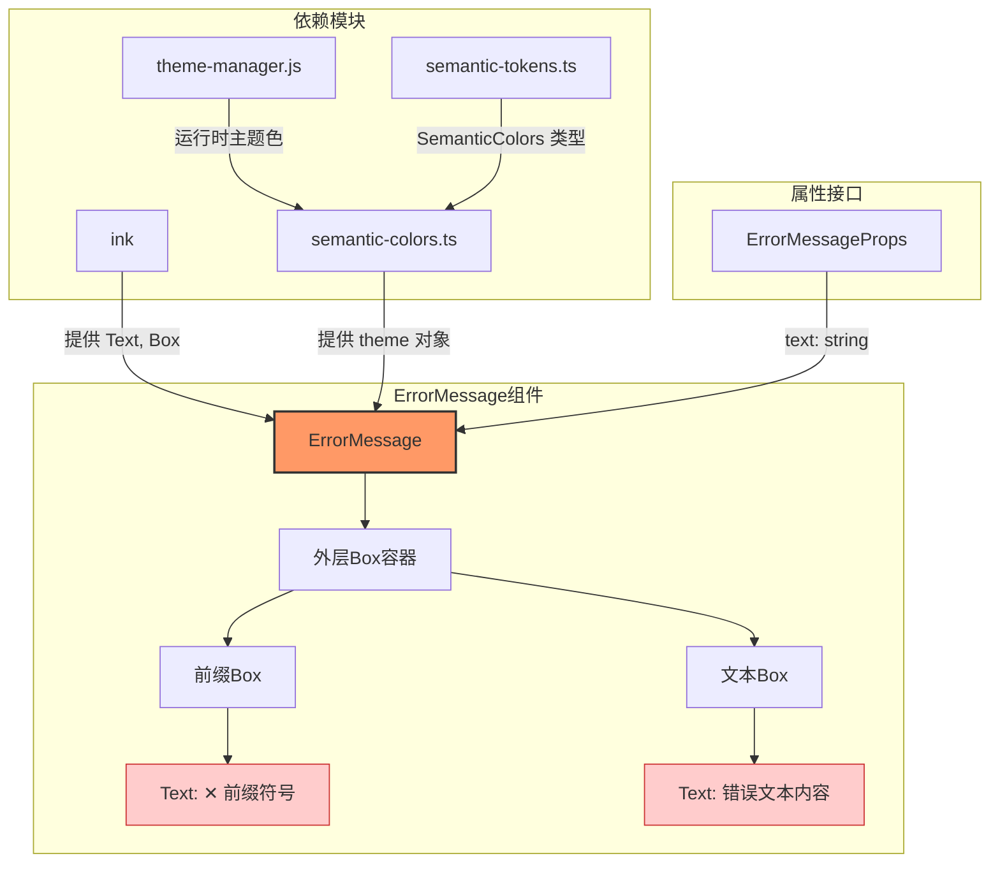

# ErrorMessage.tsx

## 概述

`ErrorMessage` 是一个 React（Ink）函数式组件，用于在 CLI 终端界面中以醒目的红色样式展示错误信息。它以 `✕` 符号作为前缀，后跟可自动换行的错误文本，统一使用主题系统中的 `status.error` 颜色进行渲染。

该组件的设计非常简洁，职责单一——只负责错误消息的视觉呈现，不包含任何业务逻辑或状态管理。

**文件路径**: `packages/cli/src/ui/components/messages/ErrorMessage.tsx`

## 架构图（Mermaid）



## 核心组件

### 1. ErrorMessageProps 接口

```typescript
interface ErrorMessageProps {
  text: string;
}
```

| 属性 | 类型 | 必填 | 说明 |
|------|------|------|------|
| `text` | `string` | 是 | 要显示的错误消息文本 |

### 2. ErrorMessage 函数式组件

```typescript
export const ErrorMessage: React.FC<ErrorMessageProps> = ({ text }) => { ... }
```

组件使用 `React.FC` 泛型定义，接收 `ErrorMessageProps` 作为属性类型。组件内部结构如下：

#### 布局结构

- **外层 `Box`** — `flexDirection="row"`, `marginBottom={1}`
  - 使用水平方向的 flex 布局排列子元素
  - 底部留有 1 行的外边距，与下方内容保持间距
- **前缀 `Box`** — `width={prefixWidth}`（固定宽度为前缀字符串长度，即 2）
  - 包含一个红色的 `✕ ` 前缀符号
- **文本 `Box`** — `flexGrow={1}`
  - 自动填充剩余空间
  - 内部 `Text` 设置 `wrap="wrap"` 启用文本自动换行

#### 样式

- 前缀和正文均使用 `theme.status.error` 颜色（通过主题管理器动态获取的错误状态颜色）
- 文本启用 `wrap="wrap"` 确保长错误消息在终端宽度不足时能够正确换行

### 3. 完整源码（带注释）

```tsx
export const ErrorMessage: React.FC<ErrorMessageProps> = ({ text }) => {
  // 错误前缀符号（✕ + 空格）
  const prefix = '✕ ';
  // 前缀的字符宽度，用于固定前缀列的宽度
  const prefixWidth = prefix.length;

  return (
    // 水平布局容器，底部留1行间距
    <Box flexDirection="row" marginBottom={1}>
      {/* 固定宽度的前缀列 */}
      <Box width={prefixWidth}>
        <Text color={theme.status.error}>{prefix}</Text>
      </Box>
      {/* 自动填充剩余空间的文本列 */}
      <Box flexGrow={1}>
        <Text wrap="wrap" color={theme.status.error}>
          {text}
        </Text>
      </Box>
    </Box>
  );
};
```

## 依赖关系

### 内部依赖

| 模块 | 导入内容 | 用途 |
|------|----------|------|
| `../../semantic-colors.js` | `theme` | 提供语义化主题颜色对象，用于获取 `theme.status.error` 错误色 |

`semantic-colors.ts` 内部通过 `themeManager` 懒加载获取当前主题的颜色方案，支持主题切换：

```typescript
export const theme: SemanticColors = {
  get status() {
    return themeManager.getSemanticColors().status;
  },
  // ...
};
```

### 外部依赖

| 包名 | 导入内容 | 用途 |
|------|----------|------|
| `react` | `React`（类型导入） | 提供 `React.FC` 类型定义 |
| `ink` | `Text`, `Box` | Ink 框架的终端 UI 组件，分别用于渲染文本和布局容器 |

## 关键实现细节

1. **固定宽度前缀布局**: 通过 `prefix.length` 动态计算前缀列宽度（当前为 2 个字符），确保前缀 `✕ ` 占据固定空间，文本内容在右侧对齐。这种设计保证了即使错误文本换行，后续行也不会占据前缀的空间。

2. **主题驱动的颜色**: 颜色不是硬编码的，而是通过 `theme.status.error` 从主题系统动态获取。这意味着当用户切换主题时，错误消息的颜色会随之改变。

3. **文本自动换行**: `wrap="wrap"` 属性确保在终端窗口较窄时，长文本会自动换行而不是被截断。

4. **纯展示组件**: 该组件是一个无状态的纯函数式组件，不包含任何副作用、事件处理或状态管理。它的唯一职责就是将传入的错误文本以统一的视觉样式渲染出来。

5. **底部间距**: `marginBottom={1}` 确保错误消息与后续内容之间有一行的间隔，提升可读性。
