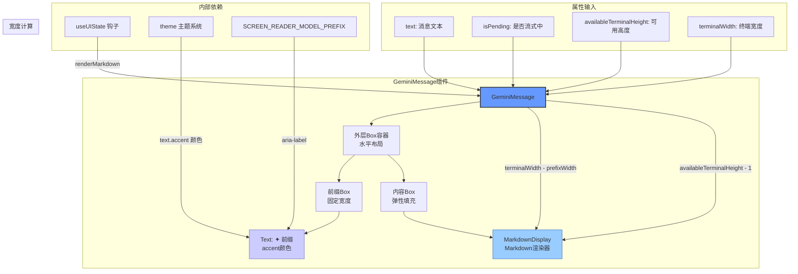

# GeminiMessage.tsx

## 概述

`GeminiMessage` 是一个 React（Ink）函数式组件，用于在 CLI 终端中渲染 Gemini 模型的回复消息。它以 `✦` 符号作为视觉前缀标识 AI 回复，并通过 `MarkdownDisplay` 组件将回复文本以 Markdown 格式进行富文本渲染。

该组件支持以下关键能力：
- **Markdown 渲染**: 根据用户设置决定是否以 Markdown 格式渲染文本
- **流式输出**: 通过 `isPending` 标志支持流式响应场景
- **自适应布局**: 根据终端宽度和可用高度动态调整内容显示
- **无障碍支持**: 为屏幕阅读器提供 `aria-label`（"Model: "）

**文件路径**: `packages/cli/src/ui/components/messages/GeminiMessage.tsx`

## 架构图（Mermaid）



## 核心组件

### 1. GeminiMessageProps 接口

```typescript
interface GeminiMessageProps {
  text: string;
  isPending: boolean;
  availableTerminalHeight?: number;
  terminalWidth: number;
}
```

| 属性 | 类型 | 必填 | 说明 |
|------|------|------|------|
| `text` | `string` | 是 | Gemini 模型返回的消息文本（可包含 Markdown） |
| `isPending` | `boolean` | 是 | 标识消息是否仍在流式输出中（影响 MarkdownDisplay 的渲染行为） |
| `availableTerminalHeight` | `number \| undefined` | 否 | 当前终端可用的行数高度，用于控制内容显示区域 |
| `terminalWidth` | `number` | 是 | 当前终端的字符宽度，用于计算内容可用宽度 |

### 2. GeminiMessage 函数式组件

```typescript
export const GeminiMessage: React.FC<GeminiMessageProps> = ({
  text, isPending, availableTerminalHeight, terminalWidth,
}) => { ... }
```

#### 内部逻辑

1. **获取 Markdown 渲染设置**: 通过 `useUIState()` 钩子从 UI 状态上下文中读取 `renderMarkdown` 布尔值，决定是否启用 Markdown 渲染。

2. **前缀定义**: 使用 `✦ `（星号 + 空格，共 2 个字符宽度）作为消息前缀。

3. **高度计算**:
   - 若 `availableTerminalHeight` 为 `undefined`，传递 `undefined` 给 `MarkdownDisplay`
   - 否则传递 `Math.max(availableTerminalHeight - 1, 1)`，减去 1 是为前缀行预留空间，最小值为 1

4. **宽度计算**: 内容区域宽度为 `Math.max(terminalWidth - prefixWidth, 0)`，减去前缀占用的宽度，最小值为 0

#### 布局结构

```
┌─────────────────────────────────────────────────┐
│ Box (flexDirection="row")                       │
│ ┌────┐ ┌──────────────────────────────────────┐ │
│ │ ✦  │ │ MarkdownDisplay                      │ │
│ │    │ │ (text, isPending, height, width,     │ │
│ │    │ │  renderMarkdown)                     │ │
│ └────┘ └──────────────────────────────────────┘ │
│ 固定2字符  弹性填充剩余空间 (flexGrow=1)          │
└─────────────────────────────────────────────────┘
```

### 3. 完整源码（带注释）

```tsx
export const GeminiMessage: React.FC<GeminiMessageProps> = ({
  text,
  isPending,
  availableTerminalHeight,
  terminalWidth,
}) => {
  // 从 UI 状态上下文获取 Markdown 渲染开关
  const { renderMarkdown } = useUIState();
  // Gemini 消息的视觉前缀符号
  const prefix = '✦ ';
  const prefixWidth = prefix.length; // 固定为 2

  return (
    <Box flexDirection="row">
      {/* 前缀列：固定宽度，显示 ✦ 符号 */}
      <Box width={prefixWidth}>
        <Text color={theme.text.accent} aria-label={SCREEN_READER_MODEL_PREFIX}>
          {prefix}
        </Text>
      </Box>
      {/* 内容列：弹性填充，纵向排列 */}
      <Box flexGrow={1} flexDirection="column">
        <MarkdownDisplay
          text={text}
          isPending={isPending}
          // 为前缀行预留 1 行高度
          availableTerminalHeight={
            availableTerminalHeight === undefined
              ? undefined
              : Math.max(availableTerminalHeight - 1, 1)
          }
          // 减去前缀宽度后的可用内容宽度
          terminalWidth={Math.max(terminalWidth - prefixWidth, 0)}
          renderMarkdown={renderMarkdown}
        />
      </Box>
    </Box>
  );
};
```

## 依赖关系

### 内部依赖

| 模块 | 导入内容 | 用途 |
|------|----------|------|
| `../../utils/MarkdownDisplay.js` | `MarkdownDisplay` | Markdown 富文本渲染组件，支持代码高亮、列表、标题等 |
| `../../semantic-colors.js` | `theme` | 语义化主题颜色对象，用于获取 `theme.text.accent` 前缀颜色 |
| `../../textConstants.js` | `SCREEN_READER_MODEL_PREFIX` | 屏幕阅读器前缀文本常量（值为 `'Model: '`） |
| `../../contexts/UIStateContext.js` | `useUIState` | UI 状态上下文钩子，提供 `renderMarkdown` 设置 |

#### MarkdownDisplay 组件接口

```typescript
interface MarkdownDisplayProps {
  text: string;
  isPending: boolean;
  availableTerminalHeight?: number;
  terminalWidth: number;
  renderMarkdown?: boolean;
}
```

`MarkdownDisplay` 是一个 `React.memo` 包裹的高性能组件，负责将 Markdown 文本解析并渲染为终端 UI 元素。

### 外部依赖

| 包名 | 导入内容 | 用途 |
|------|----------|------|
| `react` | `React`（类型导入） | 提供 `React.FC` 类型定义 |
| `ink` | `Text`, `Box` | Ink 框架的终端 UI 基础组件 |

## 关键实现细节

1. **前缀-内容双列布局**: 与 `ErrorMessage` 组件采用相同的布局模式——左侧固定宽度前缀列、右侧弹性内容列。这种模式在整个消息系统中保持了一致的视觉风格。

2. **终端尺寸自适应**: 组件接收 `terminalWidth` 和 `availableTerminalHeight` 参数，并在传递给 `MarkdownDisplay` 之前进行修正计算：
   - 宽度：减去前缀占用的 2 个字符宽度
   - 高度：减去 1 行（为前缀行预留），最小值限制为 1
   这确保 Markdown 内容在可用空间内正确渲染，不会溢出。

3. **Markdown 渲染开关**: 通过 `useUIState()` 上下文钩子动态获取 `renderMarkdown` 设置。用户可以在运行时切换是否启用 Markdown 渲染——关闭时消息将以纯文本形式显示。

4. **流式响应支持**: `isPending` 属性透传给 `MarkdownDisplay`，在流式输出场景中，Markdown 渲染器可以根据该标志调整行为（例如：不渲染未完成的代码块、显示光标等）。

5. **无障碍设计**: 前缀 `Text` 组件设置了 `aria-label={SCREEN_READER_MODEL_PREFIX}`（值为 `'Model: '`），确保屏幕阅读器用户能够识别这是来自 AI 模型的回复，而不是读出视觉装饰符号 `✦`。

6. **前缀颜色语义化**: 使用 `theme.text.accent` 而非 `theme.status.error`（ErrorMessage 所用），通过颜色语义区分消息类型——accent 色用于 AI 回复，error 色用于错误信息。
