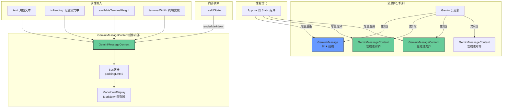

# GeminiMessageContent.tsx

## 概述

`GeminiMessageContent` 是一个 React（Ink）函数式组件，作为 `GeminiMessage` 的**"续页"组件**使用。当 Gemini 模型的回复过长时，系统会将消息拆分为多个片段：第一个片段使用 `GeminiMessage`（带 `✦` 前缀），后续片段则使用 `GeminiMessageContent`（无前缀，仅保留左侧缩进对齐）。

这种拆分设计的核心目的是**性能优化**——通过将长消息分割为独立的组件片段，使 `App.tsx` 中的根 `<Static>` 组件能够更高效地进行增量渲染，避免因单个超长消息导致的渲染性能瓶颈。

源码注释中明确指出，这是一个"半 hack"（semi-hacked）的组件设计。

**文件路径**: `packages/cli/src/ui/components/messages/GeminiMessageContent.tsx`

## 架构图（Mermaid）



## 核心组件

### 1. GeminiMessageContentProps 接口

```typescript
interface GeminiMessageContentProps {
  text: string;
  isPending: boolean;
  availableTerminalHeight?: number;
  terminalWidth: number;
}
```

| 属性 | 类型 | 必填 | 说明 |
|------|------|------|------|
| `text` | `string` | 是 | 消息片段的文本内容（Markdown 格式） |
| `isPending` | `boolean` | 是 | 标识该片段是否仍在流式输出中 |
| `availableTerminalHeight` | `number \| undefined` | 否 | 当前终端可用的行数高度 |
| `terminalWidth` | `number` | 是 | 当前终端的字符宽度 |

注意：该接口与 `GeminiMessageProps` 完全相同（只是少了不同之处在于组件的渲染逻辑）。

### 2. GeminiMessageContent 函数式组件

```typescript
export const GeminiMessageContent: React.FC<GeminiMessageContentProps> = ({
  text, isPending, availableTerminalHeight, terminalWidth,
}) => { ... }
```

#### 与 GeminiMessage 的关键差异

| 特性 | GeminiMessage | GeminiMessageContent |
|------|---------------|----------------------|
| 前缀符号 | 显示 `✦ ` | 不显示前缀 |
| 布局方式 | 双列布局（前缀列 + 内容列） | 单列布局 + 左侧 padding |
| 对齐方式 | `Box width={2}` + `Box flexGrow={1}` | `Box paddingLeft={2}` |
| 用途 | 消息的第一个片段 | 消息的后续片段 |
| 前缀颜色 | `theme.text.accent` | 无 |
| aria-label | `'Model: '` | 无 |

#### 布局结构

```
┌─────────────────────────────────────────────────┐
│ Box (flexDirection="column", paddingLeft=2)      │
│   ┌──────────────────────────────────────────┐  │
│   │ MarkdownDisplay                          │  │
│   │ (text, isPending, height, width,         │  │
│   │  renderMarkdown)                         │  │
│   └──────────────────────────────────────────┘  │
│ ←2字符缩进→ 内容区域                              │
└─────────────────────────────────────────────────┘
```

### 3. 完整源码（带注释）

```tsx
/*
 * Gemini message content 是一个半 hack 的组件。
 * 其设计意图是作为 GeminiMessage 的部分表示，
 * 仅在响应过长时使用。在这种情况下，消息会被拆分为
 * 多个 GeminiMessageContent，以便 App.tsx 中的根
 * <Static> 组件能够尽可能高效地渲染。
 */
export const GeminiMessageContent: React.FC<GeminiMessageContentProps> = ({
  text,
  isPending,
  availableTerminalHeight,
  terminalWidth,
}) => {
  // 从 UI 状态上下文获取 Markdown 渲染开关
  const { renderMarkdown } = useUIState();
  // 引用原始前缀字符串以保持缩进对齐（但不实际显示）
  const originalPrefix = '✦ ';
  const prefixWidth = originalPrefix.length; // 固定为 2

  return (
    // 使用 paddingLeft 而非双列布局来对齐（更轻量）
    <Box flexDirection="column" paddingLeft={prefixWidth}>
      <MarkdownDisplay
        text={text}
        isPending={isPending}
        availableTerminalHeight={
          availableTerminalHeight === undefined
            ? undefined
            : Math.max(availableTerminalHeight - 1, 1)
        }
        terminalWidth={Math.max(terminalWidth - prefixWidth, 0)}
        renderMarkdown={renderMarkdown}
      />
    </Box>
  );
};
```

## 依赖关系

### 内部依赖

| 模块 | 导入内容 | 用途 |
|------|----------|------|
| `../../utils/MarkdownDisplay.js` | `MarkdownDisplay` | Markdown 富文本渲染组件 |
| `../../contexts/UIStateContext.js` | `useUIState` | UI 状态上下文钩子，提供 `renderMarkdown` 设置 |

注意：与 `GeminiMessage` 相比，此组件**不依赖**以下模块：
- `semantic-colors.js`（不需要主题颜色，因为没有前缀文本）
- `textConstants.js`（不需要屏幕阅读器前缀，因为没有 aria-label）

### 外部依赖

| 包名 | 导入内容 | 用途 |
|------|----------|------|
| `react` | `React`（类型导入） | 提供 `React.FC` 类型定义 |
| `ink` | `Box` | Ink 框架的终端 UI 布局容器 |

注意：与 `GeminiMessage` 相比，此组件**不导入** `Text`（因为没有前缀文本需要渲染）。

## 关键实现细节

1. **性能优化驱动的设计**: 这是该组件存在的核心原因。Ink 框架的 `<Static>` 组件会对已渲染的子元素进行缓存，不再重新渲染。将长消息拆分为多个独立组件后，已完成渲染的前序片段会被 `<Static>` 缓存，只有最新的片段需要进行渲染计算。这极大地提升了长消息场景下的渲染性能。

2. **paddingLeft 对齐策略**: 与 `GeminiMessage` 的双列布局（前缀列 + 内容列）不同，此组件使用 `paddingLeft={prefixWidth}` 实现左侧缩进。这是因为：
   - 不需要渲染前缀文本，不需要独立的前缀列
   - `paddingLeft` 实现更简单、DOM 结构更扁平
   - 视觉上与 `GeminiMessage` 的内容区域完美对齐（相同的 2 字符左偏移）

3. **变量命名 `originalPrefix`**: 变量名使用 `originalPrefix` 而非 `prefix`，暗示这是对 `GeminiMessage` 中前缀的引用（而非自身的前缀）。该变量仅用于计算缩进宽度，从不渲染。

4. **与 GeminiMessage 的宽高计算逻辑一致**: 尽管布局方式不同，传递给 `MarkdownDisplay` 的 `terminalWidth` 和 `availableTerminalHeight` 的计算逻辑与 `GeminiMessage` 完全一致：
   - `terminalWidth - prefixWidth`（减去左侧缩进宽度）
   - `availableTerminalHeight - 1`（预留 1 行空间）

   这确保了拆分后的各片段在 Markdown 渲染时的换行和截断行为完全一致。

5. **"半 hack" 设计的权衡**: 源码注释承认了这种拆分方式是一个折衷方案。理想情况下，一条消息应该由一个组件完整渲染。但为了解决 `<Static>` 组件在长消息场景下的性能问题，不得不将消息拆分为多个片段组件。这种设计虽然增加了消息管理的复杂度（调用方需要负责拆分逻辑），但换来了显著的渲染性能提升。
