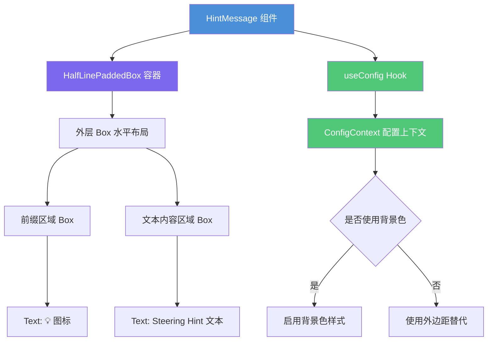

# HintMessage.tsx

## 概述

`HintMessage` 是一个 React 函数组件，用于在 CLI 终端界面中展示"引导提示"（Steering Hint）消息。该组件以灯泡图标（💡）作为前缀，使用主题强调色（accent color）渲染斜体文本，为用户提供操作建议或上下文提示信息。它基于 Ink 库构建，适配终端渲染环境，同时支持无障碍访问（screen reader）和背景色配置。

## 架构图（Mermaid）

## 核心组件

### HintMessageProps 接口

| 属性 | 类型 | 必填 | 说明 |
|------|------|------|------|
| `text` | `string` | 是 | 提示消息的文本内容 |

### HintMessage 组件

- **类型**：`React.FC<HintMessageProps>`
- **功能**：渲染一条带有灯泡图标前缀的引导提示消息
- **布局结构**：
  1. **最外层**：`HalfLinePaddedBox` —— 提供半行内边距和可选背景色
  2. **中间层**：`Box`（水平方向 `flexDirection="row"`）—— 控制整体排版
  3. **左侧**：固定宽度的前缀区域，显示 💡 图标
  4. **右侧**：弹性增长的内容区域，显示斜体提示文本

### 关键变量

| 变量 | 值/来源 | 说明 |
|------|---------|------|
| `prefix` | `'💡 '` | 提示消息前缀图标 |
| `prefixWidth` | `prefix.length`（即 3） | 前缀区域固定宽度 |
| `config` | `useConfig()` | 全局配置对象 |
| `useBackgroundColor` | `config.getUseBackgroundColor()` | 是否启用背景色模式 |

### 样式与布局细节

- **背景色模式开启时**：
  - `HalfLinePaddedBox` 使用 `theme.text.accent` 作为背景基色，透明度 0.1
  - 内层 Box：`paddingX=1`，`marginY=0`
- **背景色模式关闭时**：
  - 内层 Box：`paddingX=0`，`marginY=1`（用外边距替代背景色的视觉区分）
- **文本样式**：
  - 前缀文本颜色：`theme.text.accent`
  - 内容文本颜色：`theme.text.accent`，斜体（`italic`），自动换行（`wrap="wrap"`）
  - 内容文本前会自动拼接 `"Steering Hint: "` 前缀字符串

## 依赖关系

### 内部依赖

| 模块 | 导入内容 | 说明 |
|------|----------|------|
| `../../semantic-colors.js` | `theme` | 语义化颜色主题对象，提供 `text.accent` 等颜色值 |
| `../../textConstants.js` | `SCREEN_READER_USER_PREFIX` | 屏幕阅读器无障碍前缀常量 |
| `../shared/HalfLinePaddedBox.js` | `HalfLinePaddedBox` | 共享的半行内边距容器组件 |
| `../../contexts/ConfigContext.js` | `useConfig` | 配置上下文 Hook，获取全局配置 |

### 外部依赖

| 包名 | 导入内容 | 说明 |
|------|----------|------|
| `react` | `React`（类型导入） | React 类型定义 |
| `ink` | `Text`, `Box` | Ink 终端 UI 框架的基础组件 |

## 关键实现细节

1. **无障碍支持**：前缀 `Text` 组件设置了 `aria-label={SCREEN_READER_USER_PREFIX}`，确保屏幕阅读器能正确朗读提示消息，而不是读出灯泡 emoji。

2. **弹性布局**：前缀区域使用 `flexShrink={0}` 固定宽度不收缩，内容区域使用 `flexGrow={1}` 占满剩余空间，确保长文本能正确换行。

3. **背景色自适应**：通过 `useConfig` 获取用户配置，动态调整内边距和外边距策略。当终端不支持或用户关闭背景色时，用外边距（`marginY=1`）来保持视觉间隔。

4. **组件自对齐**：外层 Box 设置 `alignSelf="flex-start"`，使消息靠左显示，不会拉伸到全宽。

5. **文本拼接**：组件在渲染时将 `"Steering Hint: "` 硬编码拼接在用户传入的 `text` 前面，形成完整的提示消息格式。
