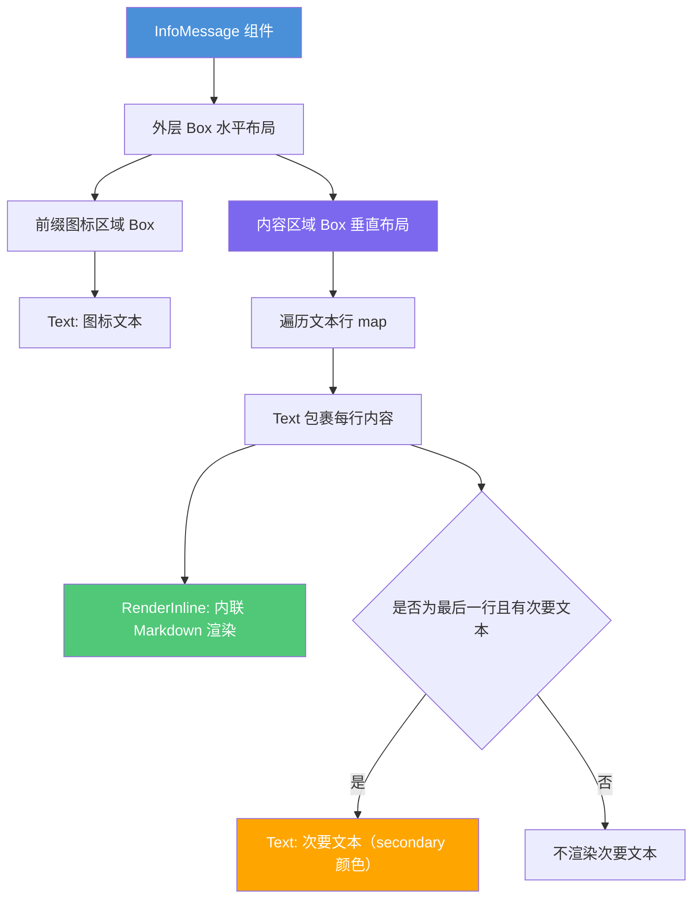

# InfoMessage.tsx

## 概述

`InfoMessage` 是一个通用的信息提示组件，用于在 CLI 终端界面中展示各类通知、警告或信息消息。它支持自定义图标、颜色、次要文本等，默认使用警告色和 ℹ 图标。该组件支持多行文本渲染，并通过 `RenderInline` 工具对每行文本进行内联 Markdown 解析，使消息内容可以包含加粗、代码等 Markdown 格式。

## 架构图（Mermaid）

## 核心组件

### InfoMessageProps 接口

| 属性 | 类型 | 必填 | 默认值 | 说明 |
|------|------|------|--------|------|
| `text` | `string` | 是 | - | 主要信息文本，支持 `\n` 换行 |
| `secondaryText` | `string` | 否 | `undefined` | 附加在最后一行末尾的次要文本 |
| `icon` | `string` | 否 | `'ℹ '` | 前缀图标字符串 |
| `color` | `string` | 否 | `theme.status.warning` | 图标和主文本颜色 |
| `marginBottom` | `number` | 否 | `0` | 底部外边距 |

### InfoMessage 组件

- **类型**：`React.FC<InfoMessageProps>`
- **功能**：渲染一条可定制的信息提示消息
- **布局结构**：
  1. **外层 Box**：水平方向布局（`flexDirection="row"`），顶部外边距为 1
  2. **左侧图标 Box**：固定宽度，显示前缀图标
  3. **右侧内容 Box**：垂直方向布局（`flexDirection="column"`），弹性增长填满剩余空间

### 关键变量

| 变量 | 值/来源 | 说明 |
|------|---------|------|
| `color` | 传入值 或 `theme.status.warning` | 使用 `??=` 空值合并赋值 |
| `prefix` | 传入的 `icon` 或 `'ℹ '` | 前缀图标 |
| `prefixWidth` | `prefix.length` | 前缀区域宽度 |

### 渲染逻辑

1. 将 `text` 按 `\n` 拆分为多行
2. 对每一行使用 `RenderInline` 组件进行内联 Markdown 渲染
3. 仅在**最后一行**末尾追加 `secondaryText`（如果有的话），以次要文本颜色显示
4. 每行文本都包裹在 `Text` 组件中，启用自动换行（`wrap="wrap"`）

## 依赖关系

### 内部依赖

| 模块 | 导入内容 | 说明 |
|------|----------|------|
| `../../semantic-colors.js` | `theme` | 语义化颜色主题对象，提供 `status.warning` 和 `text.secondary` 颜色 |
| `../../utils/InlineMarkdownRenderer.js` | `RenderInline` | 内联 Markdown 渲染器，将 Markdown 文本转为终端格式化文本 |

### 外部依赖

| 包名 | 导入内容 | 说明 |
|------|----------|------|
| `react` | `React`（类型导入） | React 类型定义 |
| `ink` | `Text`, `Box` | Ink 终端 UI 框架的基础组件 |

## 关键实现细节

1. **空值合并赋值（`??=`）**：`color ??= theme.status.warning` 仅在 `color` 为 `null` 或 `undefined` 时才使用默认值，允许调用方传入空字符串 `""` 等 falsy 值（虽然在颜色场景下不太常见，但语义上更精确）。

2. **多行文本处理**：通过 `text.split('\n').map(...)` 将文本按换行符拆分后逐行渲染。注意在判断是否为最后一行时，每次都重新调用了 `text.split('\n')`，这在性能关键路径上可能有优化空间，但对 CLI 场景影响不大。

3. **内联 Markdown 渲染**：每行文本通过 `RenderInline` 组件处理，该组件会解析内联 Markdown 语法（如 `**加粗**`、`` `代码` `` 等），并将 `defaultColor` 设为组件的主颜色，确保 Markdown 普通文本与图标颜色一致。

4. **次要文本定位**：`secondaryText` 被追加在最后一行的同一个 `Text` 组件内，前面有一个空格分隔。这意味着次要文本不会独占一行，而是紧跟在主文本之后。

5. **灵活的样式定制**：组件通过 `icon`、`color`、`marginBottom` 三个可选属性实现高度可定制，同一个组件可以用于信息提示（ℹ）、警告（⚠）、错误（✗）等不同场景。

6. **无 HalfLinePaddedBox**：与 `HintMessage` 不同，`InfoMessage` 没有使用 `HalfLinePaddedBox` 容器，而是直接用 `Box` 的 `marginTop={1}` 来提供上方间隔，说明它不需要背景色填充效果。
