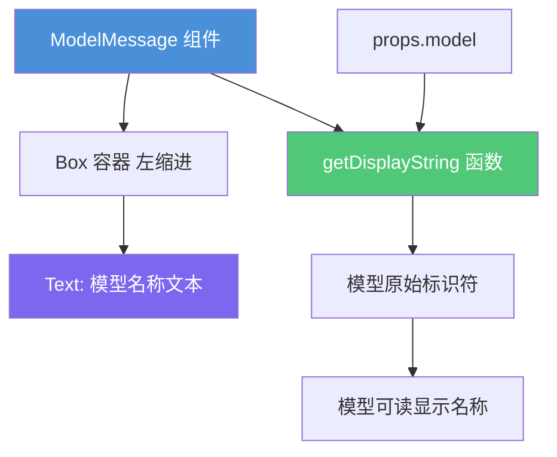

# ModelMessage.tsx

## 概述

`ModelMessage` 是一个轻量级的 React 函数组件，用于在 CLI 终端界面中显示当前正在使用的 AI 模型名称。它以注释风格（comment 颜色 + 斜体）展示 "Responding with {模型显示名称}" 的提示信息，让用户知道当前回复所使用的模型。该组件非常简洁，仅包含一个带左缩进的文本元素。

## 架构图（Mermaid）



## 核心组件

### ModelMessageProps 接口

| 属性 | 类型 | 必填 | 说明 |
|------|------|------|------|
| `model` | `string` | 是 | 模型标识符字符串（如 `"gemini-2.0-flash"` 等） |

### ModelMessage 组件

- **类型**：`React.FC<ModelMessageProps>`
- **功能**：显示当前响应所使用的模型名称
- **渲染方式**：箭头函数直接返回 JSX（无函数体），极简实现
- **布局结构**：
  1. **Box 容器**：`marginLeft={2}`，提供左侧 2 个字符的缩进
  2. **Text 文本**：注释颜色（`theme.ui.comment`），斜体（`italic`）

### 输出文本格式

```
  Responding with <模型显示名称>
```

其中 `<模型显示名称>` 是通过 `getDisplayString(model)` 将模型标识符转换为用户友好的显示名称。

## 依赖关系

### 内部依赖

| 模块 | 导入内容 | 说明 |
|------|----------|------|
| `../../semantic-colors.js` | `theme` | 语义化颜色主题对象，提供 `ui.comment` 颜色值 |
| `@google/gemini-cli-core` | `getDisplayString` | 核心包导出的模型名称转换函数，将模型 ID 转为可读名称 |

### 外部依赖

| 包名 | 导入内容 | 说明 |
|------|----------|------|
| `react` | `React`（类型导入） | React 类型定义 |
| `ink` | `Text`, `Box` | Ink 终端 UI 框架的基础组件 |

## 关键实现细节

1. **极简设计**：整个组件仅一行 JSX 返回语句，没有任何状态、副作用或复杂逻辑。这是因为它只负责展示一条静态信息。

2. **模型名称转换**：`getDisplayString(model)` 来自 `@google/gemini-cli-core` 核心包。它负责将内部模型标识符（如 `"gemini-2.0-flash-001"`）转换为用户友好的显示名称（如 `"Gemini 2.0 Flash"`），实现了展示层与数据层的解耦。

3. **注释风格渲染**：使用 `theme.ui.comment` 颜色配合 `italic` 斜体，使模型信息在视觉上呈现为次要/辅助信息，不会干扰用户对主要内容的阅读。这与代码编辑器中注释的视觉风格一致。

4. **左缩进对齐**：`marginLeft={2}` 提供 2 个字符的左侧缩进，使模型信息在视觉上与其他主要消息内容有所区分，暗示这是一条元信息（meta-information）。

5. **无换行控制**：该组件没有设置 `wrap="wrap"` 属性，因为模型名称通常较短，不太可能超出终端宽度。
