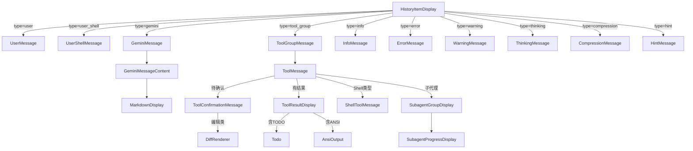

# messages

## 概述

`messages` 目录包含所有与聊天消息渲染相关的 React 组件。这些组件负责将不同类型的 `HistoryItem` 渲染为终端 UI 元素，包括用户消息、Gemini 回复、工具调用结果、错误信息、警告等。核心的工具调用渲染系统支持分组展示、确认交互、Diff 预览、Shell 命令输出等复杂场景。

## 目录结构

```
messages/
├── UserMessage.tsx              # 用户输入消息
├── UserShellMessage.tsx         # 用户 Shell 命令消息
├── GeminiMessage.tsx            # Gemini AI 回复消息
├── GeminiMessageContent.tsx     # Gemini 消息内容渲染（Markdown）
├── InfoMessage.tsx              # 信息提示消息
├── ErrorMessage.tsx             # 错误消息
├── WarningMessage.tsx           # 警告消息
├── HintMessage.tsx              # 提示/建议消息
├── ModelMessage.tsx             # 模型切换消息
├── ThinkingMessage.tsx          # AI 思考过程展示
├── CompressionMessage.tsx       # 上下文压缩消息
│
├── ToolGroupMessage.tsx         # 工具调用分组容器
├── ToolMessage.tsx              # 单个工具调用展示
├── ToolConfirmationMessage.tsx  # 工具调用确认交互
├── ToolResultDisplay.tsx        # 工具调用结果展示
├── ToolShared.tsx               # 工具组件共享逻辑
├── ShellToolMessage.tsx         # Shell 工具调用特殊展示
│
├── DiffRenderer.tsx             # Diff 差异渲染器
├── Todo.tsx                     # TODO 清单展示
│
├── SubagentGroupDisplay.tsx     # 子代理分组展示
├── SubagentProgressDisplay.tsx  # 子代理进度展示
└── __snapshots__/               # 测试快照
```

## 架构图



## 核心组件

### 消息基础组件

| 组件 | 职责 |
|------|------|
| `UserMessage` | 渲染用户输入，带 `>` 前缀和用户颜色 |
| `GeminiMessage` | 渲染 Gemini 回复，支持 Markdown 渲染和流式更新 |
| `GeminiMessageContent` | Gemini 消息的内容部分，处理 Markdown 到终端的转换 |
| `InfoMessage` | 信息消息（带可选图标和颜色） |
| `ErrorMessage` | 错误消息（红色高亮） |
| `WarningMessage` | 警告消息（黄色高亮） |
| `ThinkingMessage` | 展示 AI 的思考过程摘要 |
| `CompressionMessage` | 展示上下文压缩状态和 token 统计 |

### 工具调用系统

| 组件 | 职责 |
|------|------|
| `ToolGroupMessage` | 工具调用分组容器，管理一组相关工具调用的展开/折叠 |
| `ToolMessage` | 单个工具调用的展示，包含状态图标、名称、结果 |
| `ToolConfirmationMessage` | 工具确认交互（Accept/Reject/Modify），支持 Diff 预览 |
| `ToolResultDisplay` | 工具结果展示，支持文本、Markdown、ANSI、TODO 列表等 |
| `ShellToolMessage` | Shell 命令的特殊展示，集成 PTY 输出和交互 |
| `ToolShared` | 工具组件共享的样式和辅助函数 |

### 子代理系统

| 组件 | 职责 |
|------|------|
| `SubagentGroupDisplay` | 子代理调用组展示，可展开查看详细输出 |
| `SubagentProgressDisplay` | 子代理执行进度指示 |

### 差异渲染

| 组件 | 职责 |
|------|------|
| `DiffRenderer` | 文件编辑的 Diff 渲染，支持添加/删除行的彩色高亮 |

## 依赖关系

### 内部依赖
- `../shared/`: Scrollable、MaxSizedBox、ExpandableText 等布局原语
- `../../contexts/`: UIStateContext、ToolActionsContext、StreamingContext
- `../../hooks/`: useKeypress、useConfirmingTool
- `../../utils/`: MarkdownDisplay、CodeColorizer、toolLayoutUtils
- `../../themes/`: 主题颜色

### 外部依赖
- `ink`: 终端渲染（Box、Text）
- `diff`: 文本差异计算

## 数据流

### 工具调用确认流程
1. Gemini 模型请求执行工具 -> 生成 `ToolCallEvent`
2. `AppContainer` 将工具调用添加到 `HistoryItem` 的 `tool_group` 中
3. `ToolGroupMessage` 遍历渲染每个工具调用
4. 状态为 `AwaitingApproval` 的工具显示 `ToolConfirmationMessage`
5. 用户按 `y`/`n` -> `ToolActionsContext.confirm()` -> 发布到 MessageBus
6. 核心层收到确认后执行或取消工具
