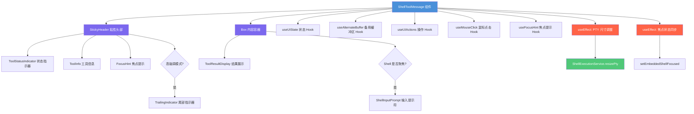

# ShellToolMessage.tsx

## 概述

`ShellToolMessage` 是一个功能丰富的 React 组件，用于在 CLI 终端界面中展示 Shell 工具调用的完整生命周期。它负责渲染 Shell 命令的执行状态、输出结果，以及在交互模式下的嵌入式 Shell 输入提示符。该组件集成了焦点管理、鼠标点击交互、PTY（伪终端）尺寸调整、备用缓冲区检测等多种终端交互能力，是消息组件中最复杂的一个。

## 架构图（Mermaid）

## 核心组件

### ShellToolMessageProps 接口

继承自 `ToolMessageProps`，额外定义了：

| 属性 | 类型 | 必填 | 默认值 | 说明 |
|------|------|------|--------|------|
| `config` | `Config` | 否 | `undefined` | 应用配置对象，用于判断交互式 Shell 功能是否启用 |
| `isExpandable` | `boolean` | 否 | `undefined` | 是否可展开（影响最大行数计算） |

继承自 `ToolMessageProps` 的属性：

| 属性 | 类型 | 说明 |
|------|------|------|
| `name` | `string` | 工具名称 |
| `description` | - | 工具描述 |
| `resultDisplay` | - | 结果展示数据 |
| `status` | `CoreToolCallStatus` | 工具调用状态 |
| `availableTerminalHeight` | `number` | 可用终端高度 |
| `terminalWidth` | `number` | 终端宽度 |
| `emphasis` | `string` | 强调级别（默认 `'medium'`） |
| `renderOutputAsMarkdown` | `boolean` | 是否以 Markdown 渲染输出（默认 `true`） |
| `ptyId` | `string` | PTY 伪终端标识符 |
| `isFirst` | `boolean` | 是否为第一个工具消息 |
| `borderColor` | `string` | 边框颜色 |
| `borderDimColor` | `string` | 边框暗色 |
| `originalRequestName` | `string` | 原始请求名称 |

### ShellToolMessage 组件

- **类型**：`React.FC<ShellToolMessageProps>`
- **渲染结构**：
  1. **StickyHeader**（粘性头部）：包含状态指示器、工具信息、焦点提示、尾部指示器
  2. **Box**（内容容器）：包含工具结果展示和可选的 Shell 输入提示符

## 依赖关系

### 内部依赖

| 模块 | 导入内容 | 说明 |
|------|----------|------|
| `../ShellInputPrompt.js` | `ShellInputPrompt` | 嵌入式 Shell 输入提示符组件 |
| `../StickyHeader.js` | `StickyHeader` | 粘性头部组件，固定在可视区域顶部 |
| `../../contexts/UIActionsContext.js` | `useUIActions` | UI 操作上下文 Hook，提供 `setEmbeddedShellFocused` |
| `../../hooks/useMouseClick.js` | `useMouseClick` | 鼠标点击事件 Hook |
| `./ToolResultDisplay.js` | `ToolResultDisplay` | 工具结果展示组件 |
| `./ToolShared.js` | `ToolStatusIndicator`, `ToolInfo`, `TrailingIndicator`, `isThisShellFocusable`, `isThisShellFocused`, `useFocusHint`, `FocusHint` | 工具共享组件和工具函数 |
| `./ToolMessage.js` | `ToolMessageProps`（类型） | 工具消息属性类型 |
| `../../constants.js` | `ACTIVE_SHELL_MAX_LINES` | 活跃 Shell 最大行数常量 |
| `../../hooks/useAlternateBuffer.js` | `useAlternateBuffer` | 备用缓冲区检测 Hook |
| `../../contexts/UIStateContext.js` | `useUIState` | UI 状态上下文 Hook |
| `../../utils/toolLayoutUtils.js` | `calculateShellMaxLines`, `calculateToolContentMaxLines`, `SHELL_CONTENT_OVERHEAD` | 工具布局计算工具函数 |

### 外部依赖

| 包名 | 导入内容 | 说明 |
|------|----------|------|
| `react` | `React`（含 `useEffect`, `useRef`） | React 核心库 |
| `ink` | `Box`, `DOMElement`（类型） | Ink 终端 UI 框架 |
| `@google/gemini-cli-core` | `Config`（类型）, `ShellExecutionService`, `CoreToolCallStatus` | 核心包：配置类型、Shell 执行服务、工具调用状态枚举 |

## 关键实现细节

### 1. 焦点管理系统

组件实现了一套完整的焦点管理逻辑：

- **焦点判断**：`checkIsShellFocused()` 综合 `name`、`status`、`ptyId`、`activeShellPtyId`、`embeddedShellFocused` 五个条件判断当前 Shell 是否处于聚焦状态。
- **可聚焦判断**：`checkIsShellFocusable()` 根据工具名、状态和配置判断 Shell 是否可被聚焦（需要是 Shell 命令、正在执行、且交互式 Shell 功能已启用）。
- **焦点切换**：通过 `handleFocus` 回调函数调用 `setEmbeddedShellFocused(true)` 切换焦点。
- **焦点丢失同步**：第二个 `useEffect` 通过 `wasFocusedRef` 跟踪焦点历史，当 Shell 从聚焦变为非聚焦时，自动将 `embeddedShellFocused` 重置为 `false`。

### 2. PTY 尺寸动态调整

第一个 `useEffect` 负责在 Shell 执行期间动态调整 PTY 终端尺寸：

- **触发条件**：状态为 `Executing` 且 `ptyId` 存在
- **宽度计算**：`terminalWidth - 4`（减去边框和内边距的 4 个字符）
- **高度计算**：`availableHeight` 或回退到 `ACTIVE_SHELL_MAX_LINES - SHELL_CONTENT_OVERHEAD`
- **最小值保护**：宽高均通过 `Math.max(1, ...)` 确保至少为 1
- **错误处理**：捕获并忽略 "Cannot resize a pty that has already exited" 错误（竞态条件场景），其他错误继续抛出

### 3. 动态高度计算

组件使用两个工具函数进行高度计算：

- `calculateShellMaxLines()`：根据状态、是否在备用缓冲区、是否聚焦、可用终端高度、高度约束、是否可展开等条件计算 Shell 最大行数
- `calculateToolContentMaxLines()`：在最大行数限制下计算实际可用的内容高度

### 4. 鼠标交互支持

通过 `useMouseClick` Hook 分别为头部（`headerRef`）和内容区域（`contentRef`）注册了鼠标点击事件，点击时触发焦点切换。仅在 `isThisShellFocusable` 为 `true` 时激活。

### 5. 焦点提示显示

`useFocusHint` Hook 根据 Shell 是否可聚焦、是否已聚焦、是否有结果展示等条件，决定是否显示焦点提示（如 "Click to focus" 等）。`FocusHint` 组件在 `StickyHeader` 内渲染该提示。

### 6. 条件渲染逻辑

- **TrailingIndicator**：仅在 `emphasis === 'high'` 时渲染
- **ShellInputPrompt**：仅在 Shell 聚焦且 `config` 存在时渲染，提供交互式输入能力
- **边框样式**：使用圆角边框（`borderStyle="round"`），仅显示左右边框，不显示上下边框（与 StickyHeader 无缝衔接）

### 7. 边框与布局

内容容器使用 `borderTop={false}` 和 `borderBottom={false}` 来去除上下边框，配合 StickyHeader 的边框形成一个连续的视觉容器。左右使用圆角边框（`borderStyle="round"`），内部有 `paddingX={1}` 的水平内边距。
