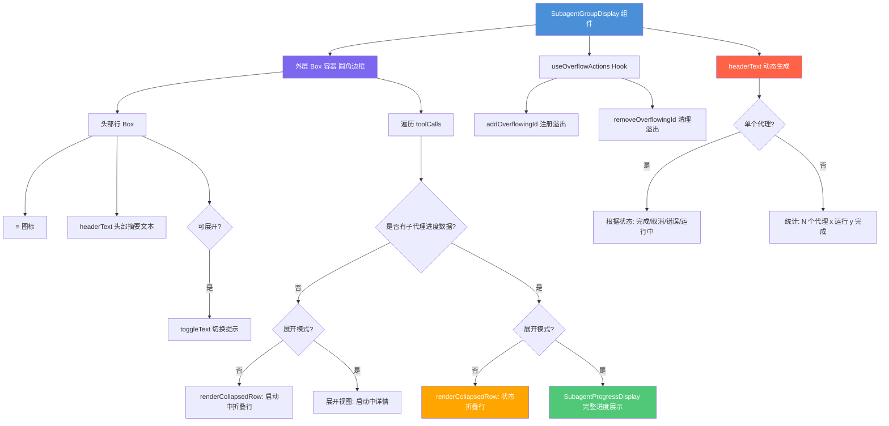

# SubagentGroupDisplay.tsx

## 概述

`SubagentGroupDisplay` 是一个 React 组件，用于在 CLI 终端界面中以分组方式展示一个或多个子代理（Subagent）的执行状态与活动信息。它支持两种显示模式——**折叠视图**（每个代理一行紧凑摘要）和**展开视图**（显示每个代理的完整历史活动）。组件动态生成头部摘要文本（如 "Running 3 Agents..."），并集成了全局溢出管理系统，通过 `ctrl+o` 快捷键在折叠/展开之间切换。

## 架构图（Mermaid）



## 核心组件

### SubagentGroupDisplayProps 接口

| 属性 | 类型 | 必填 | 默认值 | 说明 |
|------|------|------|--------|------|
| `toolCalls` | `IndividualToolCallDisplay[]` | 是 | - | 子代理工具调用展示数据数组 |
| `availableTerminalHeight` | `number` | 否 | `undefined` | 可用终端高度；`undefined` 表示展开模式 |
| `terminalWidth` | `number` | 是 | - | 终端宽度 |
| `borderColor` | `string` | 否 | `undefined` | 边框颜色 |
| `borderDimColor` | `boolean` | 否 | `undefined` | 边框是否使用暗色 |
| `isFirst` | `boolean` | 否 | `undefined` | 是否为第一个工具组（控制上边框是否显示） |
| `isExpandable` | `boolean` | 否 | `true` | 是否支持展开/折叠切换 |

### 展开/折叠逻辑

- **展开判断**：`isExpanded = availableTerminalHeight === undefined`。当 `availableTerminalHeight` 未定义时视为展开模式，否则为折叠模式。
- **切换提示**：`(ctrl+o to expand)` 或 `(ctrl+o to collapse)`

### headerText 头部摘要文本生成规则

#### 单代理场景（`toolCalls.length === 1`）

| 代理状态 | 头部文本 |
|----------|----------|
| `completed` | `Agent Completed` |
| `cancelled` | `Agent Cancelled` |
| `error` | `Agent Error` |
| 其他/无进度数据 | `Running Agent...` |

#### 多代理场景（`toolCalls.length > 1`）

| 条件 | 头部文本 |
|------|----------|
| 全部完成 | `{N} Agents Completed` |
| 部分完成 | `{N} Agents ({running} running, {completed} completed)...` |
| 全部运行中 | `Running {N} Agents...` |

### renderCollapsedRow 折叠行渲染函数

该函数渲染单行紧凑视图，结构如下：

```
[图标] [代理名称] · [内容描述] [参数信息]
```

| 区域 | 样式 | 说明 |
|------|------|------|
| 图标 | 固定最小宽度 2，不收缩 | 状态图标 |
| 代理名称 | 加粗，主颜色，截断 | 不收缩 |
| 分隔符 | 次要颜色 ` · ` | 不收缩 |
| 内容+参数 | 次要颜色，截断 | 可收缩，`minWidth=0` |

### 状态图标映射

| 状态 | 图标 | 颜色 |
|------|------|------|
| `running` | `!` | `theme.text.primary` |
| `completed` | `✓` | `theme.status.success` |
| `cancelled` | `ℹ` | `theme.status.warning` |
| `error` | `✗` | `theme.status.error` |

## 依赖关系

### 内部依赖

| 模块 | 导入内容 | 说明 |
|------|----------|------|
| `../../semantic-colors.js` | `theme` | 语义化颜色主题对象 |
| `../../types.js` | `IndividualToolCallDisplay`（类型） | 单个工具调用展示数据类型 |
| `./SubagentProgressDisplay.js` | `SubagentProgressDisplay`, `formatToolArgs` | 子代理进度详情展示组件和工具参数格式化函数 |
| `../../contexts/OverflowContext.js` | `useOverflowActions` | 溢出管理上下文 Hook |

### 外部依赖

| 包名 | 导入内容 | 说明 |
|------|----------|------|
| `react` | `React`（类型导入）, `useEffect`, `useId` | React 核心 Hooks |
| `ink` | `Box`, `Text` | Ink 终端 UI 框架的基础组件 |
| `@google/gemini-cli-core` | `isSubagentProgress`, `checkExhaustive`, `SubagentActivityItem`（类型） | 子代理进度类型守卫、穷尽检查函数、活动项类型 |

## 关键实现细节

### 1. 溢出管理系统集成

组件通过 `useOverflowActions` Hook 与全局溢出管理系统交互：

- **注册**：在 `useEffect` 中，若 `isExpandable` 为 `true` 且 `overflowActions` 可用，调用 `addOverflowingId(overflowId)` 注册一个唯一的溢出 ID。这会触发粘性底部栏显示 "ctrl+o to expand" 提示。
- **清理**：在 `useEffect` 返回的清理函数中调用 `removeOverflowingId(overflowId)` 取消注册。
- **唯一 ID**：使用 `useId()` 生成 React 唯一标识符，前缀 `subagent-` 确保 ID 在全局溢出系统中不冲突。

### 2. 展开/折叠的判断机制

展开状态不是通过内部 state 管理的，而是通过外部传入的 `availableTerminalHeight` 是否为 `undefined` 来判断：

- **`undefined`**：展开模式（不受高度约束）
- **有值**：折叠模式（高度受限，需要紧凑显示）

这种设计将展开/折叠的控制权交给了父组件或全局状态，`SubagentGroupDisplay` 本身是纯展示组件。

### 3. 折叠视图的内容提取逻辑

对于已有进度数据的代理，折叠行的内容提取遵循以下优先级：

1. **已完成**：
   - 若有非 `"GOAL"` 的终止原因，显示 `"Finished Early ({reason})"`
   - 否则显示 `"Completed successfully"`
2. **运行中**（有最近活动）：
   - 主文本：`lastActivity.displayName || lastActivity.content`
   - 辅助文本：`lastActivity.description` 或 `formatToolArgs(lastActivity.args)`（仅 `tool_call` 类型）
   - 已完成状态下不显示辅助文本
3. **思考类型活动**：在内容前添加 `💭` 前缀

### 4. 穷尽检查（Exhaustive Check）

在状态图标渲染的 `switch` 语句中，`default` 分支调用 `checkExhaustive(state)`。这是一个 TypeScript 类型安全模式，确保所有可能的状态值都被处理。如果未来新增了状态值但忘记添加对应的 `case`，TypeScript 编译器会在编译时报错。

### 5. 空数据守卫

组件在渲染前检查 `toolCalls.length === 0`，若为空则直接返回 `null`，不渲染任何内容。这是一种防御性编程模式，避免空组显示空壳容器。

### 6. 边框样式设计

- 使用圆角边框（`borderStyle="round"`）
- 左右边框始终显示
- 上边框仅在 `isFirst` 为 `true` 时显示（用于与上方其他消息的视觉连接）
- 下边框始终不显示（留给下方组件或整体容器处理）
- 左侧有 `paddingLeft={1}` 的内边距

### 7. 展开模式下的代理详情渲染

展开模式下，每个代理通过 `SubagentProgressDisplay` 组件渲染完整的活动历史，外层包裹一个带底部外边距（`marginBottom={1}`）的 Box 以分隔各代理的内容。对于尚未发送进度数据的代理（`!isSubagentProgress(progress)`），展开模式下显示代理名称和 "Starting..." 文本。
