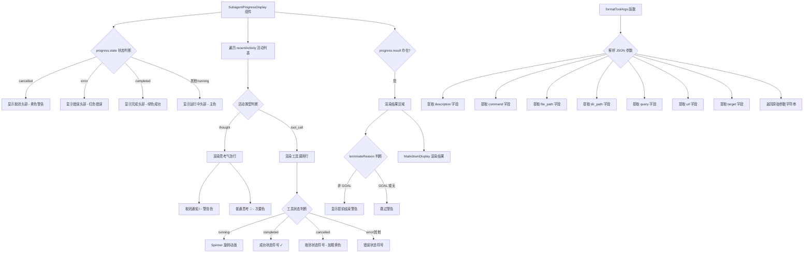

# SubagentProgressDisplay.tsx

## 概述

`SubagentProgressDisplay` 是一个 React（Ink）组件，用于在终端 CLI 界面中展示 **子代理（Subagent）** 的执行进度。它根据子代理的不同状态（运行中、已完成、已取消、出错）渲染对应的头部信息，并逐条显示子代理的最近活动（思考过程和工具调用），最终在子代理完成后展示其结果输出。

该文件同时导出了一个工具函数 `formatToolArgs`，用于从工具调用的 JSON 参数中提取出最具可读性的摘要字符串。

**文件路径**: `packages/cli/src/ui/components/messages/SubagentProgressDisplay.tsx`

## 架构图（Mermaid）



## 核心组件

### 1. `SubagentProgressDisplay` 组件

**类型**: `React.FC<SubagentProgressDisplayProps>`

**Props 接口**:

```typescript
export interface SubagentProgressDisplayProps {
  progress: SubagentProgress;  // 子代理进度对象，包含状态、活动记录、结果等
  terminalWidth: number;       // 终端宽度，传递给 MarkdownDisplay 用于排版
}
```

**渲染结构**（从上到下）:

| 区域 | 描述 | 条件 |
|------|------|------|
| **头部文本** | 根据 `progress.state` 显示不同颜色和文案的状态信息 | 始终显示 |
| **活动列表** | 遍历 `progress.recentActivity` 渲染每一条活动记录 | 始终显示 |
| **结果区域** | 使用 `MarkdownDisplay` 渲染子代理最终输出结果 | `progress.result` 存在时 |

**状态映射**:

| `progress.state` | 头部文案 | 颜色主题 |
|-------------------|----------|----------|
| `cancelled` | `Subagent {name} was cancelled.` | `theme.status.warning` (黄色) |
| `error` | `Subagent {name} failed.` | `theme.status.error` (红色) |
| `completed` | `Subagent {name} completed.` | `theme.status.success` (绿色) |
| 其他（running等） | `Running subagent {name}...` | `theme.text.primary` |

**活动项渲染逻辑**:

- **`thought` 类型**: 显示思考内容。特殊处理"Request cancelled."消息，用 `ℹ` 图标和警告色标记；其他思考用 `💭` 图标和次要文本色。
- **`tool_call` 类型**: 显示工具调用名称和参数摘要。左侧显示状态指示器（Spinner/成功/取消/错误符号），右侧显示工具名（加粗）和格式化后的参数（限制 60 字符，超出截断加 `...`）。被取消的工具调用会添加删除线效果。

**结果区域**:

- 如果 `terminateReason` 存在且不是 `'GOAL'`，会显示一条黄色加粗的提前结束警告。
- 使用 `safeJsonToMarkdown` 将结果转换为 Markdown 后，由 `MarkdownDisplay` 组件渲染。
- `isPending` 属性根据 `progress.state !== 'completed'` 决定是否显示加载状态。

### 2. `formatToolArgs` 函数

**签名**: `(args?: string) => string`

**功能**: 从工具调用的 JSON 参数字符串中智能提取最具可读性的单一字段值，按优先级尝试以下字段：

1. `description` - 工具描述
2. `command` - 命令行内容
3. `file_path` - 文件路径
4. `dir_path` - 目录路径
5. `query` - 查询字符串
6. `url` - URL 地址
7. `target` - 目标

如果参数不是有效 JSON、不是对象、或不包含上述任何字段，则返回原始字符串。空参数返回空字符串。

## 依赖关系

### 内部依赖

| 模块 | 导入内容 | 用途 |
|------|----------|------|
| `../../semantic-colors.js` | `theme` | 语义化颜色主题，用于文本着色 |
| `../../utils/MarkdownDisplay.js` | `MarkdownDisplay` | Markdown 内容渲染组件，用于展示子代理结果 |
| `../../constants.js` | `TOOL_STATUS` | 工具状态常量（SUCCESS, CANCELED, ERROR 等符号） |
| `./ToolShared.js` | `STATUS_INDICATOR_WIDTH` | 状态指示器列的固定宽度，保证对齐 |
| `@google/gemini-cli-core` | `SubagentProgress`, `SubagentActivityItem` | 子代理进度和活动项的 TypeScript 类型定义 |
| `@google/gemini-cli-core` | `safeJsonToMarkdown` | 安全地将 JSON 结果转换为 Markdown 格式字符串 |

### 外部依赖

| 包名 | 导入内容 | 用途 |
|------|----------|------|
| `react` | `React` (类型) | React 类型支持 |
| `ink` | `Box`, `Text` | Ink 终端 UI 基础布局和文本组件 |
| `ink-spinner` | `Spinner` | 终端旋转加载动画，用于"运行中"状态指示 |

## 关键实现细节

1. **状态驱动渲染**: 组件完全基于 `progress.state` 的值（`'running'`, `'completed'`, `'cancelled'`, `'error'`）来决定头部文本和颜色，实现了一个清晰的状态机式渲染逻辑。

2. **活动项多态渲染**: `recentActivity` 数组中的每个 `SubagentActivityItem` 通过 `item.type` 字段区分为 `'thought'`（思考）和 `'tool_call'`（工具调用）两种类型，各自有独立的渲染分支。对于无法识别的类型返回 `null`。

3. **工具参数智能摘要**: `formatToolArgs` 函数不是简单地展示 JSON 原文，而是按优先级提取最具人类可读性的字段。这种设计让用户无需阅读完整 JSON 就能快速理解工具在做什么。参数显示限制在 60 字符以内，超出部分用省略号截断。

4. **取消状态的视觉处理**: 被取消的工具调用使用 `strikethrough`（删除线）效果来表示，同时使用警告色的加粗取消符号，提供了直观的视觉反馈。

5. **提前终止警告**: 当子代理因非 `'GOAL'` 原因终止时（如达到迭代上限、安全策略等），会在结果上方显示醒目的黄色加粗警告，告知用户代理未正常完成。

6. **布局对齐**: 使用 `STATUS_INDICATOR_WIDTH` 常量确保所有活动行的状态指示器列宽度一致，使得工具名称和参数能够整齐对齐。

7. **Markdown 结果渲染**: 结果输出通过 `safeJsonToMarkdown` 转换后使用 `MarkdownDisplay` 组件渲染，支持富文本格式化，且 `isPending` 属性可在结果仍在流式传输时显示相应的加载状态。
