# ToolConfirmationMessage.tsx

## 概述

`ToolConfirmationMessage` 是一个大型且功能丰富的 React（Ink）组件，用于在终端 CLI 中向用户展示 **工具执行确认对话框**。当 AI 模型请求执行可能有风险的操作（如编辑文件、运行命令、调用 MCP 工具、扩展沙箱权限等）时，该组件会弹出确认界面，展示操作详情，并提供多种审批选项（允许一次、允许本次会话、永久允许、取消等）。

该组件是 Gemini CLI 安全审批机制的核心 UI 入口，支持 6 种不同的确认类型，并内置了欺骗性 URL 检测、命令重定向警告等安全功能。

**文件路径**: `packages/cli/src/ui/components/messages/ToolConfirmationMessage.tsx`

## 架构图（Mermaid）

```mermaid
graph TD
    A[ToolConfirmationMessage 组件] --> B{confirmationDetails.type 类型判断}

    B -->|ask_user| C[AskUserDialog 用户提问对话框]
    B -->|exit_plan_mode| D[ExitPlanModeDialog 退出计划模式对话框]
    B -->|edit| E[DiffRenderer 文件差异渲染]
    B -->|exec| F[命令执行确认 - 代码高亮显示]
    B -->|info| G[信息确认 - URL 列表展示]
    B -->|mcp| H[MCP 工具确认 - 可展开详情]
    B -->|sandbox_expansion| I[沙箱权限扩展确认]

    A --> J[安全检测]
    J --> J1[欺骗性 URL 检测 - getDeceptiveUrlDetails]
    J --> J2[命令重定向检测 - hasRedirection]

    A --> K[审批选项生成 getOptions]
    K --> K1[允许一次 ProceedOnce]
    K --> K2[允许本次会话 ProceedAlways]
    K --> K3[永久允许 ProceedAlwaysAndSave]
    K --> K4[取消 Cancel]
    K --> K5[外部编辑器修改 ModifyWithEditor]
    K --> K6[允许该 MCP 工具 ProceedAlwaysTool]
    K --> K7[允许该 MCP 服务器所有工具 ProceedAlwaysServer]

    A --> L[键盘事件处理 useKeypress]
    L --> L1[ESC: 设置取消状态]
    L --> L2[Ctrl+O: 切换 MCP 详情展开]
    L --> L3[Ctrl+C: 冒泡到 AppContainer]

    A --> M[最终渲染布局]
    M --> M1[系统消息 systemMessage]
    M --> M2[主体内容 bodyContent]
    M --> M3[安全警告 securityWarnings]
    M --> M4[确认问题 question]
    M --> M5[选项列表 RadioButtonSelect]
```



## 核心组件

### `ToolConfirmationMessage` 组件

**类型**: `React.FC<ToolConfirmationMessageProps>`

**Props 接口**:

```typescript
export interface ToolConfirmationMessageProps {
  callId: string;                                    // 工具调用的唯一标识符
  confirmationDetails: SerializableConfirmationDetails; // 确认详情对象，包含类型和相关数据
  config: Config;                                    // 全局配置对象
  getPreferredEditor: () => EditorType | undefined;  // 获取用户偏好的外部编辑器
  isFocused?: boolean;                               // 是否获得焦点（默认 true）
  availableTerminalHeight?: number;                  // 可用终端高度
  terminalWidth: number;                             // 终端宽度
}
```

### 支持的确认类型

| 类型 | 描述 | 主体内容 | 特殊行为 |
|------|------|----------|----------|
| `edit` | 文件编辑确认 | `DiffRenderer` 渲染文件差异 | 支持"外部编辑器修改"选项；`isModifying` 状态显示等待编辑器关闭提示 |
| `exec` | 命令执行确认 | 语法高亮的 bash 命令 | 检测重定向并显示警告；支持多命令显示 |
| `info` | 信息类操作确认 | 提示文本和 URL 列表 | URL 使用 Unicode 显示 |
| `mcp` | MCP 工具调用确认 | 服务器名和工具名，可展开的详情 | 额外的 `ProceedAlwaysTool` 和 `ProceedAlwaysServer` 选项 |
| `sandbox_expansion` | 沙箱权限扩展确认 | 请求的文件系统读/写路径和网络权限 | 分类展示读/写/网络权限 |
| `ask_user` | 用户提问（自定义 UI） | `AskUserDialog` | 自行管理 UI，不显示标准选项 |
| `exit_plan_mode` | 退出计划模式（自定义 UI） | `ExitPlanModeDialog` | 自行管理 UI，不显示标准选项 |

### 审批选项（`ToolConfirmationOutcome`）

根据确认类型、是否在受信任文件夹、是否启用永久审批等条件，动态生成审批选项：

| 选项 | 描述 | 可用条件 |
|------|------|----------|
| `ProceedOnce` | 允许一次 | 所有类型始终可用 |
| `ProceedAlways` | 允许本次会话 | 受信任文件夹 |
| `ProceedAlwaysAndSave` | 永久允许（保存到策略文件） | 受信任文件夹 + 启用永久审批 |
| `ProceedAlwaysTool` | 允许该 MCP 工具本次会话 | MCP 类型 + 受信任文件夹 |
| `ProceedAlwaysServer` | 允许该服务器所有工具本次会话 | MCP 类型 + 受信任文件夹 |
| `ModifyWithEditor` | 使用外部编辑器修改 | edit 类型 + 非 IDE 模式或 diffing 未启用 |
| `Cancel` | 取消，建议修改 | 所有类型始终可用 |

### 安全功能

#### 1. 欺骗性 URL 检测

```typescript
const deceptiveUrlWarnings = useMemo(() => {
  // 从 info 类型的 urls 或 exec 类型的命令中提取 URL
  // 使用 getDeceptiveUrlDetails 检测 Punycode 欺骗等攻击
  // 检测到欺骗性 URL 时显示 WarningMessage
}, [confirmationDetails]);
```

- 从 `info` 类型的 `urls` 数组和 `exec` 类型的命令字符串中提取所有 URL
- 使用正则 `/https?:\/\/[^\s"'`<>;&|()]+/g` 匹配 URL
- 去重后逐个调用 `getDeceptiveUrlDetails` 检测 Punycode 等欺骗手段
- 检测到时显示原始 URL 和实际 Punycode 主机名

#### 2. 命令重定向警告

对 `exec` 类型的命令调用 `hasRedirection` 检测是否包含重定向操作（如 `>`, `>>`, `|`），如果检测到且非 `AUTO_EDIT` 模式，显示 Note 和 Tip 警告。

#### 3. 安全警告高度测量

使用 `ResizeObserver` 动态测量安全警告区域的实际渲染高度，用于精确计算主体内容区域的可用高度。

### 键盘事件处理

| 按键 | 行为 |
|------|------|
| `ESC` | 设置 `isCancelling` 状态为 `true`，触发下一渲染周期的取消操作 |
| `Ctrl+O` (SHOW_MORE_LINES) | 切换 MCP 工具详情的展开/折叠状态 |
| `Ctrl+C` (QUIT) | 返回 `false`，让事件冒泡到 `AppContainer` 处理退出流程 |

### 取消操作的异步处理

```typescript
useEffect(() => {
  if (isCancelling) {
    handleConfirm(ToolConfirmationOutcome.Cancel);
  }
}, [isCancelling, handleConfirm]);
```

取消操作不是在 keypress 回调中直接执行，而是通过 `isCancelling` 状态桥接到 `useEffect`，延迟到下一个渲染周期。这是为了避免在 UI 处于展开状态时立即移除组件导致的竞态条件（同时触发 `setConstrainHeight`，导致双重 footer 渲染）。

### 初始选项索引计算

在受信任文件夹且启用永久审批的情况下，对于 `info`、`edit`、`mcp` 类型，如果设置了 `autoAddToPolicyByDefault`，默认光标会定位到 `ProceedAlwaysAndSave` 选项上。

### 渲染布局

**自定义 UI 类型**（`ask_user`、`exit_plan_mode`）：直接渲染 `bodyContent`，不显示标准选项。

**标准类型**的从上到下布局：

1. **系统消息**（可选）：黄色警告文本
2. **主体内容**：包裹在 `MaxSizedBox` 中，限制高度和宽度
3. **安全警告**（可选）：欺骗性 URL 警告
4. **确认问题**：如 "Apply this change?" 或 "Allow execution of: 'ls'?"
5. **选项列表**：`RadioButtonSelect` 组件

**编辑器修改中的特殊渲染**：当 `edit` 类型的 `isModifying` 为 `true` 时，显示带圆角边框的提示框，告知用户保存并关闭外部编辑器以继续。

### MCP 工具详情

MCP 确认类型支持可展开的详情面板，包含：

| 内容 | 描述 |
|------|------|
| **Invocation Arguments** | 工具调用参数（JSON 格式化） |
| **Description** | 工具描述 |
| **Input Schema** | 参数的 JSON Schema |

通过 `Ctrl+O` 快捷键切换展开/折叠状态。展开状态的内容溢出方向为 `bottom`（从底部裁剪），其他类型为 `top`（从顶部裁剪）。

### 常量

| 常量名 | 值 | 用途 |
|--------|-----|------|
| `REDIRECTION_WARNING_NOTE_LABEL` | `'Note: '` | 重定向警告的 Note 标签 |
| `REDIRECTION_WARNING_NOTE_TEXT` | `'Command contains redirection which can be undesirable.'` | 重定向警告正文 |
| `REDIRECTION_WARNING_TIP_LABEL` | `'Tip:  '` | 重定向警告的 Tip 标签（带额外空格对齐） |

## 依赖关系

### 内部依赖

| 模块 | 导入内容 | 用途 |
|------|----------|------|
| `@google/gemini-cli-core` | `SerializableConfirmationDetails`, `Config`, `ToolConfirmationPayload`, `ToolConfirmationOutcome`, `EditorType`, `ApprovalMode`, `hasRedirection`, `debugLogger` | 核心类型、枚举、工具函数 |
| `./DiffRenderer.js` | `DiffRenderer` | 文件差异渲染组件 |
| `../../utils/InlineMarkdownRenderer.js` | `RenderInline` | 内联 Markdown 渲染 |
| `../../contexts/ToolActionsContext.js` | `useToolActions` | 提供 `confirm` 和 `isDiffingEnabled` |
| `../shared/RadioButtonSelect.js` | `RadioButtonSelect`, `RadioSelectItem` | 单选按钮列表组件 |
| `../shared/MaxSizedBox.js` | `MaxSizedBox`, `MINIMUM_MAX_HEIGHT` | 限制最大尺寸的容器组件 |
| `../../utils/textUtils.js` | `sanitizeForDisplay`, `stripUnsafeCharacters` | 文本安全处理工具 |
| `../../hooks/useKeypress.js` | `useKeypress` | 键盘事件监听 Hook |
| `../../semantic-colors.js` | `theme` | 语义化颜色主题 |
| `../../contexts/SettingsContext.js` | `useSettings` | 获取用户设置 |
| `../../key/keyMatchers.js` | `Command` | 命令枚举 |
| `../../key/keybindingUtils.js` | `formatCommand` | 命令格式化为可读字符串 |
| `../AskUserDialog.js` | `AskUserDialog` | 用户提问对话框组件 |
| `../ExitPlanModeDialog.js` | `ExitPlanModeDialog` | 退出计划模式对话框组件 |
| `./WarningMessage.js` | `WarningMessage` | 警告消息组件 |
| `../../utils/CodeColorizer.js` | `colorizeCode` | 代码语法高亮 |
| `../../utils/urlSecurityUtils.js` | `getDeceptiveUrlDetails`, `toUnicodeUrl`, `DeceptiveUrlDetails` | URL 安全检测和转换 |
| `../../hooks/useKeyMatchers.js` | `useKeyMatchers` | 键盘匹配器 Hook |

### 外部依赖

| 包名 | 导入内容 | 用途 |
|------|----------|------|
| `react` | `React` (类型), `useEffect`, `useMemo`, `useCallback`, `useState`, `useRef` | React Hooks 和类型支持 |
| `ink` | `Box`, `Text`, `ResizeObserver`, `DOMElement` | Ink 终端 UI 组件和 DOM 类型 |

## 关键实现细节

1. **多类型统一入口**: 组件通过 `confirmationDetails.type` 的判断支持 7 种不同的确认类型，每种类型有独立的主体内容渲染和选项生成逻辑，但共享统一的布局框架和确认流程。

2. **条件化选项生成**: `getOptions` 回调根据确认类型、受信任文件夹状态（`isTrustedFolder`）、永久审批开关（`allowPermanentApproval`）、IDE 模式和 diffing 状态等多个条件动态生成可用选项。这确保了用户只看到当前上下文中合理的选项。

3. **竞态条件规避**: 取消操作通过 `isCancelling` 状态 + `useEffect` 延迟执行，而非在 keypress 回调中直接调用 `handleConfirm`。这是一个有意为之的 hack，用于避免在 UI 收缩时触发的 `setConstrainHeight` 竞态导致的双重 footer 问题。代码中有详细的 TODO 注释说明该问题。

4. **动态高度管理**: `availableBodyContentHeight` 回调精确计算主体内容区域的可用高度，减去问题行、选项列表、安全警告、外边距等所有周围元素的高度。对于重定向警告，还会额外计算基于终端宽度的行数（考虑文本换行）。

5. **ResizeObserver 测量**: 安全警告区域的高度使用 `ResizeObserver` 动态测量，通过 `ref` 回调在 DOM 节点挂载/卸载时管理观察器的连接和断开。这确保了高度计算在内容变化时保持准确。

6. **MCP 详情展开状态跟踪**: MCP 工具详情的展开/折叠状态不仅记录了 `expanded` 布尔值，还绑定了 `callId`。当组件因新的工具调用重用时（不同的 `callId`），展开状态会自动重置为折叠。

7. **安全消毒处理**: 所有用户可见的文本（命令、文件名、服务器名、工具名等）都经过 `sanitizeForDisplay` 或 `stripUnsafeCharacters` 处理，防止终端注入攻击（如通过控制字符操纵终端显示）。

8. **自动策略默认选中**: 在受信任文件夹中，对于 `info`、`edit`、`mcp` 类型（策略规则可以精确限定到特定文件/工具），如果启用了 `autoAddToPolicyByDefault` 设置，初始光标会自动定位到"永久允许"选项，提升工作流效率。

9. **溢出方向控制**: MCP 详情展开时使用 `bottom` 溢出方向（保留顶部内容，裁剪底部），其他类型使用 `top` 溢出方向（保留底部最新内容，裁剪顶部旧内容）。这是因为 MCP 详情的重要信息在顶部，而 diff 等内容的最新变更在底部。

10. **外部编辑器模式**: `edit` 类型的 `isModifying` 为 `true` 时，整个选项面板被替换为一个简洁的提示框，告知用户在外部编辑器中完成修改后保存并关闭以继续流程。
