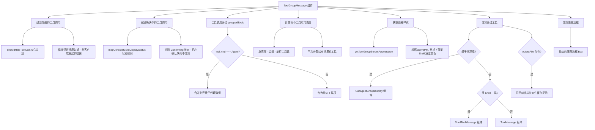

# ToolGroupMessage.tsx

## 概述

`ToolGroupMessage` 是一个 React（Ink）组件，负责在终端 CLI 界面中渲染 **一组工具调用的集合**。它是工具调用展示的容器级组件，接收一组工具调用数据后进行过滤、分组，然后将每个工具调用分派给对应的子组件（`ToolMessage`、`ShellToolMessage` 或 `SubagentGroupDisplay`）渲染。

该组件承担了工具调用展示的多项关键职责：隐藏不需要显示的工具调用、将连续的子代理调用分组合并、动态计算每个工具的可用终端高度、管理边框样式和颜色，以及处理输出过长时的文件保存提示。

**文件路径**: `packages/cli/src/ui/components/messages/ToolGroupMessage.tsx`

## 架构图（Mermaid）



## 核心组件

### `ToolGroupMessage` 组件

**类型**: `React.FC<ToolGroupMessageProps>`

**Props 接口**:

```typescript
interface ToolGroupMessageProps {
  item: HistoryItem | HistoryItemWithoutId;       // 历史记录项，用于计算边框样式
  toolCalls: IndividualToolCallDisplay[];          // 完整的工具调用列表（未过滤）
  availableTerminalHeight?: number;               // 可用终端高度
  terminalWidth: number;                          // 终端宽度
  onShellInputSubmit?: (input: string) => void;   // Shell 输入提交回调（未使用）
  borderTop?: boolean;                            // 是否显示顶部边框（可覆盖）
  borderBottom?: boolean;                         // 是否显示底部边框（可覆盖）
  isExpandable?: boolean;                         // 工具内容是否可展开
}
```

### 数据处理流水线

组件内部对工具调用数据进行了三级处理：

#### 第一级：基础过滤（`toolCalls`）

从 `allToolCalls` 中过滤掉：

| 过滤条件 | 说明 |
|----------|------|
| `shouldHideToolCall` 返回 `true` | 核心库提供的隐藏逻辑，如进行中的 AskUser、计划模式操作等 |
| 低错误详细度 + 非客户端发起的错误 | 当 `errorVerbosity` 不为 `'full'` 时，隐藏内部错误以减少噪声 |

#### 第二级：可见性过滤（`visibleToolCalls`）

从第一级结果中进一步排除：

| 过滤条件 | 说明 |
|----------|------|
| `displayStatus === ToolCallStatus.Confirming` | 正在确认中的工具已在 `ToolConfirmationQueue` 中渲染，避免重复显示 |

**注意**: `Pending`（等待执行）和 `Canceled`（用户拒绝）状态的工具调用**保留显示**，确保历史记录完整，避免工具在审批后"消失"。

#### 第三级：分组（`groupedTools`）

将 `visibleToolCalls` 按以下规则分组：

- **子代理工具**（`kind === Kind.Agent`）：连续的子代理调用合并为一个数组
- **非子代理工具**：每个独立存在

结果类型为 `Array<IndividualToolCallDisplay | IndividualToolCallDisplay[]>`，其中数组元素为子代理组。

### 高度分配算法

```
可用高度 = (总终端高度 - 边框高度(2) - 单行工具数) / 有结果的工具数

其中:
  - 单行工具数 = 无结果输出的非子代理工具数
  - 有结果的工具数 = 有结果输出的非子代理工具数
  - 至少为 1
```

这种算法确保每个有结果输出的工具获得大致相等的可见区域，而无结果的工具只占一行。

### 边框样式计算

通过 `getToolGroupBorderAppearance` 函数根据以下上下文动态计算：

| 输入 | 说明 |
|------|------|
| `item` | 当前历史记录项 |
| `activePtyId` | 当前活跃的 PTY（伪终端）ID |
| `embeddedShellFocused` | 嵌入式 Shell 是否聚焦 |
| `pendingHistoryItems` | 待处理的历史记录项 |
| `backgroundShells` | 后台运行的 Shell 列表 |

返回 `borderColor` 和 `borderDimColor` 两个颜色值。

### 渲染分派

| 条件 | 渲染组件 | 说明 |
|------|----------|------|
| 组元素为数组（子代理组） | `SubagentGroupDisplay` | 渲染一组子代理的进度和结果 |
| `isShellTool(tool.name)` 为 `true` | `ShellToolMessage` | Shell/命令执行工具的专用渲染 |
| 其他 | `ToolMessage` | 通用工具调用渲染 |

每个非子代理工具还会检查 `tool.outputFile`，如果存在则在工具下方显示"输出过长已保存到文件"的提示。

### 边框管理

**顶部边框**: 通过 `borderTopOverride` 可覆盖默认行为。默认情况下只有第一个工具显示顶部边框。

**底部边框**: 作为独立的 `Box` 元素渲染，与主内容分离。这是为了防止被内部的 sticky header 覆盖（Ink 渲染 bug）。通过 `borderBottomOverride` 可控制是否显示。

### 空组处理

```
if (visibleToolCalls.length === 0 && !isExplicitClosingSlice) {
  return null;
}
```

当所有工具调用都被过滤掉时，组件返回 `null`。但有一个例外：当 `allToolCalls.length === 0` 时（显式的"关闭切片"），仍然渲染边框以桥接静态/待处理部分。

### 常量

| 常量名 | 值 | 用途 |
|--------|-----|------|
| `TOOL_MESSAGE_HORIZONTAL_MARGIN` | `4` | 工具消息的水平边距（左右各 2 的边框 + 内边距空间） |

## 依赖关系

### 内部依赖

| 模块 | 导入内容 | 用途 |
|------|----------|------|
| `../../types.js` | `HistoryItem`, `HistoryItemWithoutId`, `IndividualToolCallDisplay`, `ToolCallStatus`, `mapCoreStatusToDisplayStatus` | 历史记录和工具调用的类型定义及状态映射 |
| `./ToolMessage.js` | `ToolMessage` | 通用工具调用渲染组件 |
| `./ShellToolMessage.js` | `ShellToolMessage` | Shell 命令工具专用渲染组件 |
| `./SubagentGroupDisplay.js` | `SubagentGroupDisplay` | 子代理组渲染组件 |
| `../../semantic-colors.js` | `theme` | 语义化颜色主题 |
| `../../contexts/ConfigContext.js` | `useConfig` | 获取全局配置 |
| `./ToolShared.js` | `isShellTool` | 判断工具名是否为 Shell 工具 |
| `@google/gemini-cli-core` | `shouldHideToolCall`, `CoreToolCallStatus`, `Kind` | 工具调用隐藏判断、状态枚举、工具种类枚举 |
| `../../contexts/UIStateContext.js` | `useUIState` | 获取全局 UI 状态 |
| `../../utils/borderStyles.js` | `getToolGroupBorderAppearance` | 计算工具组边框的颜色外观 |
| `../../contexts/SettingsContext.js` | `useSettings` | 获取用户设置 |

### 外部依赖

| 包名 | 导入内容 | 用途 |
|------|----------|------|
| `react` | `React` (类型), `useMemo` | React 类型支持和记忆化 Hook |
| `ink` | `Box`, `Text` | Ink 终端 UI 基础布局和文本组件 |

## 关键实现细节

1. **三级过滤流水线**: 组件不是一次性过滤所有不需要的工具调用，而是分三级进行。第一级处理"不应显示"的工具（核心业务逻辑），第二级处理"正在其他地方显示"的工具（UI 层去重），第三级进行分组聚合。这种分层设计使每一层的职责清晰，便于维护和测试。

2. **子代理连续分组**: `groupedTools` 的分组逻辑将连续出现的 `Kind.Agent` 工具合并为数组，非连续的则分别成组。这使得多个并行运行的子代理可以由 `SubagentGroupDisplay` 统一展示，而不是各自独立渲染。

3. **宽度约束防止 Ink 渲染 bug**: 外层 `Box` 显式设置 `width={terminalWidth}`，这不是为了美观而是为了防止 Ink 在频繁状态变化时错误渲染边框导致多行跨越和画面撕裂。代码中有详细注释说明此 bug。

4. **底部边框分离**: 底部边框作为独立的 `height={0}` Box 渲染，与主内容区域分离。这是因为 Ink 中 sticky header 会覆盖同一容器内的边框，将底部边框提取出来可以避免此问题。

5. **高度均分策略**: 可用终端高度在所有"有结果输出的工具"之间均分。"无结果的工具"只占一行不参与分配。这确保了多个工具同时有输出时，每个工具都能获得合理的可见区域。子代理类型（`Kind.Agent`）不参与此计算，它们的高度由 `SubagentGroupDisplay` 自行管理。

6. **显式关闭切片**: `allToolCalls.length === 0` 的情况被视为"显式关闭切片"，即使没有可见工具也会渲染（仅渲染边框）。这用于在静态历史和待处理区域之间桥接边框视觉连续性。

7. **边框颜色动态计算**: 边框颜色不是固定值，而是根据当前 PTY 状态、Shell 焦点、后台进程等上下文动态计算。这使得用户可以通过边框颜色直观地识别工具组的状态（如活跃、后台运行、已完成等）。

8. **输出文件提示**: 当工具的输出超过终端可显示范围时，核心层会将输出保存到文件。组件检测到 `tool.outputFile` 存在时，在工具下方显示文件路径提示，使用与边框一致的样式保持视觉统一。

9. **Shell 工具特殊处理**: 通过 `isShellTool` 判断函数区分 Shell 工具和普通工具，Shell 工具使用专门的 `ShellToolMessage` 组件渲染，支持嵌入式终端、交互式输入等额外功能，并接收 `config` 配置。

10. **borderTopOverride 联合逻辑**: 首个工具的顶部边框通过 `borderTopOverride !== undefined ? borderTopOverride && isFirst : isFirst` 计算。这意味着如果父组件传入 `borderTop={false}`，则即使是第一个工具也不显示顶部边框，用于在多段拼接时避免重复边框。
