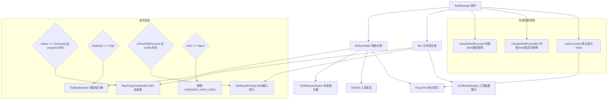

# ToolMessage.tsx

## 概述

`ToolMessage.tsx` 是 Gemini CLI 项目中用于渲染**单个工具调用消息**的 React（Ink）组件。它负责在终端 UI 中展示工具的执行状态、工具信息描述、执行结果，以及对嵌入式 Shell 的焦点管理。该组件是工具调用 UI 展示层的核心入口组件，将多个子组件（状态指示器、工具信息、结果展示、进度条等）组合在一起，形成完整的工具消息卡片。

## 架构图（Mermaid）

## 核心组件

### ToolMessageProps 接口

该接口继承自 `IndividualToolCallDisplay`，定义了组件的全部属性：

| 属性 | 类型 | 说明 |
|------|------|------|
| `name` | `string` | 工具名称（来自父接口） |
| `description` | `string` | 工具描述（来自父接口） |
| `resultDisplay` | `ToolResultDisplay` | 工具执行结果展示数据（来自父接口） |
| `status` | `CoreToolCallStatus` | 工具调用状态（来自父接口） |
| `kind` | `Kind` | 工具种类，如 Agent 等（来自父接口） |
| `progressMessage` | `string` | 进度消息（来自父接口） |
| `originalRequestName` | `string` | 原始请求名称（来自父接口） |
| `progress` | `number` | 当前进度值（来自父接口） |
| `progressTotal` | `number` | 进度总值（来自父接口） |
| `availableTerminalHeight` | `number?` | 可用终端高度 |
| `terminalWidth` | `number` | 终端宽度 |
| `emphasis` | `TextEmphasis` | 文本强调级别，默认 `'medium'` |
| `renderOutputAsMarkdown` | `boolean` | 是否以 Markdown 渲染输出，默认 `true` |
| `isFirst` | `boolean` | 是否为第一个工具消息 |
| `borderColor` | `string` | 边框颜色 |
| `borderDimColor` | `boolean` | 边框是否使用暗淡颜色 |
| `activeShellPtyId` | `number \| null?` | 当前活跃 Shell 的 PTY ID |
| `embeddedShellFocused` | `boolean?` | 嵌入式 Shell 是否已聚焦 |
| `ptyId` | `number?` | 当前工具的 PTY ID |
| `config` | `Config?` | 配置对象 |

### ToolMessage 函数式组件

组件的核心渲染逻辑分为两大部分：

1. **StickyHeader（粘性头部）**：包含工具状态图标、工具信息描述、焦点提示和尾部指示器。使用 `StickyHeader` 组件使头部在滚动时保持可见。
2. **Box（主内容区域）**：使用圆角边框（`borderStyle="round"`），仅显示左右边框，不显示上下边框（与 StickyHeader 形成视觉整体）。内部包含 MCP 进度条、工具结果展示和 Shell 输入提示。

### 焦点管理逻辑

组件内部使用三个焦点相关的判断：

- **`checkIsShellFocused`**：判断当前 Shell 工具是否已经获得焦点，依据 `name`、`status`、`ptyId`、`activeShellPtyId` 和 `embeddedShellFocused` 综合判断。
- **`checkIsShellFocusable`**：判断当前 Shell 工具是否可以获得焦点，依据 `name`、`status` 和 `config`。
- **`useFocusHint`**：自定义 Hook，基于可聚焦和已聚焦状态以及结果展示数据，决定是否显示焦点提示。

### 条件渲染规则

- **MCP 进度条**：仅当 `status === CoreToolCallStatus.Executing` 且 `progress !== undefined` 时渲染。
- **尾部指示器**：仅当 `emphasis === 'high'` 时渲染。
- **Shell 输入提示**：仅当 `isThisShellFocused && config` 都为真时渲染。
- **子代理行数限制**：当 `kind === Kind.Agent` 且 `availableTerminalHeight` 存在时，结果展示的最大行数限制为 `SUBAGENT_MAX_LINES`。
- **溢出方向**：子代理（`Kind.Agent`）使用 `'bottom'` 方向溢出，其他使用 `'top'`。

### 重要设计注意事项

代码注释中明确指出：**不能将外层 `<>` 片段替换为 `<Box>`**，因为 `StickyHeader` 需要相对于 `ToolMessage` 的父组件保持粘性，而非相对于内部的 Box。

## 依赖关系

### 内部依赖

| 模块路径 | 导入内容 | 说明 |
|----------|----------|------|
| `../../types.js` | `IndividualToolCallDisplay` | 工具调用展示数据的类型接口 |
| `../StickyHeader.js` | `StickyHeader` | 粘性头部组件，使工具头部在滚动时保持可见 |
| `./ToolResultDisplay.js` | `ToolResultDisplay` | 工具执行结果展示组件 |
| `./ToolShared.js` | `ToolStatusIndicator`, `ToolInfo`, `TrailingIndicator`, `McpProgressIndicator`, `TextEmphasis`, `STATUS_INDICATOR_WIDTH`, `isThisShellFocusable`, `isThisShellFocused`, `useFocusHint`, `FocusHint` | 工具消息共享的子组件、类型、常量和工具函数 |
| `../ShellInputPrompt.js` | `ShellInputPrompt` | Shell 输入提示组件 |
| `../../constants.js` | `SUBAGENT_MAX_LINES` | 子代理最大显示行数常量 |

### 外部依赖

| 包名 | 导入内容 | 说明 |
|------|----------|------|
| `react` | `React` (类型) | React 类型定义 |
| `ink` | `Box` | Ink 框架的 Box 布局组件，用于终端 UI 布局 |
| `@google/gemini-cli-core` | `Config`, `CoreToolCallStatus`, `Kind` | 核心包的配置类型、工具调用状态枚举和种类枚举 |

## 关键实现细节

1. **组件导出 `TextEmphasis` 类型**：虽然 `TextEmphasis` 是从 `ToolShared.js` 导入的，但 `ToolMessage.tsx` 通过 `export type { TextEmphasis }` 重新导出，使得上层组件可以直接从 `ToolMessage` 模块获取该类型。

2. **Fragment 包裹而非 Box**：组件的最外层使用 React Fragment（`<>`）而非 `Box`，这是一个关键的设计决策。`StickyHeader` 的粘性行为依赖于其相对于祖先组件的定位关系，如果用 `Box` 包裹，粘性效果会被限制在该 Box 内部，导致功能失效。

3. **边框样式设计**：主内容区域的 `Box` 使用圆角边框（`round`），且仅启用左右边框（`borderTop={false}`, `borderBottom={false}`），这与 `StickyHeader` 的顶部边框配合，形成视觉上连贯的卡片效果。

4. **子代理溢出策略差异**：对于 `Kind.Agent` 类型的工具，溢出方向设为 `'bottom'`（从底部截断），而其他类型使用 `'top'`（从顶部截断）。这意味着普通工具保留最新输出，子代理则保留最初输出。

5. **Shell 焦点系统**：组件实现了一个完整的 Shell 焦点管理流程——先判断是否可聚焦，再判断是否已聚焦，然后决定是否显示焦点提示和 Shell 输入提示。当 Shell 已聚焦时，`ShellInputPrompt` 组件会在结果下方显示，并且其左侧有 `STATUS_INDICATOR_WIDTH` 的内边距以保持对齐。

6. **MCP 进度条**：当工具处于执行中状态且有进度数据时，会在结果上方显示进度条，进度条宽度固定为 20 个字符。
