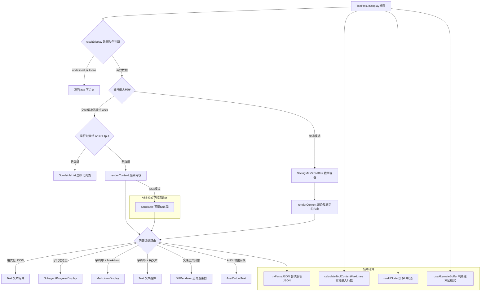

# ToolResultDisplay.tsx

## 概述

`ToolResultDisplay.tsx` 是 Gemini CLI 中用于渲染**工具执行结果**的核心 React（Ink）组件。它能够根据结果数据的类型（字符串、JSON、文件差异、ANSI 输出、子代理进度等）自动选择合适的渲染策略，并针对**普通模式**（Standard Mode / History/Scrollback）和**交替缓冲区模式**（Alternate Screen Buffer / Interactive/Fullscreen）提供不同的渲染路径。该组件承担了工具输出展示的所有复杂逻辑，是 `ToolMessage` 组件的核心子组件。

## 架构图（Mermaid）

## 核心组件

### ToolResultDisplayProps 接口

| 属性 | 类型 | 默认值 | 说明 |
|------|------|--------|------|
| `resultDisplay` | `string \| object \| undefined` | - | 工具执行结果数据，支持多种类型 |
| `availableTerminalHeight` | `number?` | - | 可用终端高度（行数） |
| `terminalWidth` | `number` | - | 终端宽度（列数） |
| `renderOutputAsMarkdown` | `boolean?` | `true` | 是否以 Markdown 格式渲染字符串输出 |
| `maxLines` | `number?` | - | 最大显示行数限制 |
| `hasFocus` | `boolean?` | `false` | 是否拥有焦点（影响滚动交互） |
| `overflowDirection` | `'top' \| 'bottom'` | `'top'` | 溢出截断方向 |

### FileDiffResult 内部接口

| 属性 | 类型 | 说明 |
|------|------|------|
| `fileDiff` | `string` | 文件差异内容（diff 格式） |
| `fileName` | `string` | 文件名 |

### ToolResultDisplay 函数式组件

#### 状态与计算

- **`renderMarkdown`**：通过 `useUIState()` Hook 获取，决定是否启用 Markdown 渲染。
- **`isAlternateBuffer`**：通过 `useAlternateBuffer()` Hook 判断当前是否处于交替缓冲区模式。
- **`availableHeight`**：通过 `calculateToolContentMaxLines()` 综合 `availableTerminalHeight`、`isAlternateBuffer` 和 `maxLines` 计算出实际可用高度。
- **`childWidth`**：`terminalWidth - 4`，减去左右边框和内边距共占用的 4 个字符宽度。

#### 虚拟化渲染（性能优化）

组件使用 `React.useCallback` 缓存了两个回调：

- **`keyExtractor`**：为虚拟化列表中的每一行生成唯一 key（使用索引）。
- **`renderVirtualizedAnsiLine`**：渲染单行 ANSI 输出，每行固定高度为 1，并设置 `overflow="hidden"` 防止溢出。

#### 提前返回条件

1. `resultDisplay` 为 falsy 值时返回 `null`。
2. `resultDisplay` 为对象且包含 `todos` 属性时返回 `null`（由 `TodoTray` 组件单独处理）。

#### renderContent 内容渲染函数

该函数是组件的核心渲染逻辑，根据内容类型进行路由：

1. **格式化 JSON**：先尝试用 `tryParseJSON` 解析字符串，若成功则用 `JSON.stringify` 美化后以 `Text` 组件渲染。
2. **子代理进度**：通过 `isSubagentProgress()` 检测，使用 `SubagentProgressDisplay` 组件渲染。
3. **Markdown 字符串**：当 `renderOutputAsMarkdown` 为 `true` 时，使用 `MarkdownDisplay` 组件渲染。
4. **纯文本字符串**：当 `renderOutputAsMarkdown` 为 `false` 时，使用普通 `Text` 组件渲染。
5. **文件差异对象**：检测到 `fileDiff` 属性时，使用 `DiffRenderer` 组件渲染差异视图。
6. **ANSI 输出**：兜底情况，使用 `AnsiOutputText` 组件渲染 ANSI 格式输出。

在 ASB 模式下，`renderContent` 的返回值会被 `Scrollable` 组件包裹，支持键盘滚动（Shift+Up/Down）。

#### 两种渲染模式

**交替缓冲区模式（ASB）**：
- 数组类型的 `resultDisplay`（`AnsiOutput`）使用 `ScrollableList` 虚拟化列表渲染，支持大量输出的高效展示。列表高度取 `maxLines`、`availableHeight`、`ACTIVE_SHELL_MAX_LINES` 中的最小适用值。初始滚动位置为列表末尾（`SCROLL_TO_ITEM_END`）。
- 非数组类型走 `renderContent` 标准路径。

**普通模式（Standard）**：
- 使用 `SlicingMaxSizedBox` 组件进行精确截断，支持 `overflowDirection` 配置截断方向。
- `SlicingMaxSizedBox` 使用 render prop 模式，将截断后的数据传递给 `renderContent` 渲染。

## 依赖关系

### 内部依赖

| 模块路径 | 导入内容 | 说明 |
|----------|----------|------|
| `./DiffRenderer.js` | `DiffRenderer` | 文件差异渲染组件 |
| `../../utils/MarkdownDisplay.js` | `MarkdownDisplay` | Markdown 内容渲染组件 |
| `../AnsiOutput.js` | `AnsiOutputText`, `AnsiLineText` | ANSI 格式输出渲染组件 |
| `../shared/SlicingMaxSizedBox.js` | `SlicingMaxSizedBox` | 可截断的最大尺寸容器组件 |
| `../../semantic-colors.js` | `theme` | 语义化颜色主题 |
| `../../contexts/UIStateContext.js` | `useUIState` | UI 状态上下文 Hook |
| `../../../utils/jsonoutput.js` | `tryParseJSON` | JSON 安全解析工具函数 |
| `../../hooks/useAlternateBuffer.js` | `useAlternateBuffer` | 判断是否处于交替缓冲区的 Hook |
| `../shared/Scrollable.js` | `Scrollable` | 可滚动容器组件 |
| `../shared/ScrollableList.js` | `ScrollableList` | 可滚动虚拟化列表组件 |
| `../shared/VirtualizedList.js` | `SCROLL_TO_ITEM_END` | 虚拟化列表滚动到末尾的常量 |
| `../../constants.js` | `ACTIVE_SHELL_MAX_LINES` | 活跃 Shell 最大行数常量 |
| `../../utils/toolLayoutUtils.js` | `calculateToolContentMaxLines` | 计算工具内容最大行数的工具函数 |
| `./SubagentProgressDisplay.js` | `SubagentProgressDisplay` | 子代理进度展示组件 |

### 外部依赖

| 包名 | 导入内容 | 说明 |
|------|----------|------|
| `react` | `React` | React 库，使用 `useCallback` 等 Hook |
| `ink` | `Box`, `Text` | Ink 框架的布局和文本组件 |
| `@google/gemini-cli-core` | `AnsiOutput` (类型), `AnsiLine` (类型), `isSubagentProgress` | 核心包的 ANSI 输出类型和子代理进度检测函数 |

## 关键实现细节

1. **多类型内容路由**：`renderContent` 函数实现了一个完整的内容类型路由系统，支持 6 种不同的内容类型。路由优先级为：JSON > 子代理进度 > Markdown 字符串 > 纯文本字符串 > 文件差异 > ANSI 输出。

2. **双模式渲染架构**：组件针对 ASB（交替缓冲区）和普通模式提供完全不同的渲染路径。ASB 模式注重交互性（支持滚动），普通模式注重截断展示（使用 `SlicingMaxSizedBox`）。

3. **虚拟化列表优化**：在 ASB 模式下处理大型 ANSI 数组输出时，使用 `ScrollableList` 虚拟化列表，每行固定高度为 1，避免一次性渲染全部内容导致性能问题。初始滚动到列表末尾确保用户看到最新输出。

4. **宽度计算**：`childWidth = terminalWidth - 4`，其中 4 是左右边框（各 1）加上左右内边距（`paddingX={1}`，各 1）的总和，确保内容不会超出父组件 `ToolMessage` 定义的边框区域。

5. **截断禁用逻辑**：在 ANSI 输出的兜底渲染中，当处于 ASB 模式或者既没有 `availableTerminalHeight` 也没有 `maxLines` 时，禁用截断功能（`shouldDisableTruncation`），让内容完整显示。

6. **Todos 特殊处理**：当 `resultDisplay` 是包含 `todos` 属性的对象时，组件不渲染任何内容，因为待办事项由独立的 `TodoTray` 组件处理，避免重复渲染。

7. **Render Prop 模式**：在普通模式下，`SlicingMaxSizedBox` 使用 render prop（函数作为子元素）模式，将截断处理后的数据通过回调传递给 `renderContent`，实现了截断逻辑与渲染逻辑的解耦。
