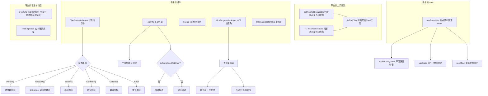

# ToolShared.tsx

## 概述

`ToolShared.tsx` 是 Gemini CLI 中**工具消息共享组件与工具函数**的集合模块。它为 `ToolMessage` 及其相关组件提供了一系列可复用的子组件（状态指示器、工具信息、焦点提示、进度条、尾部指示器）、工具函数（Shell 工具判断、焦点判断）和自定义 Hook（焦点提示管理）。该模块是工具消息 UI 层的基础设施层，被多个上层组件依赖。

## 架构图（Mermaid）



## 核心组件

### 常量

| 名称 | 值 | 说明 |
|------|-----|------|
| `STATUS_INDICATOR_WIDTH` | `3` | 状态指示器的固定宽度（字符数），用于布局对齐 |

### 类型定义

#### TextEmphasis

```typescript
type TextEmphasis = 'high' | 'medium' | 'low';
```

文本强调级别，影响工具名称的颜色显示：
- `'high'` / `'medium'`：使用 `theme.text.primary` 主色
- `'low'`：使用 `theme.text.secondary` 次要色

### 工具函数

#### isShellTool(name: string): boolean

判断给定工具名称是否对应 Shell 工具。匹配条件为名称等于 `SHELL_COMMAND_NAME`、`SHELL_NAME` 或 `SHELL_TOOL_NAME` 中的任何一个。这三个常量分别来自内部常量模块和核心包。

#### isThisShellFocusable(name, status, config?): boolean

判断 Shell 工具调用是否当前可聚焦。需同时满足三个条件：
1. 是 Shell 工具（`isShellTool(name)` 返回 `true`）
2. 状态为执行中（`status === CoreToolCallStatus.Executing`）
3. 配置中启用了交互式 Shell（`config?.getEnableInteractiveShell()` 返回 `true`）

#### isThisShellFocused(name, status, ptyId?, activeShellPtyId?, embeddedShellFocused?): boolean

判断特定的 Shell 工具调用是否当前已聚焦。需同时满足四个条件：
1. 是 Shell 工具
2. 状态为执行中
3. 当前工具的 `ptyId` 等于活跃 Shell 的 `activeShellPtyId`
4. `embeddedShellFocused` 为 `true`

### 自定义 Hook

#### useFocusHint(isThisShellFocusable, isThisShellFocused, resultDisplay)

管理焦点提示的显示逻辑。返回 `{ shouldShowFocusHint: boolean }`。

**内部逻辑**：

1. **`userHasFocused` 状态**：通过 `useState(false)` 初始化，当检测到 Shell 已聚焦时（`useEffect` 监听 `isThisShellFocused`），设为 `true`。一旦用户聚焦过，后续始终显示焦点提示。

2. **`resetKey` 派生键**：用于传递给 `useInactivityTimer`，基于 `resultDisplay` 的变化生成重置信号：
   - 字符串类型：使用 `resultDisplay.length`
   - 数组类型：使用 `resultDisplay.length`
   - 其他类型：使用 `!!resultDisplay`（布尔值）

   这种设计避免了深比较的性能开销和引用变化的误触发问题。

3. **`showFocusHint`**：通过 `useInactivityTimer` 在 `SHELL_FOCUS_HINT_DELAY_MS` 毫秒的不活跃期后触发显示。

4. **最终判断**：`shouldShowFocusHint = isThisShellFocusable && (showFocusHint || userHasFocused)`。只要 Shell 可聚焦，且（不活跃计时器触发了 或 用户曾经聚焦过），就显示提示。

### 子组件

#### FocusHint

焦点提示组件，显示聚焦/取消聚焦的快捷键提示。

| 属性 | 类型 | 说明 |
|------|------|------|
| `shouldShowFocusHint` | `boolean` | 是否显示焦点提示 |
| `isThisShellFocused` | `boolean` | Shell 是否已聚焦 |

当 `shouldShowFocusHint` 为 `false` 时返回 `null`。否则显示：
- 已聚焦：`(快捷键 to unfocus)`，颜色为 `theme.ui.focus`
- 未聚焦：`(快捷键 to focus)`，颜色为 `theme.ui.active`

快捷键文本通过 `formatCommand` 函数从 `Command.FOCUS_SHELL_INPUT` / `Command.UNFOCUS_SHELL_INPUT` 格式化得到。

#### ToolStatusIndicator

工具状态指示器组件，根据工具调用状态显示不同的图标和颜色。

| 属性 | 类型 | 说明 |
|------|------|------|
| `status` | `CoreToolCallStatus` | 核心工具调用状态 |
| `name` | `string` | 工具名称 |
| `isFocused` | `boolean?` | 是否已聚焦 |

**状态到图标的映射**（通过 `mapCoreStatusToDisplayStatus` 转换后）：

| 显示状态 | 图标常量 | 颜色 | 特殊效果 |
|----------|----------|------|----------|
| `Pending` | `TOOL_STATUS.PENDING` | `theme.status.success` | - |
| `Executing` | `CliSpinner` 动画 | 根据焦点和工具类型动态决定 | 旋转动画（toggle 类型） |
| `Success` | `TOOL_STATUS.SUCCESS` | `theme.status.success` | aria-label |
| `Confirming` | `TOOL_STATUS.CONFIRMING` | 动态颜色 | aria-label |
| `Canceled` | `TOOL_STATUS.CANCELED` | 动态颜色 | 加粗，aria-label |
| `Error` | `TOOL_STATUS.ERROR` | `theme.status.error` | 加粗，aria-label |

**动态颜色逻辑**：
- 已聚焦（`isFocused`）：`theme.ui.focus`
- Shell 工具（`isShell`）：`theme.ui.active`
- 其他：`theme.status.warning`

#### ToolInfo

工具信息展示组件，显示工具名称和描述。

| 属性 | 类型 | 说明 |
|------|------|------|
| `name` | `string` | 工具名称 |
| `description` | `string` | 工具描述 |
| `status` | `CoreToolCallStatus` | 核心工具调用状态 |
| `emphasis` | `TextEmphasis` | 文本强调级别 |
| `progressMessage` | `string?` | 进度消息（当前未使用，以下划线前缀标记） |
| `originalRequestName` | `string?` | 原始请求名称 |

**渲染逻辑**：
- 外层 Box：`overflow="hidden"`, `height={1}`, `flexGrow={1}`, `flexShrink={1}`，确保单行显示并可收缩。
- 工具名称：加粗显示，颜色由 `emphasis` 决定。
- 重定向提示：当 `originalRequestName` 存在且与 `name` 不同时，显示 `(redirection from {originalRequestName})`。
- 工具描述：使用 `theme.text.secondary` 颜色，当取消状态时整体文本加删除线。
- **Ask User 工具特殊处理**：当 `isCompletedAskUserTool(name, status)` 返回 `true` 时，隐藏描述文本，因为结果展示本身已足够说明。
- **exhaustive check**：`emphasis` 的 `switch` 使用 TypeScript 的 `never` 类型进行穷尽检查，确保所有枚举值都被处理。

#### McpProgressIndicator

MCP（Model Context Protocol）进度条组件。

| 属性 | 类型 | 说明 |
|------|------|------|
| `progress` | `number` | 当前进度值 |
| `total` | `number?` | 总进度值 |
| `message` | `string?` | 进度消息 |
| `barWidth` | `number` | 进度条宽度（字符数） |

**进度计算逻辑**：

- **有总进度时**：计算百分比 `Math.min(100, Math.round((progress / total) * 100))`，填充格数 `Math.round((progress / total) * barWidth)`。
- **无总进度时**：百分比显示为 `null`（直接显示 `progress` 原始值），填充格数使用取模运算 `Math.floor(progress) % (barWidth + 1)` 实现循环动画效果。

**进度条字符**：
- 填充块：`\u2588`（全块字符 `█`）
- 空白块：`\u2591`（浅阴影字符 `░`）

**安全处理**：对 `rawFilled` 进行 `Number.isFinite` 检查，防止 NaN 或 Infinity 导致的渲染异常。

#### TrailingIndicator

简单的尾部指示器组件，显示一个左箭头 `←`，用于标识高强调级别的工具消息。使用 `theme.text.primary` 颜色，`wrap="truncate"` 防止换行。

## 依赖关系

### 内部依赖

| 模块路径 | 导入内容 | 说明 |
|----------|----------|------|
| `../../types.js` | `ToolCallStatus`, `mapCoreStatusToDisplayStatus` | 显示层工具调用状态枚举和核心状态到显示状态的映射函数 |
| `../CliSpinner.js` | `CliSpinner` | CLI 旋转动画组件 |
| `../../constants.js` | `SHELL_COMMAND_NAME`, `SHELL_NAME`, `TOOL_STATUS`, `SHELL_FOCUS_HINT_DELAY_MS` | Shell 工具名称常量、工具状态图标常量、焦点提示延迟时间 |
| `../../semantic-colors.js` | `theme` | 语义化颜色主题 |
| `../../hooks/useInactivityTimer.js` | `useInactivityTimer` | 不活跃计时器 Hook |
| `../../key/keybindingUtils.js` | `formatCommand` | 快捷键格式化工具函数 |
| `../../key/keyBindings.js` | `Command` | 命令枚举（快捷键命令） |

### 外部依赖

| 包名 | 导入内容 | 说明 |
|------|----------|------|
| `react` | `React`, `useState`, `useEffect` | React 库及其 Hook |
| `ink` | `Box`, `Text` | Ink 框架的布局和文本组件 |
| `@google/gemini-cli-core` | `Config` (类型), `SHELL_TOOL_NAME`, `isCompletedAskUserTool`, `ToolResultDisplay` (类型), `CoreToolCallStatus` | 核心包的配置类型、Shell 工具名称常量、Ask User 工具完成检测函数、结果展示类型、核心工具调用状态枚举 |

## 关键实现细节

1. **双层状态映射**：组件内部接收 `CoreToolCallStatus`（核心层状态），通过 `mapCoreStatusToDisplayStatus` 映射为 `ToolCallStatus`（显示层状态）。这种双层设计解耦了核心逻辑与 UI 展示，使得核心层状态变更不会直接影响 UI 渲染逻辑。

2. **Shell 工具三重名称匹配**：`isShellTool` 函数需要匹配三个不同的常量（`SHELL_COMMAND_NAME`、`SHELL_NAME`、`SHELL_TOOL_NAME`），说明 Shell 工具在不同上下文中可能使用不同的名称标识，该函数统一了这些差异。

3. **不活跃计时器与焦点提示**：`useFocusHint` Hook 使用 `useInactivityTimer` 实现"静默一段时间后提示用户聚焦"的体验。`resetKey` 的设计巧妙地利用了数据长度变化作为活跃信号，避免了深比较的性能开销。

4. **焦点提示持久化**：一旦用户曾经聚焦过 Shell（`userHasFocused` 变为 `true`），焦点提示将持续显示，不再受不活跃计时器控制。这确保用户一旦知道了焦点功能，提示信息不会消失。

5. **进度条循环动画**：当 `McpProgressIndicator` 没有 `total` 值时，使用取模运算 `Math.floor(progress) % (barWidth + 1)` 让填充块在进度条宽度内循环移动，产生"不确定进度"的视觉效果。

6. **穷尽检查模式**：`ToolInfo` 中 `nameColor` 的 `switch` 语句使用 TypeScript 的 `never` 类型（`const exhaustiveCheck: never = emphasis`）确保所有 `TextEmphasis` 枚举值都被处理，如果未来新增枚举值会在编译时报错。

7. **无障碍支持**：`ToolStatusIndicator` 中的 Success、Confirming、Canceled、Error 状态都设置了 `aria-label` 属性，提供屏幕阅读器支持。

8. **状态指示器动态颜色策略**：执行中状态的颜色有三级优先级——聚焦状态用 `focus` 色 > Shell 工具用 `active` 色 > 其他用 `warning` 色，这种层级化设计帮助用户快速区分不同工具的交互状态。
