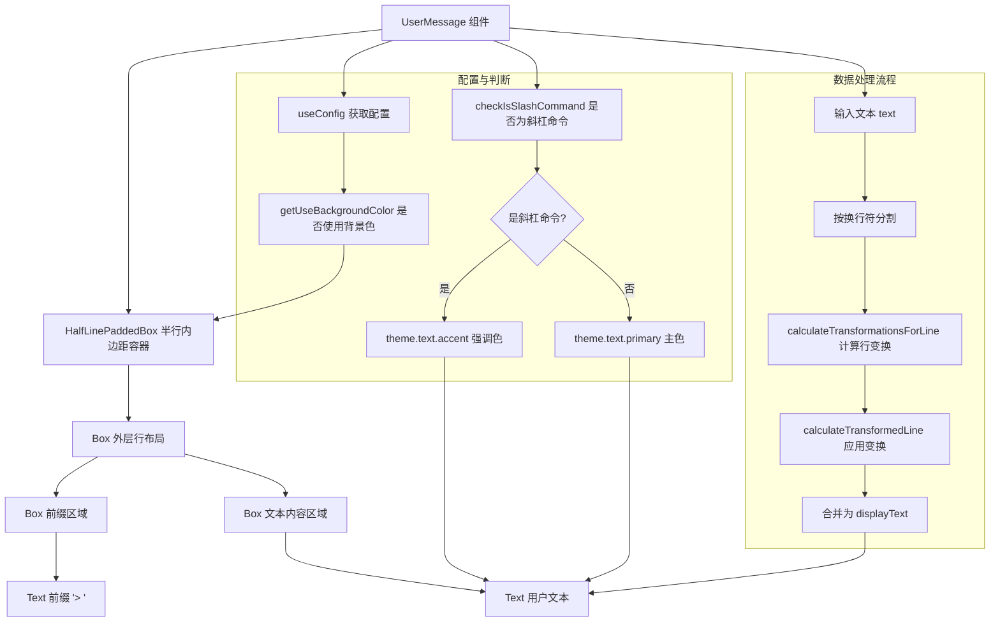

# UserMessage.tsx

## 概述

`UserMessage.tsx` 是 Gemini CLI 中用于渲染**用户输入消息**的 React（Ink）组件。它负责在终端 UI 中展示用户输入的文本内容，支持多行文本、斜杠命令的特殊颜色标识、文本行变换（如图片折叠）、以及可选的背景色渲染。组件设计简洁，以 `> ` 前缀标识用户消息，并提供无障碍支持。

## 架构图（Mermaid）

## 核心组件

### UserMessageProps 接口

| 属性 | 类型 | 说明 |
|------|------|------|
| `text` | `string` | 用户输入的原始文本内容 |
| `width` | `number` | 组件的显示宽度（字符数） |

### UserMessage 函数式组件

#### 常量与配置

- **`prefix`**：固定值 `'> '`，用作用户消息的视觉前缀标识。
- **`prefixWidth`**：前缀的字符宽度，即 `prefix.length`（2 个字符）。
- **`isSlashCommand`**：通过 `checkIsSlashCommand(text)` 判断用户输入是否为斜杠命令（如 `/help`、`/clear`）。
- **`config`**：通过 `useConfig()` Hook 获取全局配置。
- **`useBackgroundColor`**：从配置中获取是否使用背景色渲染。

#### 文本颜色逻辑

- 斜杠命令：使用 `theme.text.accent`（强调色）
- 普通文本：使用 `theme.text.primary`（主色）

#### displayText 文本变换（useMemo）

对用户输入文本进行行级变换处理，使用 `useMemo` 缓存计算结果：

1. 将文本按 `\n` 分割为多行。
2. 对每一行调用 `calculateTransformationsForLine` 计算可用的变换（如图片标记等）。
3. 调用 `calculateTransformedLine` 应用变换，传入光标位置 `[-1, -1]` 表示无光标，使所有可折叠内容保持折叠状态（如图片保持折叠显示）。
4. 将变换后的各行重新用 `\n` 连接。

#### 渲染结构

1. **HalfLinePaddedBox**：最外层容器，提供半行级别的内边距和可选的背景色。
   - `backgroundBaseColor`：使用 `theme.background.message` 消息背景色。
   - `backgroundOpacity`：不透明度为 1（完全不透明）。
   - `useBackgroundColor`：由配置决定是否启用背景色。

2. **外层 Box**：水平布局（`flexDirection="row"`），宽度为传入的 `width`。
   - 当使用背景色时：`marginY=0`，`paddingX=1`
   - 不使用背景色时：`marginY=1`（上下各 1 行间距），`paddingX=0`

3. **前缀 Box**：固定宽度（`width={prefixWidth}`），不可收缩（`flexShrink={0}`）。
   - 显示 `> ` 前缀，颜色为 `theme.text.accent`。
   - 设置 `aria-label={SCREEN_READER_USER_PREFIX}` 提供无障碍支持。

4. **文本 Box**：弹性增长（`flexGrow={1}`），占据剩余空间。
   - `wrap="wrap"` 启用自动换行。
   - 颜色根据是否为斜杠命令动态决定。

## 依赖关系

### 内部依赖

| 模块路径 | 导入内容 | 说明 |
|----------|----------|------|
| `../../semantic-colors.js` | `theme` | 语义化颜色主题 |
| `../../textConstants.js` | `SCREEN_READER_USER_PREFIX` | 屏幕阅读器用户消息前缀常量 |
| `../../utils/commandUtils.js` | `isSlashCommand` | 斜杠命令检测工具函数 |
| `../shared/text-buffer.js` | `calculateTransformationsForLine`, `calculateTransformedLine` | 文本行变换计算函数 |
| `../shared/HalfLinePaddedBox.js` | `HalfLinePaddedBox` | 半行内边距容器组件 |
| `../../contexts/ConfigContext.js` | `useConfig` | 配置上下文 Hook |

### 外部依赖

| 包名 | 导入内容 | 说明 |
|------|----------|------|
| `react` | `React` (类型), `useMemo` | React 类型和记忆化 Hook |
| `ink` | `Text`, `Box` | Ink 框架的文本和布局组件 |

## 关键实现细节

1. **前缀分离设计**：前缀 `> ` 与文本内容分别放在独立的 `Box` 中，前缀固定宽度不可收缩，文本区域弹性增长。这确保前缀始终对齐，文本内容在换行时不会与前缀重叠。

2. **文本变换与光标位置**：`calculateTransformedLine` 接收光标位置 `[-1, -1]`，这是一个特殊值，表示"无光标"。在此模式下，所有可展开的变换（如嵌入的图片预览）都保持折叠状态。`line index` 参数传入 `0`，因为在无光标模式下行索引不影响结果。

3. **背景色自适应布局**：组件的布局策略会根据 `useBackgroundColor` 配置动态调整：
   - 有背景色时：不需要外边距（背景色本身提供视觉分隔），但需要水平内边距使文本与背景边缘保持间距。
   - 无背景色时：使用上下外边距提供视觉分隔，不需要额外的水平内边距。

4. **斜杠命令视觉区分**：通过颜色差异让用户能直观区分普通消息和斜杠命令，斜杠命令使用强调色（`accent`），普通消息使用主色（`primary`）。

5. **无障碍性**：前缀文本的 `aria-label` 设置为 `SCREEN_READER_USER_PREFIX` 常量，为屏幕阅读器提供语义化的用户消息标识，而非读出视觉符号 `> `。

6. **useMemo 优化**：`displayText` 的计算被 `useMemo` 包裹，依赖项为 `[text]`，确保只在用户输入文本变化时重新计算变换结果，避免每次重渲染都执行行分割和变换计算。
