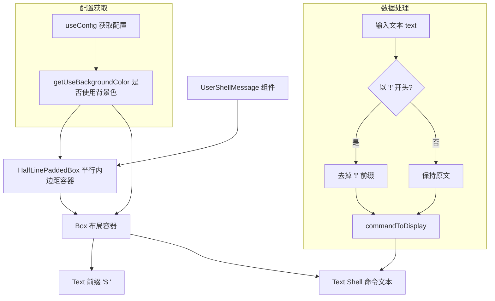

# UserShellMessage.tsx

## 概述

`UserShellMessage.tsx` 是 Gemini CLI 中用于渲染**用户 Shell 命令消息**的 React（Ink）组件。当用户通过 `!` 前缀在 CLI 中直接执行 Shell 命令时，该组件负责以 `$ ` 前缀的形式展示该命令。它是 `UserMessage` 的简化版本，专门针对 Shell 命令场景，不包含文本变换、斜杠命令检测等复杂逻辑。

## 架构图（Mermaid）



## 核心组件

### UserShellMessageProps 接口

| 属性 | 类型 | 说明 |
|------|------|------|
| `text` | `string` | 用户输入的 Shell 命令文本（可能带有 `!` 前缀） |
| `width` | `number` | 组件的显示宽度（字符数） |

### UserShellMessage 函数式组件

#### 配置获取

- **`config`**：通过 `useConfig()` Hook 获取全局配置对象。
- **`useBackgroundColor`**：从配置中读取是否启用背景色渲染模式。

#### 命令文本处理

```typescript
const commandToDisplay = text.startsWith('!') ? text.substring(1) : text;
```

如果输入文本以 `!` 开头，则去除该前缀。代码注释说明这是因为 `App.tsx` 在处理用户输入时会添加 `!` 前缀来标识这是一个 Shell 命令（交由 Shell 处理器处理），但在展示时不需要显示这个内部标记。

#### 渲染结构

1. **HalfLinePaddedBox**：最外层容器，提供半行级别的内边距和可选的背景色。
   - `backgroundBaseColor`：使用 `theme.background.message` 消息背景色。
   - `backgroundOpacity`：不透明度为 1（完全不透明）。
   - `useBackgroundColor`：由配置决定。

2. **Box 布局容器**：
   - 当使用背景色时：`marginY=0`，`paddingX=1`
   - 不使用背景色时：`marginY=1`（上下各 1 行间距），`paddingX=0`
   - 宽度为传入的 `width`。

3. **前缀 Text**：显示 `$ `（美元符号加空格），颜色为 `theme.ui.symbol`，模拟终端命令行的视觉风格。

4. **命令 Text**：显示处理后的命令文本，颜色为 `theme.text.primary`。

## 依赖关系

### 内部依赖

| 模块路径 | 导入内容 | 说明 |
|----------|----------|------|
| `../../semantic-colors.js` | `theme` | 语义化颜色主题 |
| `../shared/HalfLinePaddedBox.js` | `HalfLinePaddedBox` | 半行内边距容器组件 |
| `../../contexts/ConfigContext.js` | `useConfig` | 配置上下文 Hook |

### 外部依赖

| 包名 | 导入内容 | 说明 |
|------|----------|------|
| `react` | `React` (类型) | React 类型定义 |
| `ink` | `Box`, `Text` | Ink 框架的布局和文本组件 |

## 关键实现细节

1. **`!` 前缀剥离**：`App.tsx` 在内部处理流程中使用 `!` 前缀来标识用户输入的 Shell 命令（例如用户输入 `!ls -la`，内部存储为 `!ls -la`），但展示时需要去掉这个前缀，只显示实际的命令 `ls -la`。这种内部标记与展示分离的设计使得消息类型判断和展示互不干扰。

2. **与 UserMessage 的设计对比**：
   - `UserMessage` 使用 `> ` 前缀，`UserShellMessage` 使用 `$ ` 前缀。
   - `UserMessage` 包含文本变换（`calculateTransformationsForLine`）、斜杠命令检测、`useMemo` 优化等复杂逻辑。
   - `UserShellMessage` 更加精简，不需要文本变换和斜杠命令检测，因为 Shell 命令不会包含图片嵌入等需要变换的内容。

3. **背景色自适应布局**：与 `UserMessage` 一致，组件根据 `useBackgroundColor` 配置动态调整布局策略——有背景色时用水平内边距，无背景色时用垂直外边距。这种一致的设计确保了两种消息类型在视觉上的协调。

4. **前缀颜色差异**：
   - `UserMessage` 的前缀 `> ` 使用 `theme.text.accent`（文本强调色）。
   - `UserShellMessage` 的前缀 `$ ` 使用 `theme.ui.symbol`（UI 符号色）。
   这种颜色差异帮助用户在视觉上快速区分普通消息和 Shell 命令。

5. **简洁的前缀布局**：与 `UserMessage` 不同，`UserShellMessage` 没有将前缀和文本放在独立的 `Box` 中，而是将两个 `Text` 组件直接并排放在同一个 `Box` 内。这是因为 Shell 命令通常是单行的，不需要像多行用户消息那样精确控制前缀区域的独立宽度和缩进对齐。

6. **组件职责单一**：该组件只负责展示用户输入的 Shell 命令，不涉及命令的执行、输出渲染或状态管理。Shell 命令的执行结果由其他组件（如 `ToolMessage` 和 `ToolResultDisplay`）负责展示。
