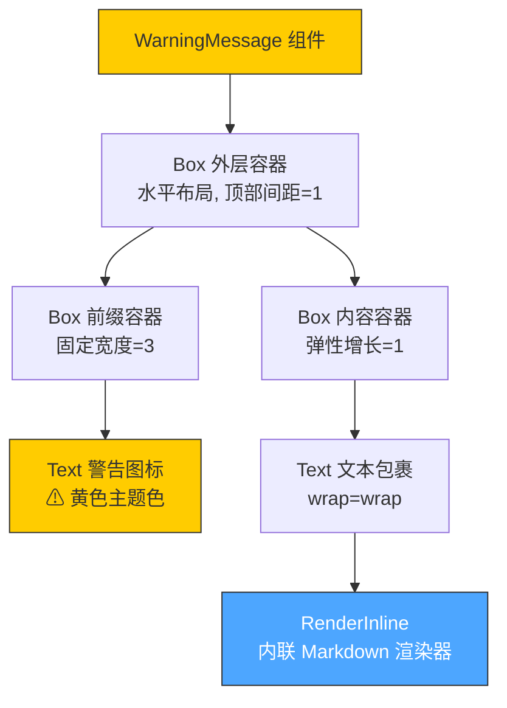

# WarningMessage.tsx

## 概述

`WarningMessage` 是一个 React 函数组件，用于在 CLI 终端界面中渲染带有警告图标（⚠）的警告信息。该组件基于 `ink` 库构建，采用水平布局，左侧显示黄色警告符号前缀，右侧显示经过 Markdown 内联渲染的警告文本内容。组件设计简洁，专注于单一职责——展示格式化的警告消息。

## 架构图（Mermaid）

## 核心组件

### WarningMessageProps 接口

| 属性 | 类型 | 必填 | 说明 |
|------|------|------|------|
| `text` | `string` | 是 | 需要显示的警告文本内容，支持内联 Markdown 语法 |

### WarningMessage 函数组件

`React.FC<WarningMessageProps>` 类型的函数组件，接收 `text` 属性并渲染警告信息。

**内部常量：**

| 常量 | 值 | 说明 |
|------|-----|------|
| `prefix` | `'⚠ '` | 警告图标前缀字符串，包含一个空格 |
| `prefixWidth` | `3` | 前缀区域的固定显示宽度（字符数） |

**渲染结构：**

1. **外层 `Box`** — `flexDirection="row"`（水平排列），`marginTop={1}`（顶部留一行空白间距）
2. **前缀 `Box`** — `width={prefixWidth}`（固定宽度 3），包含黄色的 `⚠` 图标
3. **内容 `Box`** — `flexGrow={1}`（占据剩余全部空间），内部通过 `Text` 组件启用自动换行（`wrap="wrap"`），并使用 `RenderInline` 渲染支持 Markdown 内联语法的警告文本

## 依赖关系

### 内部依赖

| 模块路径 | 导入内容 | 用途 |
|----------|----------|------|
| `../../semantic-colors.js` | `theme` | 提供语义化的颜色主题对象，这里使用 `theme.status.warning` 作为警告色（通常为黄色） |
| `../../utils/InlineMarkdownRenderer.js` | `RenderInline` | 内联 Markdown 渲染组件，用于将纯文本中的 Markdown 内联语法（如粗体、斜体、代码等）渲染为终端格式化输出 |

### 外部依赖

| 包名 | 导入内容 | 用途 |
|------|----------|------|
| `react` | `React`（类型导入） | 提供 React 类型定义，用于 `React.FC` 泛型组件类型声明 |
| `ink` | `Box`, `Text` | Ink 框架的核心布局和文本组件，用于在终端中构建 UI |

## 关键实现细节

1. **类型导入优化**：使用 `import type React from 'react'` 进行纯类型导入，确保在运行时不会引入 React 模块，减小打包体积。

2. **固定宽度前缀设计**：前缀区域使用固定宽度 `width={3}`，确保警告图标 `⚠ `（一个 Unicode 字符加一个空格）占据精确的列空间，使多行警告信息的文本部分保持左对齐。

3. **弹性布局策略**：内容区域使用 `flexGrow={1}` 填充剩余空间，配合 `wrap="wrap"` 实现长文本的自动换行，适应不同终端宽度。

4. **语义化颜色系统**：通过 `theme.status.warning` 引用警告色，而非硬编码颜色值，确保整个应用中警告信息的视觉一致性，同时便于主题切换。

5. **Markdown 内联渲染支持**：文本内容通过 `RenderInline` 组件渲染，支持在警告消息中使用 Markdown 内联格式（如 `**粗体**`、`` `代码` `` 等），`defaultColor` 参数确保未格式化的文本也使用警告主题色显示。

6. **顶部间距设计**：`marginTop={1}` 在警告消息与上方内容之间增加一行空白，提升视觉可读性和信息层次感。
